# Standard Operating Procedure — Physical Inventory Counting

**Site:** Front Royal, VA cold storage  **Scanners:** Zebra MC9000-series handhelds

This is the working manual. It assumes you have never opened the app before and takes
you from an empty deployment through to a finished count sent to the ERP. Read Part 1
and Part 2 once, when the app is first set up. Parts 3 to 5 are what you do for every
count. Part 6 is the cycle-count programme, Part 7 is what to do when something goes
wrong.

> **About the screenshots.** Every picture below is the real application, photographed
> against a count part-way through a morning: the actual Front Royal bin list, three
> teams, four scanners, two aisles finished and three being counted. The names, pallet
> IDs and lot codes are made up. If a screen changes, `npm run docs` rebuilds every
> picture in this manual from scratch and re-prints
> **[SOP.pdf](SOP.pdf)** — the same manual typeset for paper.

---

## Contents

- [Part 0 — What the system is](#part-0--what-the-system-is)
- [Part 1 — First-time setup: getting in](#part-1--first-time-setup-getting-in)
- [Part 2 — First-time setup: the warehouse](#part-2--first-time-setup-the-warehouse)
- [Part 3 — Setting up a count](#part-3--setting-up-a-count)
- [Part 4 — Counting day](#part-4--counting-day)
- [Part 5 — Finishing a count](#part-5--finishing-a-count)
- [Part 6 — The cycle-count programme](#part-6--the-cycle-count-programme)
- [Part 7 — When something goes wrong](#part-7--when-something-goes-wrong)
- [Part 8 — Capacity: what the system will take](#part-8--capacity-what-the-system-will-take)
- [Appendix A — File column reference](#appendix-a--file-column-reference)
- [Appendix B — Server settings reference](#appendix-b--server-settings-reference)

---

## Part 0 — What the system is

One server, four screens. Everything below happens in a browser; nothing is installed
on a PC.

| Screen | Address | Who uses it | Sign-in |
|---|---|---|---|
| **Scanner** | `/` | Counters, on the handhelds | Each scanner has its own link |
| **Dashboard** | `/admin` | Supervisor running the count | Supervisor login |
| **Settings** | `/settings` | Whoever sets the count up | Supervisor login |
| **Office board** | `/board` | Anyone — put it on the office TV | **None.** Read-only |
| **Cycle counts** | `/cycle` | Whoever runs the daily programme | Supervisor login |

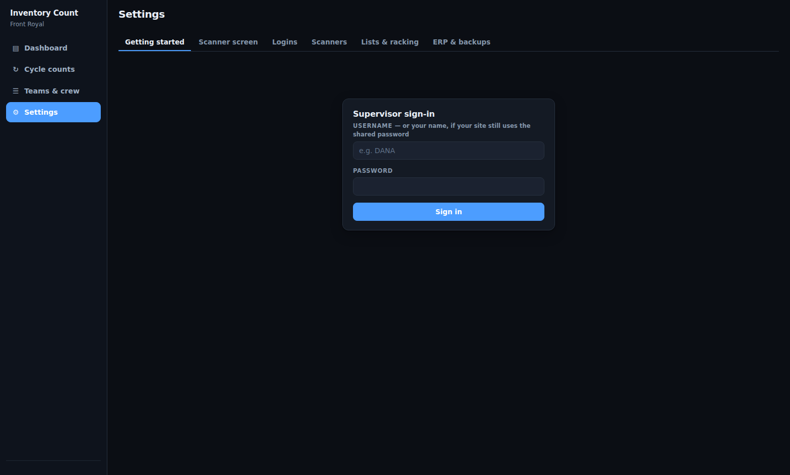

*Every supervisor page opens on the same sign-in. Signing in on one carries to all four.*

**What the system does.** It holds a list of every bin in the warehouse and a list of
what the ERP thinks is in them. Counters scan pallets into bins on the handhelds. The
app compares the two, tells you where they disagree, sends people back to look again
where it matters, and produces an adjustment file for the ERP.

**What a "count session" is.** One count — a wall-to-wall in October, a spot check of
the freezer, the year's cycle-count programme. Everything (bin list, inventory report,
team assignments, every scanned line) belongs to a session. You can have several open
at once; scanners choose which one they are working on at sign-on.

**Two words you need.**
- **Aisle** — a rack run, e.g. `F01`. Teams are assigned whole aisles.
- **Block** — aisles that back onto each other share a **block**, and only one team may
  be active in a block at a time, so two crews never work opposite faces of the same
  racking. Pairing aisles into blocks is a one-time job (Part 2, step 7).

**Bin codes.** A code like `F01A001` reads as zone `F`, aisle `01`, level `A`,
position `001`. Four positions per bay; odd positions are the front face, even are the
back. The app derives the aisle from the code when your file has no aisle column.

---

## Part 1 — First-time setup: getting in

> Do this once, with whoever administers the server. Allow 20 minutes.

### Step 1 — Deploy the server

**On Railway (how this site runs).** Deploy the repository; `railway.json` builds the
Dockerfile, and the app listens on the port Railway gives it. Attach a **persistent
volume** and point `DB_PATH` at it — see step 2 — or the database is wiped on every
redeploy.

**On a PC inside the warehouse (no internet needed).**

```bash
ADMIN_PASSWORD='pick-something' docker compose up -d
```

Then give that PC a static IP or a DHCP reservation, because the handhelds are pointed
at its address and that address must never change. Scanners reach it at
`http://<that-ip>:3000/`.

### Step 2 — Set the server settings

On Railway these are **Variables**; on a PC they go in `docker-compose.yml`. Set these
before anybody signs in:

| Setting | Set it to | Why |
|---|---|---|
| `ADMIN_PASSWORD` | A password only supervisors know | The shared way in, used once to create real logins |
| `DB_PATH` | A path on the persistent volume, e.g. `/data/inventory.db` | Otherwise a redeploy loses the count |
| `SITE_TIMEZONE` | `America/New_York` | Dates on reports and cycle-count due dates |
| `SUPERADMIN_USER` | e.g. `sitelead` | Creates one permanent admin login at start-up |
| `SUPERADMIN_NAME` | That person's name, as it should appear in the log | Shown against everything they do |
| `SUPERADMIN_PASSWORD` | A strong password, at least 8 characters | If unset it falls back to `ADMIN_PASSWORD` |

The superadmin account is created when the server starts and cannot be deleted from
inside the app, so you can never lock yourself out. The app refuses to create it if the
password would be the default `changeme` or is shorter than 8 characters — it will say
so in the start-up log and carry on without it.

> **Never put a password in the repository.** These are server settings for a reason:
> anything committed to git is readable by anyone with access to the code, for ever.

### Step 3 — Sign in for the first time

Open `/settings`. Sign in with the shared `ADMIN_PASSWORD` (leave the username box
empty), or with the superadmin username and password if you set one.

### Step 4 — Create a login for each supervisor

**Settings → Logins → Supervisor logins.**

1. Type the person's **name**, a **username** and choose their **role**:
   - **Admin** — can do everything, including managing logins.
   - **Supervisor** — runs counts; cannot add or remove logins.
2. Press **Add**. The app shows a **starter password** once — something like
   `winter-4k2p`. Write it down and hand it to them; it is not shown again.
3. The first time they sign in they are made to choose their own password before they
   can do anything. Nobody but them knows it after that.

If somebody forgets their password, an admin presses **Reset password** on their row and
gives them the new starter password. The same forced change happens again.

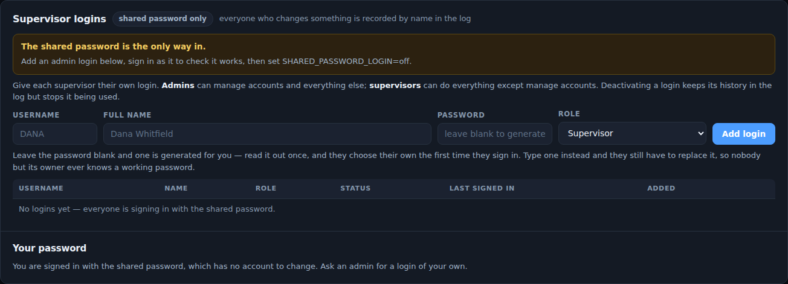

*Settings &rarr; Logins. Each person has their own login and their own password; the starter password is shown once.*

### Step 5 — Turn the shared password off

Once at least one admin login exists, set `SHARED_PASSWORD_LOGIN=off` in the server
settings. From then on everybody signs in as themselves and the log names who did what.

The app will not let this lock you out: if there are no admin accounts, the shared
password keeps working regardless of the setting.

---

## Part 2 — First-time setup: the warehouse

> Also once, though you will come back to steps 6 and 7 whenever the racking changes.

### Step 6 — Upload the bin list

**Settings → Lists & racking → Bin list.**

This is every location in the warehouse. It is what a scanned bin is checked against,
and it is what defines the aisles teams get assigned to. **Upload this before anything
else.**

- For this site, press **Load the Front Royal bin list** — the ERP bin export ships with
  the app: racks F01–F24 and A01–A04 plus WIP, the NIL bin and other areas. Staging
  lanes and dock doors are counted manually and are deliberately left out.
- Otherwise choose a CSV or Excel file. Column names are matched loosely — see
  [Appendix A](#appendix-a--file-column-reference). The only column you must have is the
  bin location.
- **Replace what is there** wipes the existing list first. Leave it unticked to add to
  it.

The card reports what it read: how many bins, how many aisles, and anything it skipped.

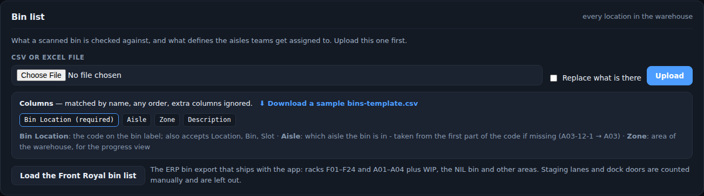

*Settings &rarr; Lists &amp; racking. Each list has its own card, and each reports exactly what it read.*

### Step 7 — Pair the aisles into racking blocks

**Settings → Lists & racking → Aisles & racking blocks.**

Aisles that back onto each other must share a block so two teams are never working the
same racking from both sides.

1. Set **Aisles per block** to 2 (most double-deep racking).
2. **Skip first** is 1 if the first aisle has a wall behind it rather than another aisle.
3. Press **Auto-pair aisles**, then read the table and correct anything that is wrong by
   typing a block name straight onto a row.

If you have uploaded a rack drawing, **Pair from drawing** uses it instead — more
reliable than counting aisles off by hand.

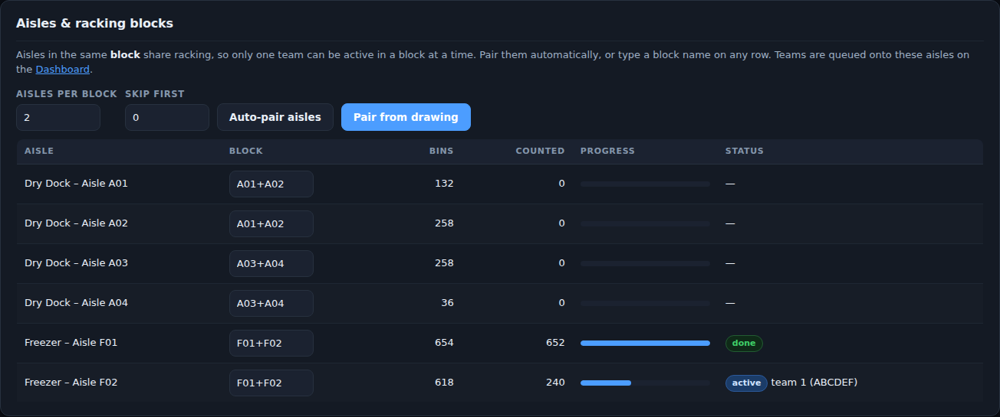

*Aisles paired into racking blocks. F01+F02 share racking, so only one team works that block at a time.*

### Step 8 — Register the scanners

**Settings → Scanners → Scanner setup.**

Each handheld gets its own link. Opening that link once is what signs the scanner in;
after that the server accepts counts from it and stamps its name on every line.

1. Type a **scanner name** — use what is written on the device, e.g. `SCANNER-05`.
   Add notes (asset tag, "freezer unit") if it helps.
2. Press **Add scanner**. Repeat for every handheld.
3. Press **Print setup cards**. You get one card per scanner with its own QR code. Cut
   them up and tape one inside each cradle.

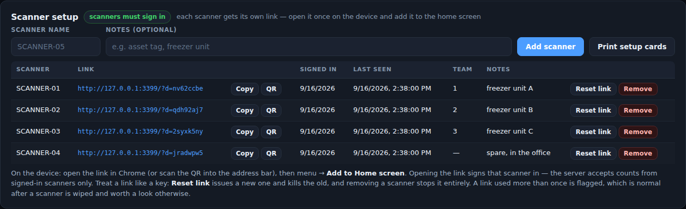

*Settings &rarr; Scanners. One row per handheld: its link, when it was last seen, Reset link and Remove.*

**On each handheld, once:**

1. Open Chrome, scan the QR code from its card into the address bar (or type the link).
2. **Install it. Do not leave it running as a browser tab.** Chrome menu →
   **Install app** / **Add to Home screen**, or tap **Install on this scanner** on the
   app's own sign-on screen. Installed, it runs in its own window — no address bar at
   all — and starts even with no signal.

   A browser tab is the one setup that causes trouble: Chrome keeps its address bar
   above the page, brings it back whenever the page moves, and if the keyboard focus
   ever leaves the page a scan is typed into that bar instead of into the count. The app
   warns you when it is running in a tab and offers **Hide the browser bar for this
   shift** as a stopgap.

   *Still want a locked-down device?* See **Kiosk mode** at the end of this step.
3. Set up **DataWedge** so scans arrive as keystrokes:
   - the profile associated with Chrome → **Keystroke output: enabled**
   - **Basic data formatting** → send a suffix: **ENTER** *(or TAB — the app takes
     either as the end of a scan, and neither moves the cursor off the box)*
   - **Barcode input** → enable the symbologies your labels use.

**Kiosk mode.** Three levels, strongest last:

| | What it takes | What the counter sees |
|---|---|---|
| **Installed app** (do this) | Chrome menu → Install app, once per device | Its own window. No address bar, no tabs, no back button |
| **Full screen for a shift** | The button on the sign-on screen, one tap | The bar goes away until the app is closed. The browser says so once, with a banner carrying the address |
| **Locked device** | Zebra **Enterprise Home Screen** (built into the device) or your MDM, set to launch this app and nothing else | The handheld does nothing but count. Survives a reboot |

The first two are inside the app. The third is a device setting — it is configured on the
handheld or through your MDM, not here, and it is the only one that stops somebody
leaving the app altogether.

**Treat a scanner link like a key.** **Reset link** issues a new one and kills the old —
use it if a device is lost or a link gets out. Removing a scanner stops it entirely. A
link used on more than one device is flagged in the table; that is normal after a
scanner is wiped and worth asking about otherwise.

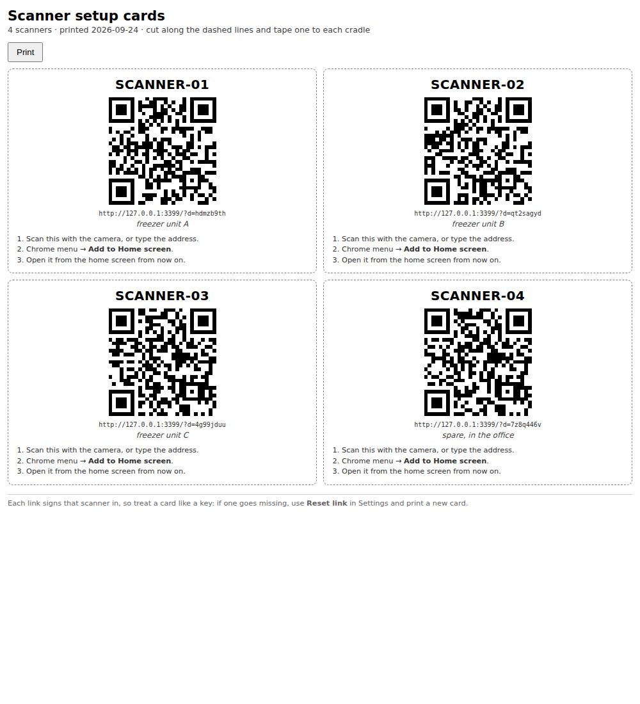

*Print setup cards: one per scanner, each with its own QR code and the three steps to do on the device.*

### Step 9 — Set up the counting screen

**Settings → Scanner screen.**

This is what a counter actually sees. The preview on the right is drawn at the real
pixel size of the device (MC9090 is 240 × 320; MC9200 is 480 × 640) using the scanner's
own stylesheet, so it cannot drift from reality.

- **The questions, in order.** Drag to reorder. The default asks for the pallet, then
  the quantity, then the bin. Counting **location-first** — bin, then what is in it —
  suits a team working a bay at a time. Lot code and expiry sit in the order too, and
  only appear on counts that ask for them (Part 3). A question can never be dragged off
  the list entirely.
- **Show contents after a pallet scan** — shows the SKU and description the ERP has for
  that pallet, so the counter can see they are at the right one.
- **Show the next bin in the aisle** — once a team starts a section, the gun tells them
  which bin comes next (001 → 002 → 003), so nothing is skipped. A bin holding several
  pallets keeps the guide until every tag in it is accounted for — see step 15.
- **The on-screen keyboard never appears by itself**, on any screen — not for the
  quantity, not for a clock-in number. The scanner is the keyboard. The **Keyboard**
  button on the counting screen, and **Type it instead** on the sign-on screen, bring one
  up for whoever has to type.
- **The app asks the device to stay upright.** An installed app gets portrait from the
  manifest; a browser tab only gets it once the app owns the screen. If the handheld
  still rotates, turn auto-rotate off on the device — it is an Android setting, not an
  app one.
- **Take the whole screen** — off unless you turn it on. It makes the app fill the display
  at sign-on, but the browser announces that with a bar carrying the site's address, right
  over the counting screen. **Installing the app** on the handheld (step 8) is the quiet
  way to lose the browser, and the one to prefer.
- **Keep the screen awake** — holds the display on while a team is counting, instead of
  it sleeping between bays.
- **Buzz on a good or bad scan** — useful with ear defenders.
- **Text size: Large** — for gloves and a freezer.
- **Re-key a quantity of at least** — anything this big has to be typed twice. 0 never
  asks twice.
- **Comments step moves on after N seconds** — how long the comments step waits before it
  goes to the next bin by itself. It ships at **2 seconds**: long enough to tap a reason,
  short enough that a counter with nothing to say is not standing there. Use **−** and
  **+** to change it, or type a number. **0** turns the clock off and waits for the
  counter. Typing or tapping a chip always stops the countdown, whatever it is set to.

Press **Save**. Scanners pick the change up within about half a minute, between pallets
— nobody has to sign out.

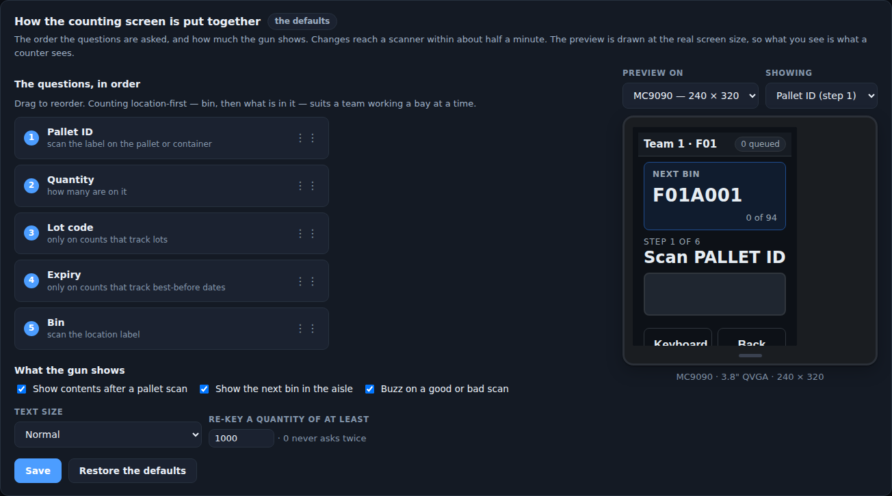

*Settings &rarr; Scanner screen. Drag the questions into the order your site counts in; the preview is the real MC9090 screen size.*

### Step 10 — Set the one-tap reasons

**Settings → Scanners → What the scanners offer.**

Counters wearing gloves in a freezer will not type. These are the buttons they tap
instead, and the reasons a site needs are its own — "Blocked by a trailer" means
something here and nothing anywhere else.

- **Comments** — offered on the last step, after the bin is scanned.
- **Override reasons** — offered when a pallet ID is not on the list and the counter is
  allowed to accept it anyway. **Other** is always offered on the gun as well, whatever
  you configure.
The time the comments step waits before moving on is set with the rest of the counting
screen — see step 9.

Press **Save**; again, scanners pick it up within about half a minute.

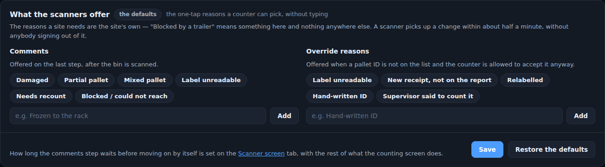

*Settings &rarr; Scanners &rarr; What the scanners offer. These are the buttons a counter taps instead of typing.*

---

## Part 3 — Setting up a count

> Do this the day before, not on the morning of the count.

### Step 11 — Create the count

**Dashboard → Progress → Count session → Start a new count.**

1. **Name** it something you will recognise later: `Q3 2026 wall-to-wall`.
2. **Type**:
   - **Full count** — teams work whole aisles. This is a wall-to-wall.
   - **Cycle count** — a batch of bins per day or week; see Part 6.
3. **Bin list** — attach it here, or upload it later in Settings.
4. **Inventory report** — what the ERP thinks is on hand. **Attach it.** With it you get
   variances, second counts and an ERP adjustment file. Without it the count still
   records what is there, but nothing is compared against anything.
5. Press **Create count**.

The new count inherits the rack drawing the last one used, so the map works immediately.

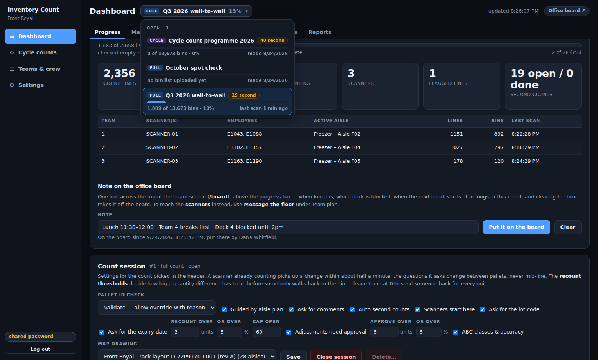

*The count is picked in the header, on every supervisor page. Each row carries its own progress, so two counts are never confused.*

### Step 12 — Check the guided setup

**Settings → Getting started.**

A checklist worked out from what is actually in the database, not from a box somebody
ticked. It tells you what is still missing and takes you straight to the screen that
fixes it. For a full count it wants: the bin list, the inventory report, registered
scanners, the scanner screen, racking blocks, a crew roster and a team plan.

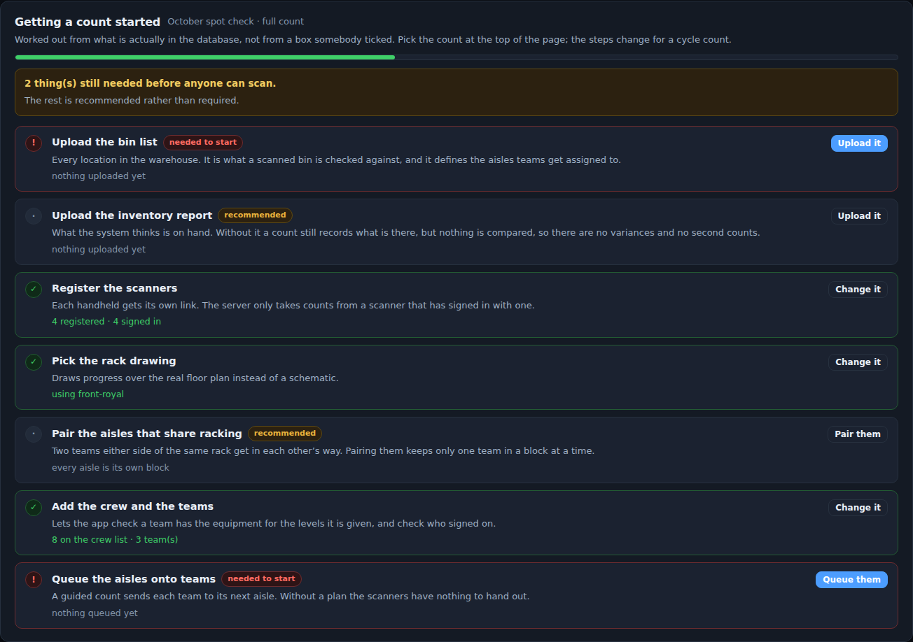

*A new count: two things stop anybody scanning, the rest are recommended. Every step links to the screen that fixes it.*

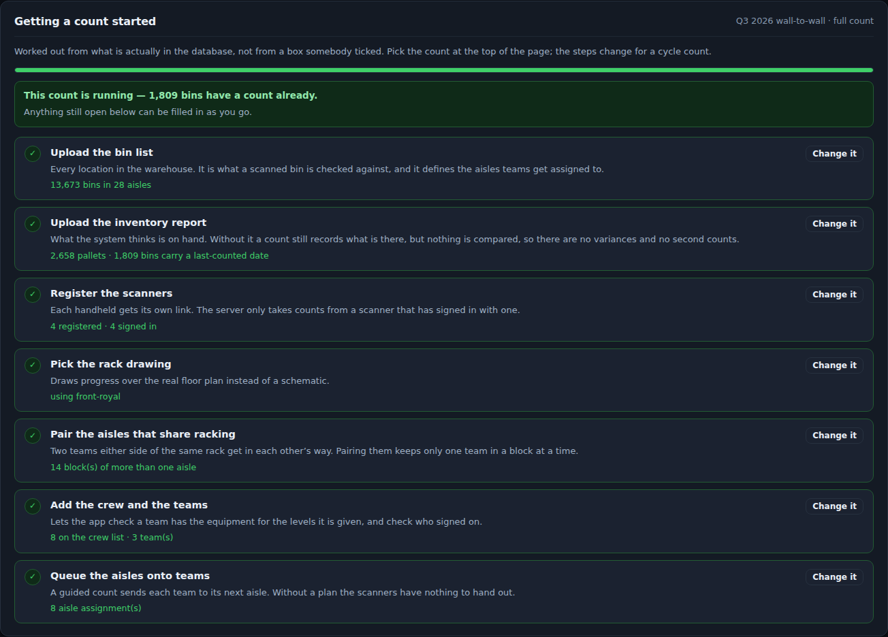

*The same checklist once that count is ready to run: every step green, and the count already running.*

### Step 13 — Set the count's options

**Dashboard → Progress → Count session.** These apply to the count picked in the header,
and a scanner that is already counting picks up a change within about half a minute. The
questions it asks change between pallets, never mid-line.

| Option | What it does | Suggested |
|---|---|---|
| **Pallet ID check** | *Validate — allow override with reason*: an unknown pallet can be accepted with a reason. *Validate — no overrides*: it cannot. *Accept any ID*: no checking, though duplicates are still blocked. | Validate with override |
| **Guided by aisle plan** | Teams are sent to their assigned aisle and warned when they scan a bin outside it. Off means anyone can count anything. | On for a wall-to-wall |
| **Ask for comments** | Adds the optional comments step at the end of each pallet. | On |
| **Auto second counts** | Raises a "go back and look again" task automatically when a line disagrees with the report. | On |
| **Scanners start here** | Every scanner lands on this count at sign-on. They can still pick another. | On, on count day |
| **Ask for the lot code** | Adds a LOT CODE question, checked against the report. Wrong lot is called out at the pallet. | On only if you track lots |
| **Ask for the expiry date** | Adds an EXPIRY question and flags anything already out of date. | On for frozen food |
| **Recount over N units** | A difference smaller than this raises no second count. | 2–5 units |
| **or over N %** | ...or at least this share of the expected quantity. Either threshold is enough. | 5–10 % |
| **Cap open** | Stop raising automatic second counts once this many are open, so the list stays walkable. | 50–100 |
| **Map drawing** | Which rack drawing the map uses. *Schematic* builds one from the bin codes. | Your drawing |

> **Why the thresholds matter.** With both at 0 the app sends somebody back for a
> one-unit difference, and by mid-morning the second-count list is longer than the count.
> Set them once and the list stays short enough that people actually walk it.

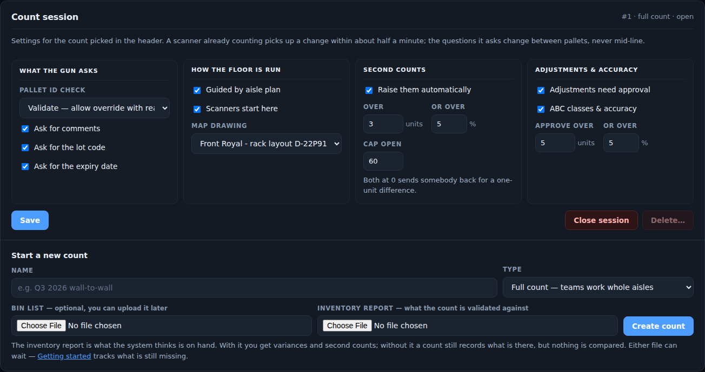

*Dashboard &rarr; Progress &rarr; Count session: every option above, on one card, for the count picked in the header.*

### Step 14 — Give the teams their aisles

**Dashboard → Team plan.**

Either upload a **counting plan** (Settings → Lists & racking → Counting plan: one row
per aisle, in the order each team counts it, with the levels their equipment reaches),
or queue aisles by hand here.

- A team's next aisle starts automatically as soon as the block it belongs to is clear.
  That is what staggers the crews apart.
- A team is not sent where its equipment cannot reach: if the roster says a crew is on
  foot, they will not be queued onto level D. A supervisor can override this.
- Two teams **can** share one aisle as long as their levels do not overlap — a forklift
  crew high and a crew on foot low.

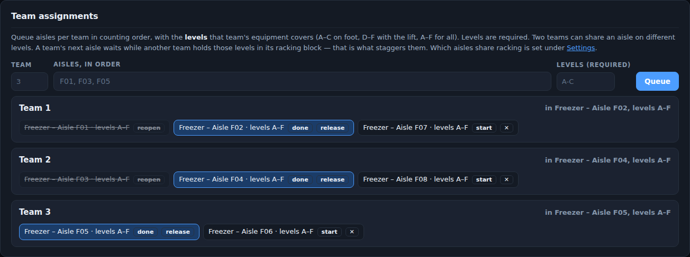

*Dashboard &rarr; Team plan: each team's aisles in counting order — what they are on now, and what is queued behind it.*

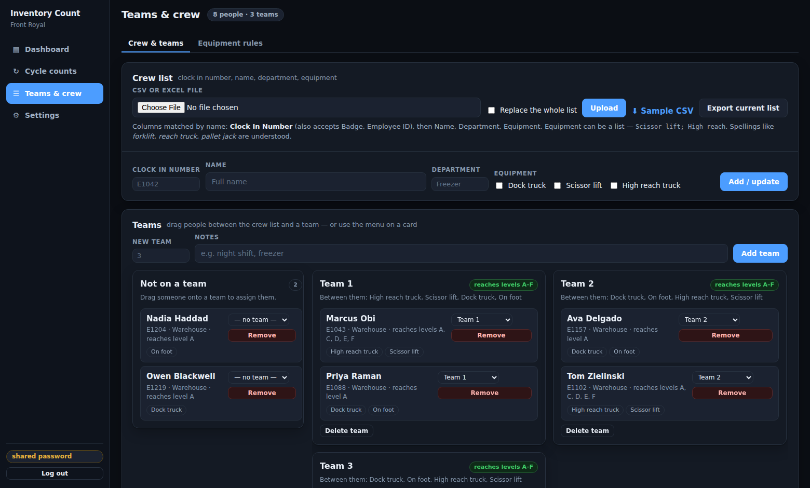

*Teams &amp; crew (`/teams`): the crew list and who is on which team. Equipment is what decides which levels a team can be sent to.*

---

## Part 4 — Counting day

### Step 15 — The counter's procedure (on the handheld)

**Signing on**

1. Open the app from the home screen. It shows the scanner's own name.
2. Pick the **count session** (it lands on the default one).
3. Enter the **team number**.
4. Scan or type every **clock-in number** on the crew, pressing Enter after each. Tap a
   number to remove it.
5. Press **Sign on & load list**. The handheld downloads the bin and pallet lists for
   that count and can work from then on **with no signal**.
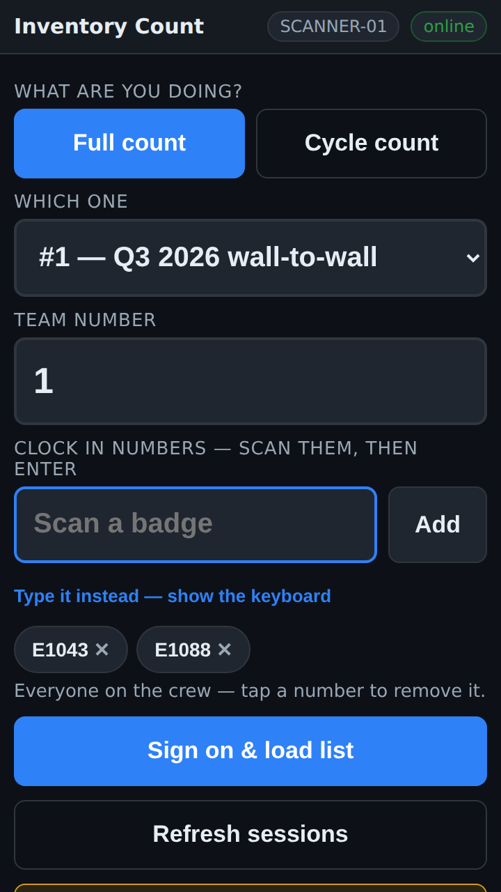

*Signing on: the count, the team number, and every clock-in number on the crew.*

**Counting a pallet**

The gun asks one question per screen, in the order the site configured:

1. **Scan PALLET ID** — it shows what the ERP says is on that pallet.
2. **Enter QUANTITY** — big numbers may have to be typed twice.
3. **Scan LOT CODE** / **Enter EXPIRY** — only on counts that ask for them. A lot that
   disagrees with the report, or a date already past, is called out on the spot.
4. **Scan BIN LOCATION** — it says where that bin is and which face it is on.
5. **Comments** — optional. Tap a reason or type a note; leave it and the gun moves on by
   itself after a couple of seconds (Settings → Scanner screen sets how long). Typing or
   tapping a reason stops the countdown.

The line is saved on the handheld the moment the last question is answered, and pushed
to the server whenever there is a signal. The header shows `online` / `OFFLINE` and how
many lines are still queued.

| | | |
|:--:|:--:|:--:|
| 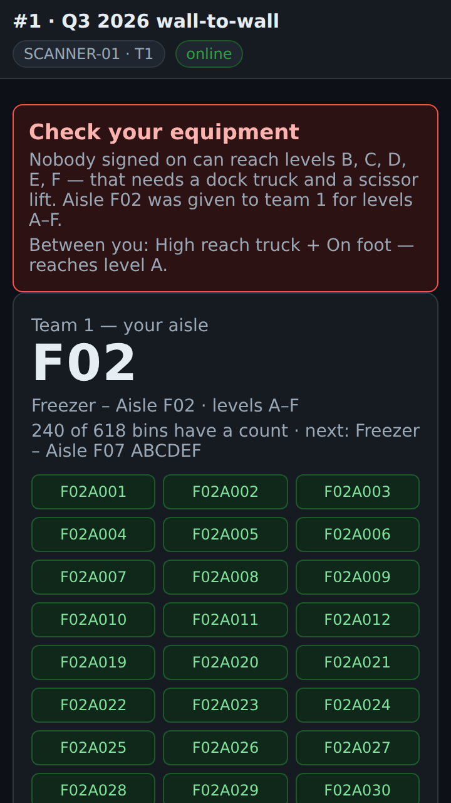<br>**After sign-on** — the aisle this team has been given, what is queued behind it, and any second counts waiting | 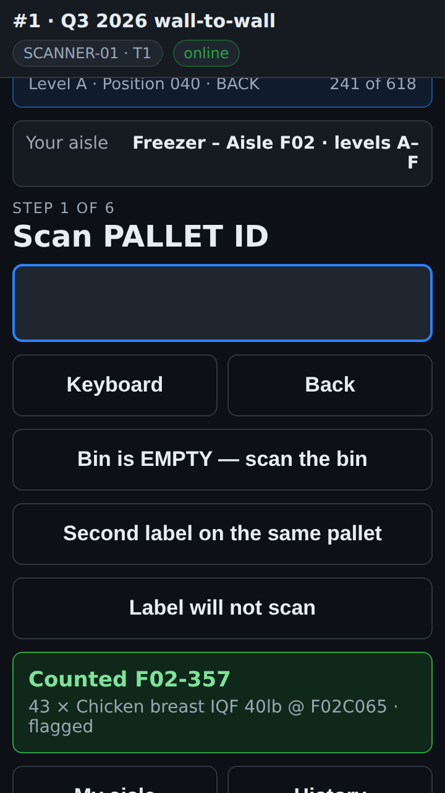<br>**Question 1** — *Next bin* tells the team which bin comes next in the aisle, so nothing gets skipped | 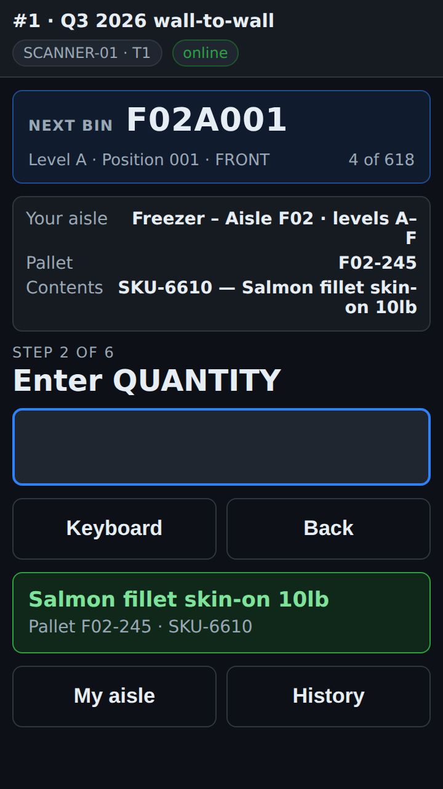<br>**Question 2** — the gun shows what the ERP says is on that pallet, so the counter can see they are at the right one |
| 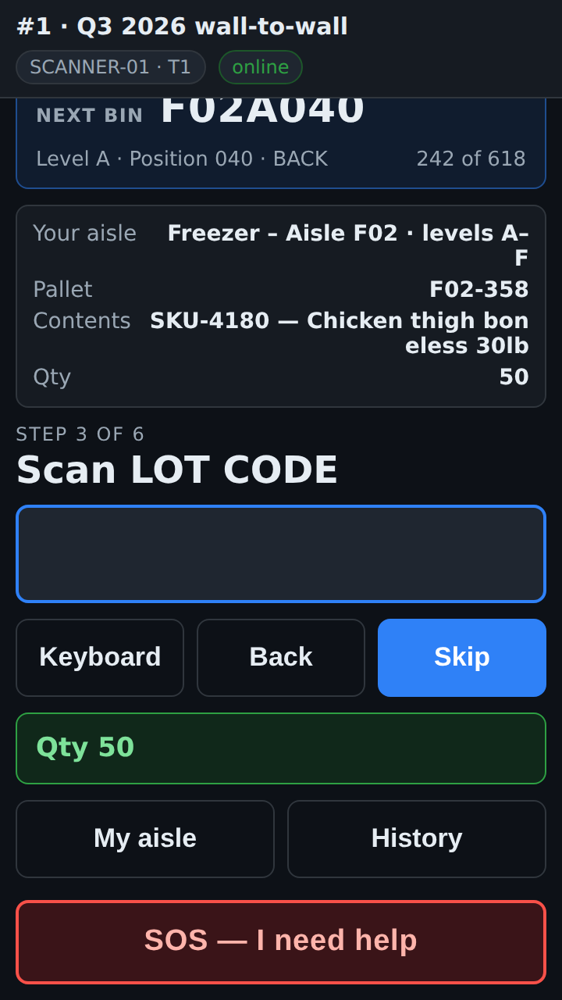<br>**Questions 3 and 4** — only on counts that ask for them. A lot that disagrees with the report is called out here, not a week later in a report | 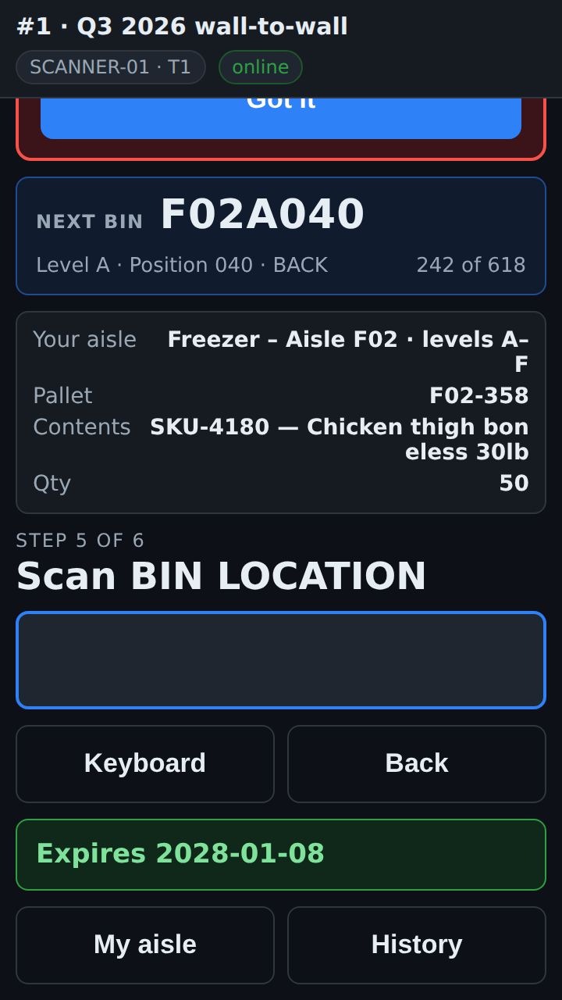<br>**The last required question** — the gun says where that bin is and which face it is on | 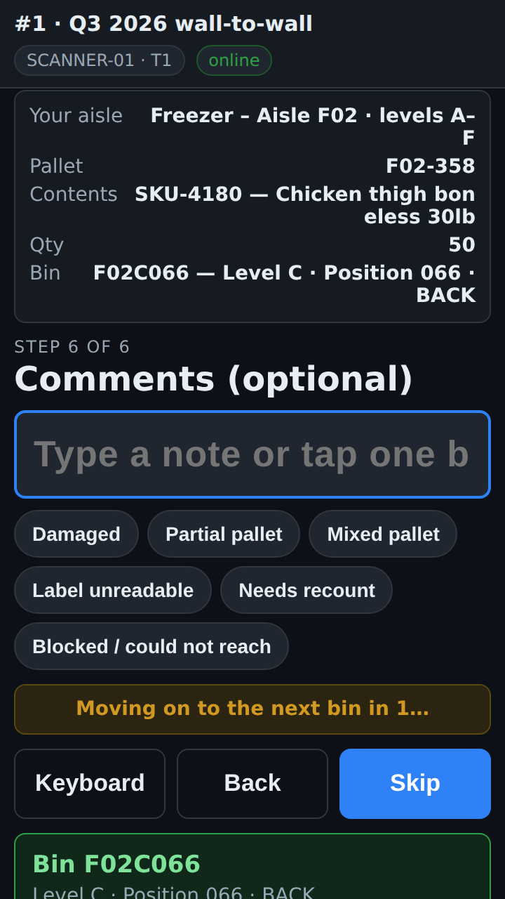<br>**Comments** — tap a reason rather than type one. Left alone, the gun counts down and moves to the next bin by itself |

**A bin with more than one pallet in it**

Four pallet tags in one position is ordinary, and the guide stays put until they are all
counted. After the first tag the banner turns amber and reads **Still in this bin** with
a tally — *2 of 4 tags* — taken from the inventory report, so the team knows what is left
to find before they walk on.

- Scan the next tag in the same bin. The tally goes up; when the report's pallets are all
  accounted for, the banner turns back to **Next bin** on its own.
- If the report is wrong and there is nothing more there, tap **Nothing more here →**.
  The bin is closed and the guide moves on.
- A bin the report lists nothing for stays open after a count, for the same reason — there
  may be a second pallet in it that the ERP has never heard of. Tap **Nothing more here →**
  when it is clear.
- **Bin is EMPTY** closes a bin outright.

The tally counts what the whole team has done, not just this scanner, so two handhelds
working the same aisle never double-walk a bay or leave one half counted.

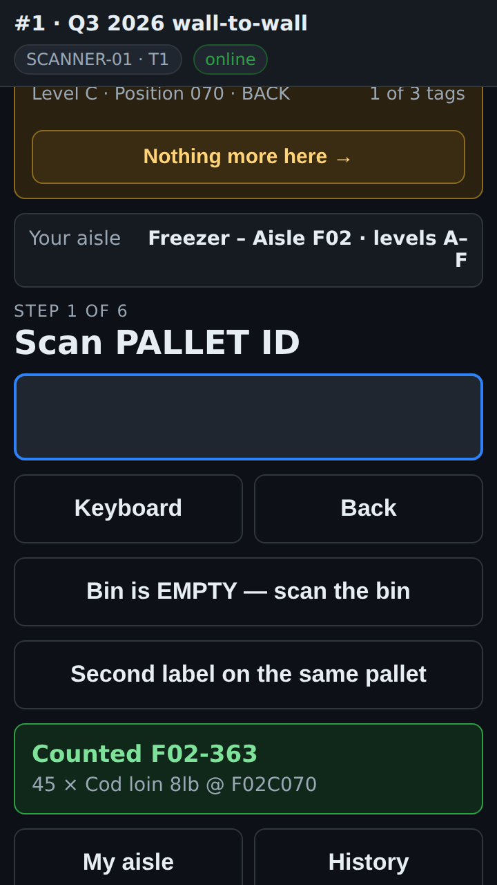

*One tag into a position that holds three: the banner turns amber and stays on the bin
until the other two are counted, or somebody says there is nothing more there.*

**A pallet with two labels on it**

A re-tagged pallet that kept its old label, or one built from two, has two barcodes and is
one pallet. Counting both as pallets doubles the stock; ignoring one leaves a live label
for the next team to find.

1. Count the pallet once, as normal.
2. Tap **Second label on the same pallet**.
3. Scan the other label.

The tag is recorded against the pallet it is stuck to, with no quantity of its own. It
shows on the pallet report as **SECOND LABEL**, the pallet it belongs to says *also tagged*,
nobody is sent back for it, and it never reaches the ERP file as an adjustment. If the
second tag is not on the inventory report, the gun offers the same answer in the
"Pallet not on the list" screen.

| | |
|:--:|:--:|
| 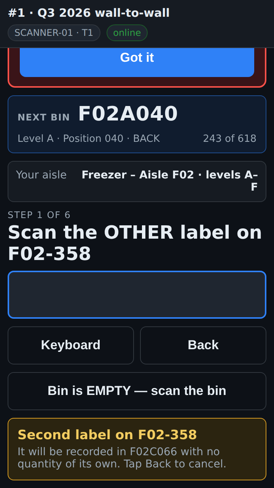<br>The gun asks for the other label and names the pallet it will belong to | 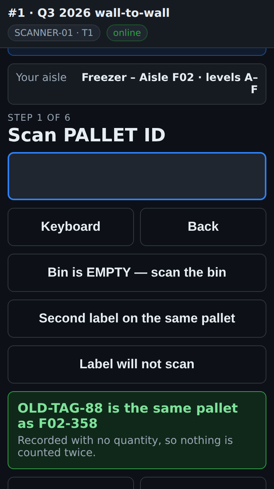<br>Recorded as the same pallet, with no quantity — so the stock is not counted twice |

**A message from the office**

A supervisor can put a line on this team's scanners from the dashboard — *"come to
the dock when you finish this aisle"*, *"leave F12, the forklift is in it"*. It arrives
within about twenty seconds, buzzes, and sits on the screen until somebody taps
**Got it**. An urgent one is red. Tapping Got it tells the dashboard who read it.

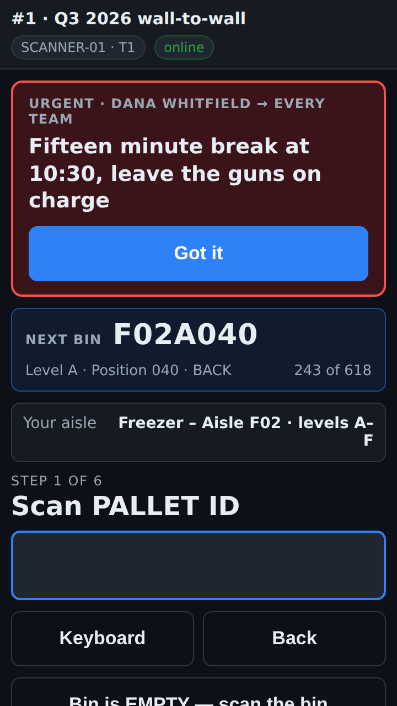

*A message waiting on the counting screen. Nothing else is blocked — the scan box is
still live underneath it.*

**The other buttons**

| Button | When to use it |
|---|---|
| **Keyboard** | Brings the on-screen keyboard up to type an entry by hand — a number pad on the quantity step. It never appears on its own: the scanner is the keyboard, and a keypad covers half the screen. Tap it again to put it away |
| **Back** | Wrong entry — steps back one question |
| **Skip** | Lot, expiry or comments the pallet does not have |
| **Bin is EMPTY** | The bin is genuinely empty. Scan the bin; it is recorded as counted and empty |
| **My aisle** | Back to the assignment screen |
| **History** | The last 50 lines from this scanner. **Void** removes a wrong line from the totals |
| **Aisle complete — next aisle** | Only when the aisle is finished. It frees the racking block and releases the team's next aisle |
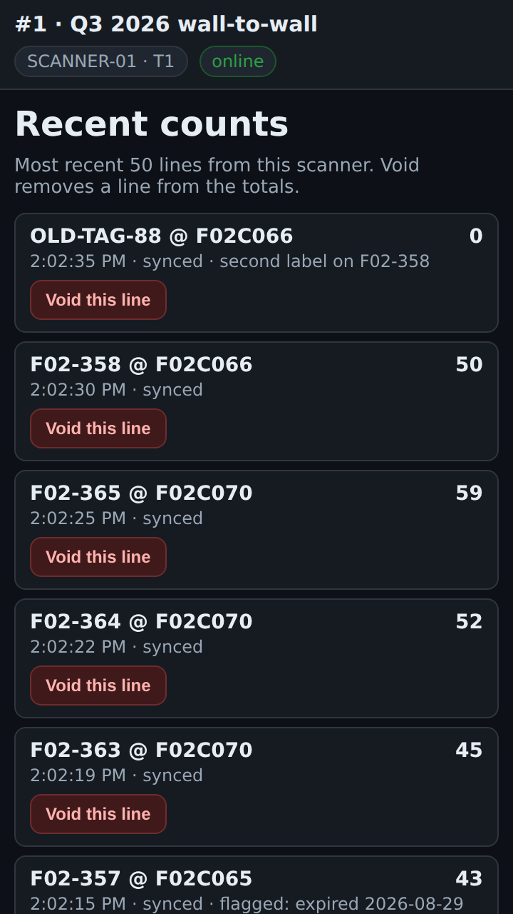

*History: the last 50 lines this scanner counted. **Void** takes a wrong one out of the totals.*

**When the gun asks for a reason**

An unknown pallet, an unknown bin, a pallet already counted, a bin outside the team's
aisle or level — the gun stops and asks why before it will take the line. Pick a reason
from the list (or **Other**), add a note if it helps, and press **Accept and continue**.
The line is saved and flagged for a supervisor. **Cancel — rescan** if it was simply the
wrong barcode.

| | |
|:--:|:--:|
| 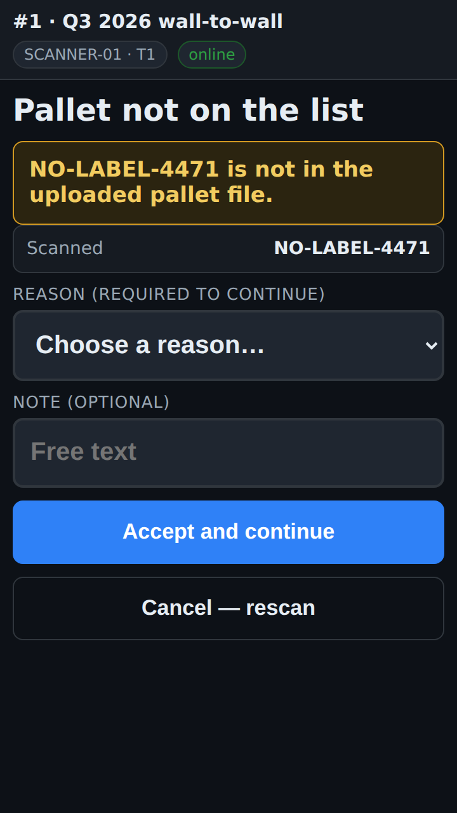<br>A pallet that is not on the inventory report: the gun will not take the line until somebody says why | 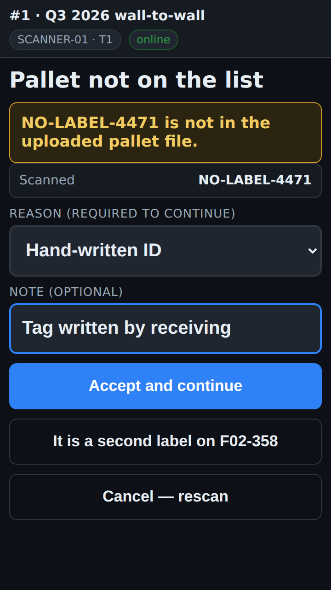<br>The reasons in that list are the ones set in Settings, so they are your site's words. **Other** is always offered |

### Step 16 — The supervisor's procedure (on the dashboard)

**Dashboard**, with the count picked in the header. It refreshes itself every 30
seconds.

- **Progress** — lines, bins counted, pallets, exceptions; and a row per team with what
  they are counting right now and when they last scanned. A team whose last scan was 40
  minutes ago is a team with a problem.

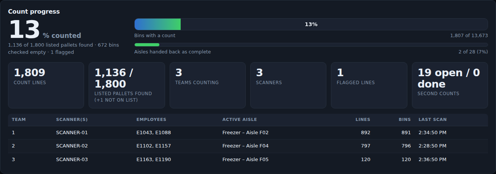

*Dashboard &rarr; Progress. The row per team is the one to watch: what they are on, how much they have done, and when they last scanned.*

- **Map** — the warehouse from above. Aisles are outlined by state: not started, being
  counted now (with the team's number), done. Click an aisle for its bins, who counted
  it and what is flagged.

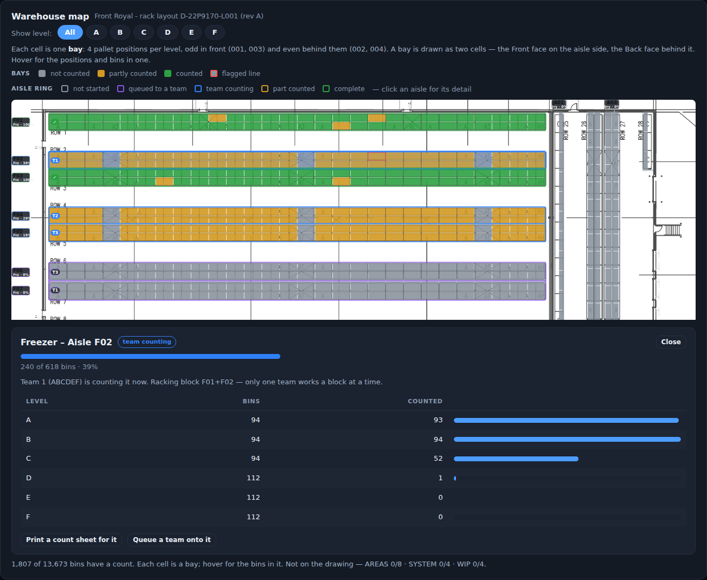

*Dashboard &rarr; Map, with an aisle picked: 240 of 618 bins, level by level, and which team holds that racking block.*

- **Team plan** — who is where, queue the next aisles, hand an aisle back. It also holds
  **Message the floor**: type a line, pick one team or all of them, tick **Urgent** if it
  cannot wait. The table underneath shows who has read each one — *2 of 3* means a
  scanner has not seen it yet, so do not assume. **Take it down** removes a message from
  the handhelds without losing what was said.

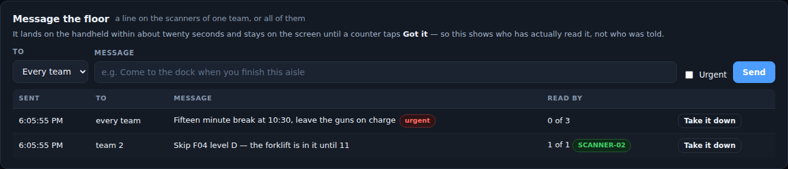

*Message the floor, under Team plan. "1 of 1" with the scanner named is a message that
landed; "0 of 3" is one nobody has looked at yet.*
- **Second counts** — see step 17.
- **Reports** — see step 18.

**Watch for, during the count:**

- Exceptions climbing on one team — usually a training problem, worth a radio call.
- A team stopped for a long time — dead battery, or stuck behind a trailer.
- An aisle nobody has started by mid-afternoon.

### Step 17 — The office board

Put `/board` on the office TV. It needs no sign-in and is read-only: the percentage
counted, bins with a count, aisles handed back as complete, a row per team with what they
are on, and every aisle as a tile coloured by state. It deliberately shows no pallet IDs
and no clock-in numbers.

It follows the newest open count on its own. To pin it to a particular one, add the
session to the address: `/board?session=12`.

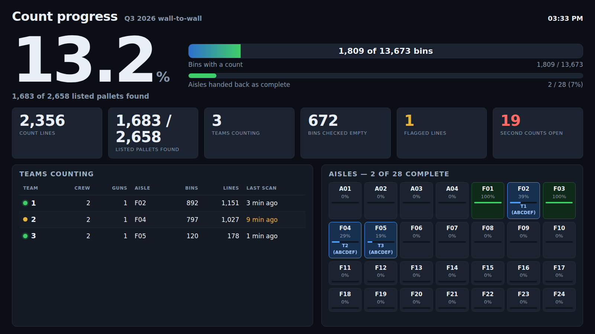

*The office board, for the TV: percentage counted, aisles complete, every team, and every aisle coloured by state.*

---

## Part 5 — Finishing a count

### Step 18 — Work the second counts

**Dashboard → Second counts.**

A second count is a bin somebody has to walk back to. They are raised automatically when
a line disagrees with the inventory report (subject to your thresholds), or by a
supervisor.

- **Raise from all variances now** goes through everything that currently disagrees and raises the
  tasks. It deliberately leaves alone pallets in aisles nobody has counted yet — mid-count
  those are not missing, just not reached — and tells you how many it skipped and why.
- The tasks appear on the handhelds: a team taps **Start second counts** on the
  assignment screen, counts the bin again, and presses **Bin done — nothing more here**.
- A second count that agrees with the first settles the line.

Work these down before you close the count. A count closed with open second counts is a
count with known-wrong numbers in it.

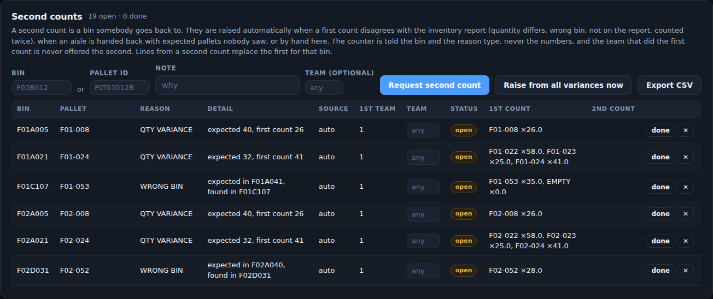

*Dashboard &rarr; Second counts. The counter is told the bin and the reason type, never the numbers — and never the team that counted it first.*

### Step 19 — Read the reports

**Dashboard → Reports.**

- **Pallet report** — one row per pallet: expected vs counted, which bin the ERP expected
  and where it was actually found, and a status you can act on: `MATCH`, `QTY VARIANCE`,
  `WRONG BIN`, `MISSING`, `NOT IN MASTER`, `COUNTED TWICE`. Lot and expiry get their own
  columns, because the right count of the wrong lot is still wrong. **Only exceptions**
  narrows it to what needs attention — including a wrong lot or a date about to run out,
  even when the quantity is right.

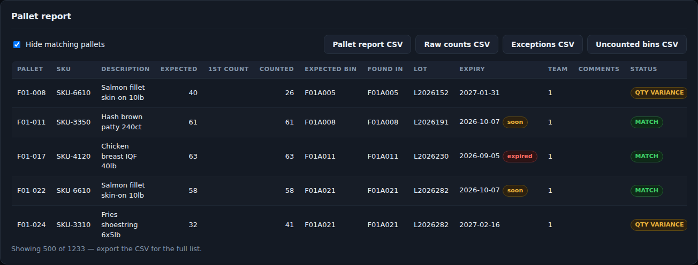

*The pallet report with **Hide matching pallets** ticked: a short pallet, an expired date, one expiring soon. This is the list to work down.*

- **Find a lot** — after a recall notice: type part of a lot code and get every case of
  it, both where it was actually counted and where the report expected it, so a pallet
  nobody found still shows up.

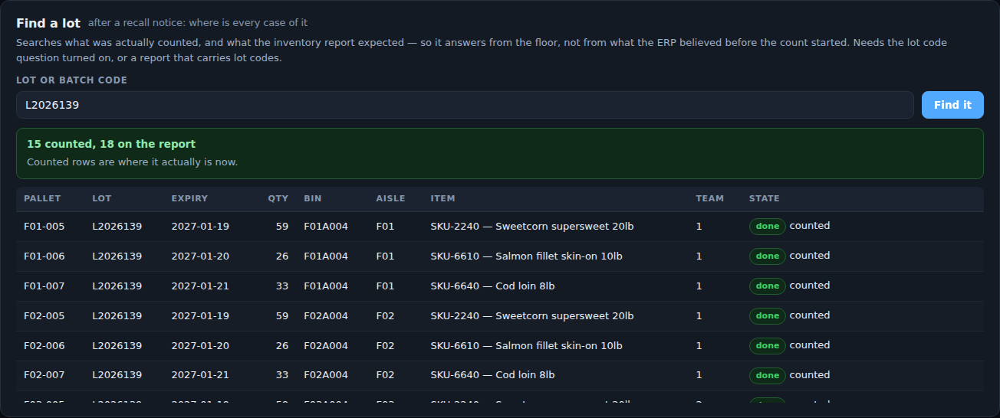

*A recall: five cases of the lot found on the floor, and a sixth the report still expects in an aisle nobody has reached.*

- **Count sheets** — printable paper sheets by aisle and level, for a dead battery or an
  auditor.
- **Exports** — the full count (every line as scanned), exceptions only, uncounted bins,
  the pallet report, second counts.

### Step 20 — Send it to the ERP

**Settings → ERP & backups → Send to the ERP.**

1. Choose the **layout** that matches your ERP. Column names and which rows are included
   are configuration — add a layout rather than editing the file by hand afterwards.
2. **Preview** and read the first rows.
3. **Download CSV** and import it into the ERP.

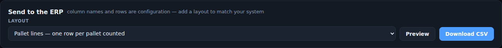

*Settings &rarr; ERP &amp; backups. Preview before you download; the layout decides the column names and which rows are included.*

### Step 21 — Close the count

**Dashboard → Progress → Count session → Close session.** A closed count is read-only:
scanners can no longer post lines to it, and its reports stay available for ever.

**Delete…** is separate and deliberately harder: the count must be closed first, you have
to type its name, and a backup is taken before anything is removed. Everything counted
against it goes with it. Close counts; delete only the ones created by mistake.

### Step 22 — Backups and the log

**Settings → ERP & backups → Backups & log.**

- **Back up now** before and after anything large — an ERP import, a bulk re-upload, a
  deletion. The app also backs itself up daily and keeps the last 14.
- **The log** records every supervisor action: who signed in, who uploaded what, who
  overrode what, who raised second counts, who searched for a lot. **Export the log** for
  an auditor.

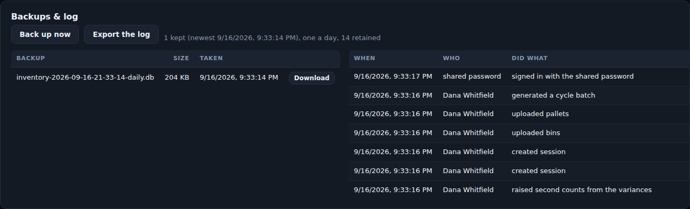

*Backups on the left, the log on the right. Both export.*

---

## Part 6 — The cycle-count programme

A cycle count is the same app with a different rhythm: instead of stopping the warehouse,
a handful of bins are counted every day.

1. **Create one count session of type "Cycle count"** and keep using it. It runs for the
   year — do not create a new one each week, or you lose the history of when each bin was
   last counted.
2. Upload the bin list and the inventory report. If your ERP export has a
   *last physical inventory date* column it is read automatically, and the programme
   picks up where the ERP left off.
3. Go to **`/cycle` → Today's bins**. Choose:
   - **how many bins** in the batch,
   - **which bins**: *longest since it was counted*, *never counted*, or a *random sample*,
   - optionally a **zone, aisle or levels** to stay inside.
4. **Preview**, then **Generate**. The bins appear on the handhelds as tasks.

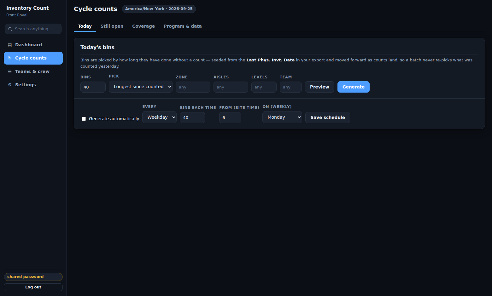

*`/cycle` &rarr; Today's bins: how many, which ones, and optionally the zone or aisles to stay inside.*

5. Counters pick **Cycle count** at sign-on and work the list. Each bin is counted as it
   stands — it is *the* count for that bin, not a second opinion.
6. **Coverage** shows how much of the warehouse has been counted in the period, and what
   has not been touched. Export it for the auditors.
7. A **schedule** generates the batch automatically each day or week so nobody has to
   remember.

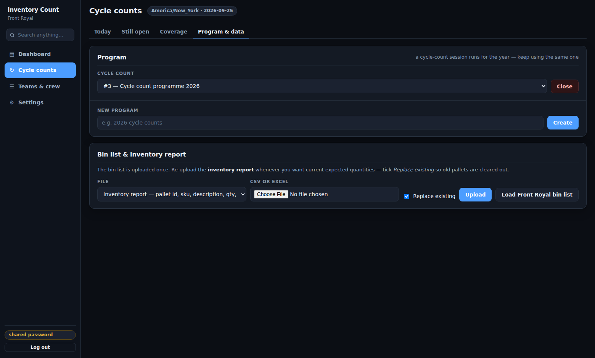

*The batches that have been generated, and the programme's own bin list and inventory report.*

---

## Part 7 — When something goes wrong

| What you see | What it means | What to do |
|---|---|---|
| Gun: *"this scanner is no longer authorised"* | Its link was reset or the scanner was removed | Settings → Scanners → **Reset link**, open the new link on the device |
| Gun: *"Offline and no list cached for this session"* | The handheld has never downloaded this count | Carry it into Wi-Fi once and sign on again |
| Gun says `OFFLINE` with lines queued | Normal in a dead spot | Nothing. They upload when it gets a signal. Do not wipe the device |
| A scan does nothing | DataWedge is not sending a suffix | DataWedge → Basic data formatting → send **ENTER** (or TAB) |
| A keypad covers the screen | Somebody left the **Keyboard** button on | Tap **Keyboard** again. It is off by default and never comes up by itself |
| The screen keeps rotating | Auto-rotate is on, and a browser tab cannot lock the orientation | Install the app (it asks for portrait), or turn auto-rotate off on the handheld |
| A team says they never got a message | Look at **Read by** on the dashboard | It shows which scanners have tapped Got it. A scanner that is offline gets it on its next sync |
| A scan seems to land on a button instead of the box | Something else took the focus | Nothing — the app puts the keystrokes in the box and carries on. Tell us if it still happens |
| The guide is a bin or two ahead of the team | The bins hold several pallets each | Fixed: the guide now stays on a bin until its tags are counted. Check **Show the next bin in the aisle** is on |
| A scan opens the address bar and the text goes into it | The page has lost the keyboard — either the scanner sends a TAB that used to move focus out of the page, or somebody tapped the browser's own bar | Fixed: TAB now ends a scan like ENTER and the focus never leaves the box. If it ever happens again the app shows a red **Tap here to scan** bar — one tap puts it right |
| A bar with the web address appears on every scan | The app is being run as a page in Chrome rather than installed | Install it: Chrome menu → **Install app**, or the **Install on this scanner** button on the sign-on screen, then open it from the home-screen icon |
| The browser's address bar is in the way | Same thing — the app is not installed | As above. For a device that should run nothing else, use Zebra's Enterprise Home Screen |
| Gun: *"Team N is counting aisle X"* | Another team holds that racking block | Wait, or hand the other aisle back first |
| Second-count list is enormous | Thresholds are at 0 | Set **Recount over** and **or over %**, and a **cap** (Part 3, step 13) |
| The map is a schematic, not your drawing | No rack drawing on this count | Dashboard → Progress → Count session → **Map drawing** |
| A reason code edit "did not reach" a gun | It takes up to about half a minute, and only lands between pallets | Wait for the counter to finish the pallet they are on |
| Can nobody sign in? | All logins lost | The shared password turns itself back on when there are no admin accounts; the superadmin login is recreated at start-up |
| Numbers look wrong after an ERP import | The inventory report moved on | Re-upload it with **Replace what is there**, then re-read the pallet report |

---

## Part 8 — Capacity: what the system will take

Measured against the real Front Royal bin list (13,673 bins), with fifteen teams and
thirty scanners counting simultaneously while the office board and two dashboards
refreshed over the top of them:

| | |
|---|---|
| Scanners posting at once | 30, no errors, nothing lost, nothing double-counted |
| Throughput | ~1,200–1,600 count lines per second |
| A scan, under that full load | 75 ms median, 205 ms at the 95th percentile |
| Office board / dashboard refresh | ~140 ms median while all thirty guns were writing |
| Whole master list to a handheld | ~0.4 s each, thirty pulling simultaneously |

Thirty scanners is comfortably inside what the server will take — real counters scan a
pallet every ten to twenty seconds, which is a small fraction of the load above. The
constraints that matter in practice are warehouse Wi-Fi coverage and battery life, not
the server.

This is checked automatically: `node tests/run-all.mjs load-15-teams` runs the whole
scenario and fails if anything is lost, doubled, mis-attributed, or if two teams ever end
up in one racking block.

---

## Appendix A — File column reference

Files may be CSV, TSV or Excel (`.xlsx`/`.xlsm`). Column names are matched loosely —
case, spaces and punctuation are ignored — so most ERP exports load unchanged. Each
upload card shows exactly which columns it recognised.

**Bin list** — the only required column is the location.

| What | Accepted column names |
|---|---|
| Bin (required) | location, loc, bin, bin location, location code, slot, code, warehouse location |
| Aisle | aisle, row, aisle no, aisle number — *derived from the bin code if absent* |
| Zone | zone, area, section, region, warehouse |
| Level | level, levels, tier, shelf — *derived from the bin code if absent* |
| Description | description, desc, name |
| Last counted | last phys invt date, last counted, last count date, last inventory date |

**Inventory report** — the only required column is the pallet ID.

| What | Accepted column names |
|---|---|
| Pallet (required) | pallet id, pallet, container, container id, LPN, licence plate, pallet no, id, tag |
| SKU | sku, item, item number, item code, part number, product, material, stock code |
| Description | description, desc, item description, product name |
| Quantity | qty, quantity, on hand, on hand qty, expected, expected qty, system qty, cases, units |
| Unit | uom, unit, unit of measure, um |
| Location | *same names as the bin list* |
| Lot | lot, lot code, lot no, lot number, batch, batch code, batch number |
| Expiry | expiry, expiry date, expiration, expires, best before, use by, shelf life date |

**Counting plan** — one row per aisle, in the order the team counts it.

| What | Accepted column names |
|---|---|
| Team | team, team number, crew, group |
| Aisle | aisle, row, aisle no |
| Levels | level, levels, tier, shelf — e.g. `A-C`, `D-F`, `A-F` |

Dates are read in either order — `2027-03-15` and `03/15/2027` both work.

---

## Appendix B — Server settings reference

| Setting | Default | What it does |
|---|---|---|
| `ADMIN_PASSWORD` | `changeme` | The shared supervisor password. Change it |
| `SHARED_PASSWORD_LOGIN` | `on` | `off` requires named logins — ignored if no admin account exists, so it cannot lock you out |
| `SUPERADMIN_USER` | — | Username of the permanent admin, created at start-up |
| `SUPERADMIN_NAME` | — | That person's name, as it appears in the log |
| `SUPERADMIN_PASSWORD` | falls back to `ADMIN_PASSWORD` | Must be 8+ characters and not `changeme` |
| `SCANNER_AUTH` | on | `off` lets anything on the network post counts. Leave it on |
| `DB_PATH` | `data/inventory.db` | Put this on a persistent volume |
| `BACKUP_DIR` | `data/backups` | Where the daily backups go |
| `BACKUP_KEEP` | 14 | How many backups to keep |
| `SITE_TIMEZONE` | `America/New_York` | Dates on reports and cycle-count due dates |
| `PORT` / `HOST` | 3000 / 0.0.0.0 | Where the server listens |
| `MAX_UPLOAD_MB` | 64 | Largest file an upload will accept |
