# Standard Operating Procedure — Full Harvest Inventory

**Site:** Front Royal, VA cold storage  **Scanners:** Zebra MC9000-series handhelds

This is the working manual. It assumes you have never opened the app before and takes
you from an empty deployment through to a finished count sent to the ERP. Read Part 1
and Part 2 once, when the app is first set up. Parts 3 to 5 are what you do for every
count. Part 6 is the cycle-count programme, Part 7 is what to do when something goes
wrong.

> **About the screenshots.** Every picture below is the real application, photographed
> against a count part-way through a morning: the actual Front Royal bin list, three
> teams, four scanners, two aisles finished and three being counted. The names, pallet
> IDs and lot codes are made up. If a screen changes, `npm run docs` rebuilds every
> picture in this manual from scratch and re-prints
> **[SOP.pdf](SOP.pdf)** — the same manual typeset for paper.

---

## Contents

- [Part 0 — What the system is](#part-0--what-the-system-is)
- [Part 1 — First-time setup: getting in](#part-1--first-time-setup-getting-in)
- [Part 2 — First-time setup: the warehouse](#part-2--first-time-setup-the-warehouse)
- [Part 3 — Setting up a count](#part-3--setting-up-a-count)
- [Part 4 — Counting day](#part-4--counting-day)
- [Part 5 — Finishing a count](#part-5--finishing-a-count)
- [Part 6 — The cycle-count programme](#part-6--the-cycle-count-programme)
- [Part 7 — When something goes wrong](#part-7--when-something-goes-wrong)
- [Part 8 — Capacity: what the system will take](#part-8--capacity-what-the-system-will-take)
- [Appendix A — File column reference](#appendix-a--file-column-reference)
- [Appendix B — Server settings reference](#appendix-b--server-settings-reference)

---

## Part 0 — What the system is

One server, four screens. Everything below happens in a browser; nothing is installed
on a PC.

| Screen | Address | Who uses it | Sign-in |
|---|---|---|---|
| **Scanner** | its own link, `/?d=…` | Counters, on the handhelds | Each scanner has its own link; the bare address opens the supervisor sign-in |
| **Dashboard** | `/admin` | Supervisor running the count — the live view of the count in the picker | Supervisor login |
| **Full Counts** | `/full` | Every wall-to-wall on the site: open and closed, how far each got, which one the scanners land on; start a new one; what a count still needs | Supervisor login (the Dashboard's access) |
| **Settings** | `/settings` | Whoever sets the count up | Supervisor login |
| **Office board** | `/board` | Anyone — put it on the office TV | **None.** Read-only |
| **Cycle counts** | `/cycle` | Whoever runs the daily programme | Supervisor login |
| **User guide** | `/guide` | Anyone with a login — new starters first | Supervisor login, any access |

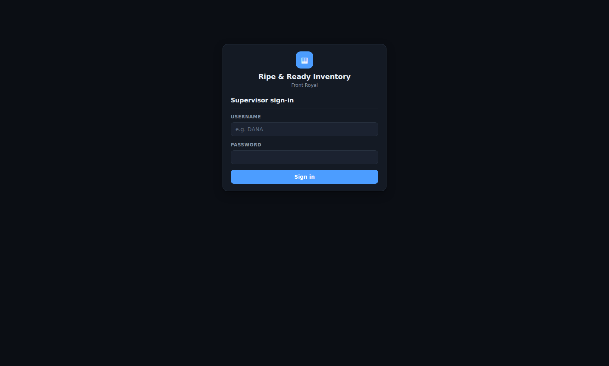

*Every supervisor page opens on the same sign-in. Signing in on one carries to all four.*

**What the system does.** It holds a list of every bin in the warehouse and a list of
what the ERP thinks is in them. Counters scan pallets into bins on the handhelds. The
app compares the two, tells you where they disagree, sends people back to look again
where it matters, and produces an adjustment file for the ERP.

**What a "count session" is.** One count — a wall-to-wall in October, a spot check of
the freezer, the year's cycle-count programme. Everything (bin list, inventory report,
team assignments, every scanned line) belongs to a session. You can have several open
at once; scanners choose which one they are working on at sign-on.

**Two words you need.**
- **Aisle** — a rack run, e.g. `F01`. Teams are assigned whole aisles.
- **Block** — aisles that back onto each other share a **block**, and only one team may
  be active in a block at a time, so two crews never work opposite faces of the same
  racking. Pairing aisles into blocks is a one-time job (Part 2, step 7).

**Bin codes.** A code like `F01A001` reads as zone `F`, aisle `01`, level `A`,
position `001`. Four positions per bay; odd positions are the front face, even are the
back. The app derives the aisle from the code when your file has no aisle column.

---

## Part 1 — First-time setup: getting in

> Do this once, with whoever administers the server. Allow 20 minutes.

### Step 1 — Deploy the server

**On Railway (how this site runs).** Deploy the repository; `railway.json` builds the
Dockerfile, and the app listens on the port Railway gives it. Attach a **persistent
volume** and point `DB_PATH` at it — see step 2 — or the database is wiped on every
redeploy.

**Your own address (e.g. `fullharvest-inventory.app`).** Railway gives the service a
`*.up.railway.app` address; a name of your own goes on top of it. In Railway: the service
→ **Settings → Networking → Custom Domain**, type the name, and Railway shows the DNS
record to add at the registrar. Then at the registrar:

- a **subdomain** such as `count.fullharvest-inventory.app` takes a plain **CNAME** to the
  target Railway shows — the simplest, and what we suggest for the scanners;
- the **bare name** `fullharvest-inventory.app` cannot carry a CNAME under ordinary DNS,
  so it needs a registrar or DNS host that offers *CNAME flattening* / an *ALIAS* record
  (Cloudflare, for one), or point the bare name at the subdomain with a redirect.

Railway issues the HTTPS certificate itself within a few minutes. A `.app` name is
HTTPS-only by design (the whole top-level domain is on the browsers' preload list), which
the app needs anyway for the scanners' offline mode. Once the new address answers, open
**Settings → Scanner screen** on it: the scanner links shown there carry the new address,
and each handheld is opened from its new link and installed again — an app installed from
the old address is a different app to the device. Supervisors just use the new address.

**On a PC inside the warehouse (no internet needed).**

```bash
SUPERADMIN_PASSWORD='pick-something' docker compose up -d
```

Then give that PC a static IP or a DHCP reservation, because the handhelds are pointed
at its address and that address must never change. Scanners reach it at
`http://<that-ip>:3000/`.

### Step 2 — Set the server settings

On Railway these are **Variables**; on a PC they go in `docker-compose.yml`. Set these
before anybody signs in:

| Setting | Set it to | Why |
|---|---|---|
| `DB_PATH` | A path on the persistent volume, e.g. `/data/inventory.db` | Otherwise a redeploy loses the count |
| `SITE_TIMEZONE` | `America/New_York` | Dates on reports and cycle-count due dates |
| `SUPERADMIN_USER` | e.g. `sitelead` (defaults to `ADMIN`) | The one admin login the site starts with, made at start-up |
| `SUPERADMIN_NAME` | That person's name, as it should appear in the log | Shown against everything they do |
| `SUPERADMIN_PASSWORD` | A strong password, at least 8 characters | Its password; `ADMIN_PASSWORD` is read as the same thing |

The superadmin account is created when the server starts and cannot be deleted from
inside the app, so you can never lock yourself out. The app refuses to create it if the
password would be the default `changeme` or is shorter than 8 characters — it will say
so in the start-up log and carry on without it.

> **Never put a password in the repository.** These are server settings for a reason:
> anything committed to git is readable by anyone with access to the code, for ever.

### Step 3 — Sign in for the first time

Open `/admin`. The page is a plain sign-in until you are in. Sign in as the superadmin —
its username and the password you set in Railway (a password typed with no username is
taken as the superadmin's). There is no shared password.

### Step 4 — Create a login for each supervisor

**Settings → Advanced → Supervisor logins.**

1. Type the person's **name**, a **username** and choose their **role**:
   - **Admin** — everything, Settings and logins included.
   - **Supervisor** — everything a supervisor can: every page and function except Settings.
   - **Inventory control** — the count only: Dashboard, Testing Suite, approving adjustments,
     downloads. Nothing on teams, warehouse jobs or cycle counts.
   - **Count supervisor** — runs the floor: Dashboard, Teams & crew, messages, SOS, queueing
     aisles, downloads, Testing Suite.
   - **Warehouse jobs** — Front bins, Not in Location, Cycle counts, downloads, Testing Suite.
   - **Cycle counter** — Cycle counts and the Testing Suite only.
   The role can be changed on the person's row at any time, and **May use** fine-tunes it
   (which shows the role as **Custom**).
2. Press **Add**. The app shows a **starter password** once — something like
   `winter-4k2p`. Write it down and hand it to them; it is not shown again.
3. The first time they sign in they are made to choose their own password before they
   can do anything. Nobody but them knows it after that.

If somebody forgets their password, an admin presses **Reset password** on their row and
gives them the new starter password. The same forced change happens again.

**Roles.** Each row has a **Role**: *Admin* (everything, Settings included), *Supervisor*
(every page and function but Settings), *Inventory control* (the Dashboard, the Testing Suite,
approving adjustments and downloads — nothing to do with teams, warehouse jobs or cycle counts),
*Floor lead* (the Dashboard and Teams & crew, messages, SOS and aisles), *Warehouse jobs* (Front
bins and Not in Location), *Cycle counts*, and *Custom* for a list of your own. Picking a role sets
the list; changing the list makes it Custom.

**What each login may use.** Every supervisor row has a **May use** column: tick the
**pages** they may open (Dashboard, Cycle counts, Front bins, Not in Location, Teams &
crew, Testing Suite) and what they **can also** do (approve adjustments, message the floor,
answer an SOS, queue aisles and raise second counts, downloads and printouts). A new login
may use everything a supervisor can until you untick something; a tick takes effect on
their very next click, with no sign-out needed. The sidebar shows them only the pages on
their list, and the buttons they may not press are greyed out and say why. **Settings** —
Advanced included — is for admins only, whatever the list says; supervisors change their
own password from **Change my password** at the foot of the sidebar.

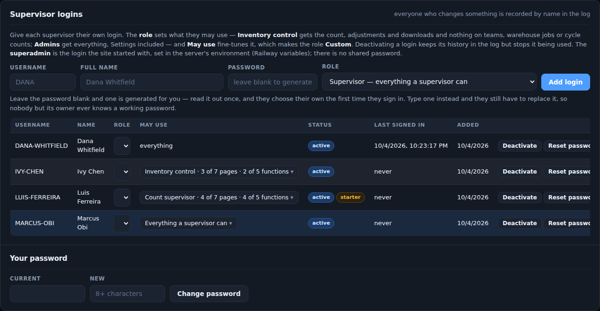

*Settings &rarr; Advanced. Each person has their own login, a role and their own password; the starter password is shown once.*

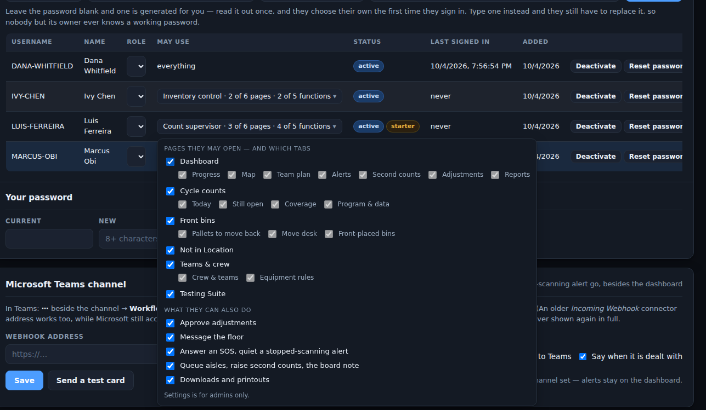

*May use, opened on one login: the pages, each page's tabs, and the functions — a tick takes effect on their next click.*

**What an admin sees in the count picker.** An admin's picker lists every count on the site,
other people's practice counts from the Testing Suite included, each tagged *practice · NAME*; a
supervisor sees the real counts and only their own practice count.

**A procedure per role.** Each profile has a short SOP of its own under `docs/roles/` (and as a
PDF beside it): Admin, Supervisor, Inventory control, Count supervisor, Warehouse jobs, Cycle
counter, and one for the counters on the handhelds. Hand a new login the right one; this manual
is the reference behind them.

### Step 5 — Change the superadmin's password

Sign in as the superadmin, press **Change my password** at the foot of the sidebar, and
pick one only you know. The environment variable no longer opens the account after that;
a restart never puts the old password back.

### Step 6 — Upload the bin list

**Settings → Lists & racking → Bin list.**

This is every location in the warehouse. It is what a scanned bin is checked against,
and it is what defines the aisles teams get assigned to. **Upload this before anything
else.**

- **No bin list ships with the app.** A new installation starts empty, and the site uploads
  its own: the ERP's bin export, as it comes. For Front Royal that is racks F01–F24 and
  A01–A04 plus WIP, the NIL bin and other areas; staging lanes and dock doors are counted
  manually and are left out on upload.
- Choose the CSV or Excel file. Column names are matched loosely — see
  [Appendix A](#appendix-a--file-column-reference). The only column you must have is the
  bin location.
- **Replace what is there** wipes the existing list first. Leave it unticked to add to
  it.

The card reports what it read: how many bins, how many aisles, and anything it skipped.

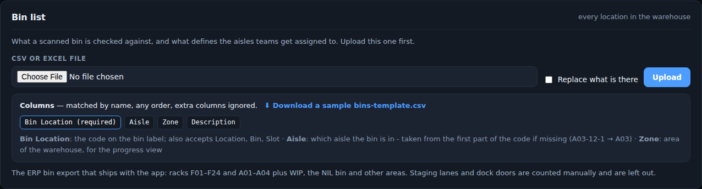

*Settings &rarr; Lists &amp; racking. Each list has its own card, and each reports exactly what it read.*

### Step 7 — Pair the aisles into racking blocks

**Settings → Lists & racking → Aisles & racking blocks.**

Aisles that back onto each other must share a block so two teams are never working the
same racking from both sides.

1. Set **Aisles per block** to 2 (most double-deep racking).
2. **Skip first** is 1 if the first aisle has a wall behind it rather than another aisle.
3. Press **Auto-pair aisles**, then read the table and correct anything that is wrong by
   typing a block name straight onto a row.

If you have uploaded a rack drawing, **Pair from drawing** uses it instead — more
reliable than counting aisles off by hand.

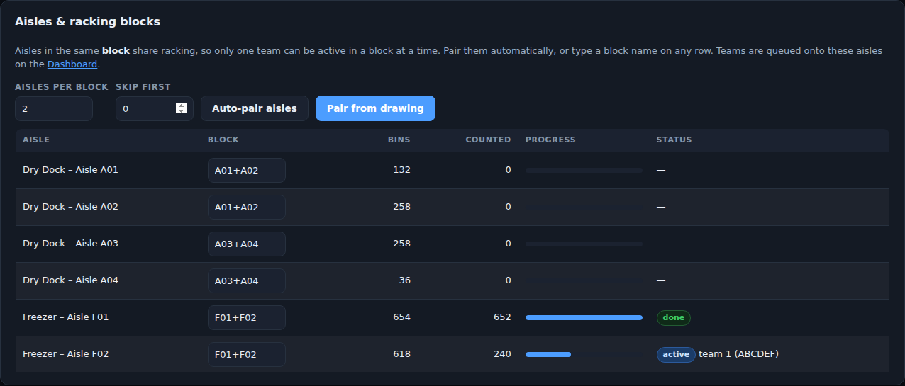

*Aisles paired into racking blocks. F01+F02 share racking, so only one team works that block at a time.*

### Step 8 — Register the scanners

**Settings → Scanner screen → Scanner setup.**

Each handheld gets its own link. Opening that link once is what signs the scanner in;
after that the server accepts counts from it and stamps its name on every line.

1. Type a **scanner name** — use what is written on the device, e.g. `SCANNER-05`.
   Add notes (asset tag, "freezer unit") if it helps.
2. Press **Add scanner**. Repeat for every handheld.
3. Press **Print setup cards**. You get one card per scanner with its own QR code. Cut
   them up and tape one inside each cradle.

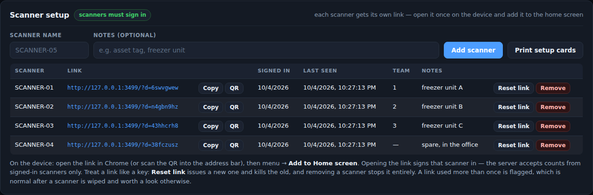

*Settings &rarr; Scanner screen. One row per handheld: its link, when it was last seen, Reset link and Remove.*

**On each handheld, once:**

1. Open Chrome, scan the QR code from its card into the address bar (or type the link).
2. **Install it. Do not leave it running as a browser tab.** Chrome menu →
   **Install app** / **Add to Home screen**, or tap **Install on this scanner** on the
   app's own sign-on screen. Installed, it runs in its own window — no address bar at
   all — and starts even with no signal.

   A browser tab is the one setup that causes trouble: Chrome keeps its address bar
   above the page, brings it back whenever the page moves, and if the keyboard focus
   ever leaves the page a scan is typed into that bar instead of into the count. The app
   warns you when it is running in a tab and offers **Hide the browser bar for this
   shift** as a stopgap.

   *Still want a locked-down device?* See **Kiosk mode** at the end of this step.
3. Set up **DataWedge** so scans arrive as keystrokes:
   - the profile associated with Chrome → **Keystroke output: enabled**
   - **Basic data formatting** → send a suffix: **ENTER** *(or TAB — the app takes
     either as the end of a scan, and neither moves the cursor off the box)*
   - **Barcode input** → enable the symbologies your labels use.

**Kiosk mode.** Three levels, strongest last:

| | What it takes | What the counter sees |
|---|---|---|
| **Installed app** (do this) | Chrome menu → Install app, once per device | Its own window. No address bar, no tabs, no back button |
| **Full screen for a shift** | The button on the sign-on screen, one tap | The bar goes away until the app is closed. The browser says so once, with a banner carrying the address |
| **Locked device** | Zebra **Enterprise Home Screen** (built into the device) or your MDM, set to launch this app and nothing else | The handheld does nothing but count. Survives a reboot |

The first two are inside the app. The third is a device setting — it is configured on the
handheld or through your MDM, not here, and it is the only one that stops somebody
leaving the app altogether.

**Treat a scanner link like a key.** **Reset link** issues a new one and kills the old —
use it if a device is lost or a link gets out. Removing a scanner stops it entirely. A
link used on more than one device is flagged in the table; that is normal after a
scanner is wiped and worth asking about otherwise.

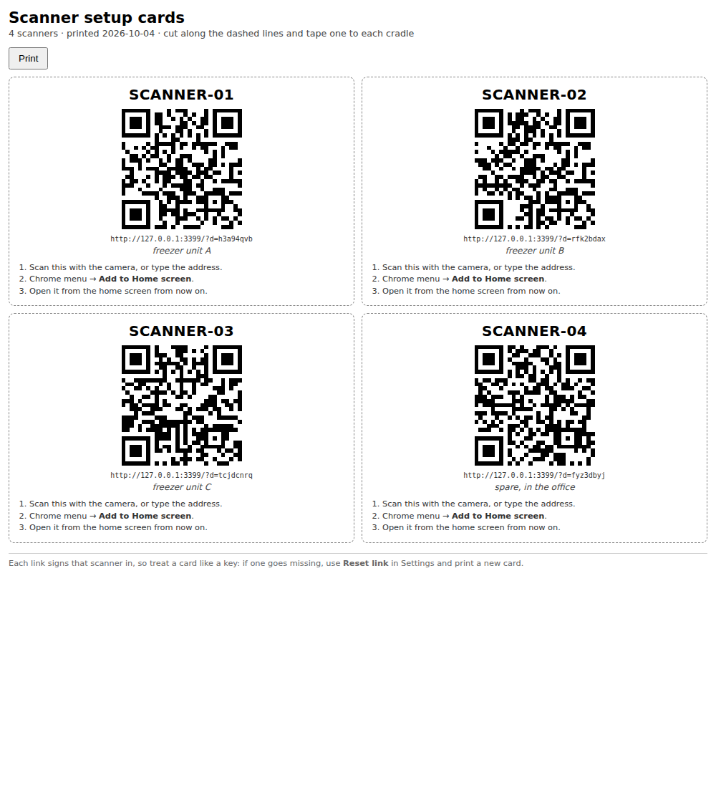

*Print setup cards: one per scanner, each with its own QR code and the three steps to do on the device.*

**Which jobs the scanners offer.** *Settings → Scanner screen → What the scanners offer → Jobs on
the sign-on screen.* A gun's sign-on screen shows exactly the jobs ticked here — **Full count**,
**Cycle count**, **Front2Back**, **Not in Location (NIL)** — whether or not there is work waiting
for each; a ticked job with nothing to do says so when it is picked. Day to day a site ticks the
cycle count, Front2Back and Not in Location. On the morning of a wall-to-wall, untick those and
tick the full count alone, so every scanner opens on it and nobody signs on to anything else by
mistake; tick the others back on when it is over. At least one job has to stay on. Scanners pick
the change up the next time they are online, and the practice gun in the Testing Suite always
has every job, whatever is ticked here.

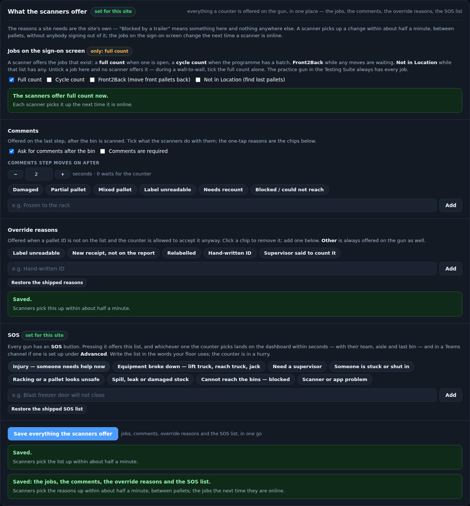

*Settings &rarr; Scanner screen &rarr; What the scanners offer: the full count alone ticked, for count day.*

### Step 8a — A barcode test book, to practise on

**Settings → Getting started → Barcode test book.** A page of real **Code 128** labels to print, cut up
and scan — the same symbology the racking uses, so a gun that reads the book reads the rack.
Use it to train a crew at a desk, to check a new scanner reads properly, or to dry-run a count
before the real one.

The page is a table, one row per line to count: **Bin**, **Pallet**, **Qty**. Work down it the way
a counter works down an aisle — scan the pallet, key the quantity, scan the bin. The quantity is
printed as a number to type; tick **Quantity as a barcode too** and it is scannable as well, for
demonstrating a scan-everything workflow.

Two ways to fill it:

- **From this count** — **Pallets, with their bin and quantity** gives a full practice line per row,
  straight from the uploaded lists, so what you scan off the paper is what the gun expects.
  **Bins on their own** prints rack labels with the other two columns empty, which is what you want
  for practising empty bays. Narrow it to one aisle, and say how many rows.
- **From a spreadsheet** — **↓ Excel template** downloads a workbook with four columns:

| Column | What goes in it |
|---|---|
| **Bin** | The bin barcode for that row — leave it out and the column is blank |
| **Pallet** | The pallet barcode |
| **Qty** | The quantity to key in (or to scan, if you ticked the box) |
| **Note** | A small line under the pallet — the item, or what the row is for |

Fill it in, upload it back, and the book opens ready to print. The codes need not exist in any
count — that is the point of practising.

> **Print at 100%.** “Fit to page” shrinks the bars and a scanner will refuse them. Plain white
> paper only: glossy or coloured stock scatters the beam.

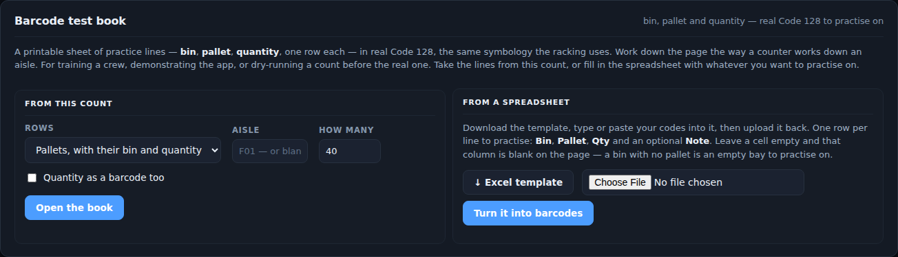

*The test book card: a practice line per row from the count itself, or from a spreadsheet of
whatever you want to practise on.*

### Step 8b — The SOS list, and the Teams channel

**Settings → Scanner screen → SOS from a scanner.**

Every gun has an SOS button. What it offers when pressed is this list — write it in the words your
floor uses, because the person pressing it is in a hurry. It ships with what usually goes wrong in a
cold store, most urgent first: an injury, **equipment broken down**, **needing a supervisor**,
somebody shut in, racking that looks unsafe, a spill, blocked bins, a scanner problem. Each SOS shows
on the dashboard (a red bar above every tab, with a chime) and, if the channel is set up, in Teams.

**To send alerts to a Teams channel as well** (Settings → Advanced → Microsoft Teams channel):

1. In Teams, click **⋯** beside the channel → **Workflows** → *Post to a channel when a webhook
   request is received*.
2. Follow it through; Teams gives you a web address.
3. Paste that into **Webhook address**, tick **Send alerts to Teams**, and **Save**.
4. **Send a test card** — a card should appear in the channel within a second or two. Do this now,
   not during an emergency.

An older *Incoming Webhook* connector address also works while Microsoft still accepts them. The
address is a key — anybody holding it can post into that channel — so it is stored once and never
shown again in full; the page only shows which server it points at.

> **A Teams outage never costs you an alert.** The SOS is on the dashboard either way, and the row
> says whether the channel took it (`teams`, or `teams failed: …`).

**When a team stops scanning.** On the same card: a team that is signed on and still has an
aisle, but has not scanned for this many minutes (10 to start with), gets an amber bar on the
dashboard — and a card in the Teams channel if **Send it to the Teams channel too** is ticked.
**0** turns it off.


*The SOS list, under Scanner screen.*

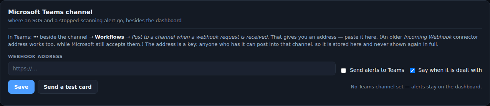

*The Teams channel it goes to, under Advanced: the address is kept, never shown again in full.*

### Step 8c — The Testing Suite: try the scanner on test data

**Testing Suite** in the sidebar. The fastest way to show somebody the gun, or to try a setting before
a count, without a handheld and without touching a real count.

On the left is the **real scanner app** — the same one the Zebras run — on a picture of an MC9300.
On the right is a sheet of test data: two short aisles of real Front Royal bins (F01 and F02,
levels A–B), what is on each shelf, and a made-up inventory report laid over them.

**Click any bin, pallet or quantity on the sheet and it is scanned into the gun**, exactly as the
trigger would send it. The **SCAN** box under the screen sends anything you type — a wrong ID,
a typo — to see what the gun does with it. You can also click on the gun's screen and use it
directly.

1. **Sign on.** Click team **99** and a clock-in number, then **Sign on & load list** on the gun.
   Team 99 already has F01, then F02. Your own clock-in number works; **T1001** and **T1002** are
   made up, so the gun flags them as not on the crew list — which is what it does with a typo.
2. **Start counting**, and work down the sheet. For each pallet: pallet, quantity, bin.
3. **Things to try** ticks itself off from what actually reached the server. The shelves are
   wrong in places on purpose, each with a **Try this** line saying what to do:

| Bin | What it teaches |
|---|---|
| F01A002, F01B004 | Two and three pallets in one bin |
| F01A003 | An empty bin — **Bin is EMPTY — scan the bin** |
| F01A004 | A pallet short of the report (report 36, shelf 32) |
| F01A005 / F01A006 | A pallet in the next bay, and one the report never heard of |
| F01B001 | A torn pallet label — **Label will not scan**, then type it |
| F01B002 | Best-before already passed |
| F01B003 | A missing rack label — **Bin label will not scan** |
| F01B006 | A pallet on the report that has gone — record the bin empty |
| F02B001 | A quantity big enough that the gun asks for it twice |

Then **Aisle complete — next aisle**, press **SOS** once, and **Open the dashboard on this count**
to see it all from the supervisor's side: progress, the pallet report, the SOS bar, adjustments.

**It is walled off from the real thing.**

- It counts into a **Practice count** of its own. A gun on the floor is never offered it, and the
  test gun is never offered anything else.
- The office board never shows it. In every dashboard's count picker it is listed **last** and
  marked **PRACTICE**, so no page opens on it by mistake.
- **It is yours.** Each login has its own practice count and its own test scanner (**TEST-** and
  their name, under Scanners), kept from one sign-in to the next. Nobody else sees it, two people
  practising at once never touch each other's, and a **new user** opens the tab to a fresh one.
  The test gun keeps its own storage in the browser, separate from a real scanner's and from
  anyone else's.

**First time here?** The tab opens with a short guide at the top — what the two halves are, and the
six steps from signing on to opening the dashboard — and a **tip bubble** that points at the next
thing to click and follows the gun: *click 99*, *now a clock-in number*, *tap Sign on on the gun*,
*click this pallet*, *now the quantity*, *now the bin*. Both fold away (**Hide**, **I've got it**)
and stay folded for anyone who has counted here before; **Show tips** brings the bubble back.

**Before you start** at the top of the tab is the checklist: signed in with your own login, test data
loaded, the test scanner registered and signed in, team 99 with aisles, the gun running — each with
what to do if not. It reads **ready to test** when there is nothing to do.

**Your own test pallets.** Upload a sheet with **Bin**, **Pallet** and **Qty** (and, if you have them,
**Note**, **Lot**, **Best Before**) and the practice run is built from it instead. It is the
same sheet as the barcode test book (step 8a): print the book, upload the same file here, and scan
the paper. A row with a bin and no pallet is an empty bin. The file is checked row by row and told
back plainly (*row 7: "ten" is not a quantity*). **Back to the built-in test data** returns to the
shipped aisles.

**Try the features that ship turned off.** Lot codes, best-before dates, adjustments needing
approval (with its thresholds), the pallet check (allow override / no
overrides / accept any), automatic second counts, the comments step — each can be switched on for
**your practice count only**; nothing else changes. Each one says whether the practice data has what
it needs (*✓ 25 of 25 pallets have a lot code*) and, when it does not, what to add to your file. Settings that apply to every scanner
(the Teams channel, the stopped-scanning limit, the scanner screen) are not changed from here.

**Start over** begins a new practice run. The one you were on is kept under **Your earlier runs**
— when it started, how many of the twelve things you tried, how much you counted — so you can
see your own progress. The last ten are kept. Nothing on a real count is touched.

**What to practise.** A count is not the only thing a scanner does, so the card under the guide
offers the other jobs, each set up on your practice the first time you pick it — and only the jobs
your login may do for real (a login without Cycle counts is not offered the cycle count):

| Pick | What is set up | What the gun does |
|---|---|---|
| **Cycle count** | A practice cycle count beside your run, with a five-bin list: a plain bin, two pallets, an empty bin, a short pallet, one whose pallet has gone | **Cycle count** at the top of the sign-on screen; sign on with a clock-in number alone; **Start counting the list**; every pallet in the bin, then **Bin done** |
| **Front2Back** | Three front pallets to put back in the empty bin behind — one of them into a bin that turns out not to be empty | **Front2Back** at sign-on with a clock-in number alone; pick the aisle; the gun shows the move desk — pallet, from → to, the pallet system under it; put it back, tap **Moved — next**; the one that will not go is left and skipped from the office with the reason |
| **Not in Location** | Three lost pallets on the list, for you alone: two are on the shelves, one is nowhere | Count the full count as normal; the gun says **found!** the moment it scans one, and the office is told where |

Each job adds its own lines to **Things to try**, the tips follow it on the gun, and the pane under the
card shows the list — bins, pallets, moves, lost pallets — with what is done. The planted lost pallets
never reach the real Not in Location page or a scanner on the floor. **Start over** clears the lot.

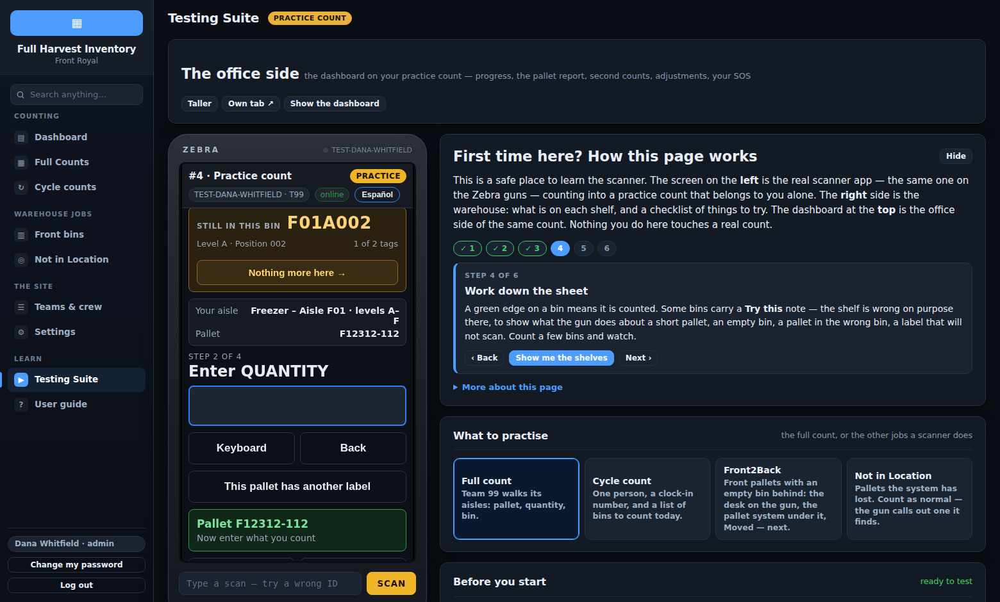

*The Testing tab: the real gun on the left, the shelves and what to try on the right.*

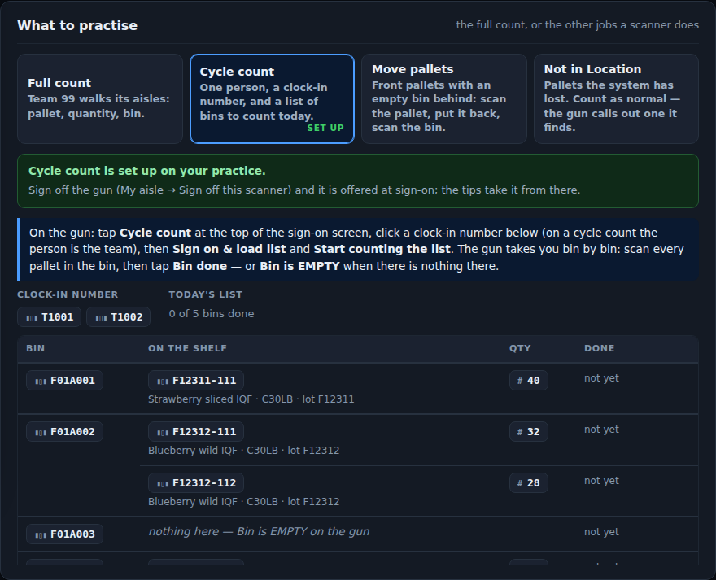

*What to practise: the cycle count picked, its five-bin list under the card.*

### Step 8d — The user guide: this document, inside the app

**User guide** in the sidebar, under *Learn*. Every login can open it, whatever else it may
or may not do. It follows this SOP job by job and is the first place to send a new starter.

- **Journeys.** Your first day, Set the site up, Set up a count, Counting day, Finish a count,
  Cycle counts, Front bins and pallet moves, Not in Location, and On the scanner (the counter's
  loop, for training). Each step says what to do, links to the card it is about, and then lists
  **what tends to go wrong here** — the message you will see, what it means, what to do — and
  **what people ask at this point**. Tick a step when it is done; the ticks stay in that browser,
  so each person keeps their own place.
- **Ask the guide.** Type a question in your own words (*"the gun says offline — did we lose the
  counts?"*, *"how do I approve adjustments"*) or paste a message straight off the gun or the
  dashboard. It searches every step, every question, and every message the gun and the server can
  show, and answers with the fix and a link. *Gun*, *handheld* and *Zebra* all mean the scanner;
  *Wi-Fi* means signal; *variance* means adjustment.
- **Right now.** The guide reads the count in the picker — the guided setup, open SOS, second
  counts, the thresholds, the scanners, the Teams channel — and lists what is missing, red for
  required and amber for wanted, each with a link. Under it, **You will probably want to know**
  offers the questions those gaps usually raise. It refreshes every fifteen seconds.
- **Only doors you can open.** A login without Settings sees *"ask an admin"* in place of a
  Settings link, never a link that bounces.

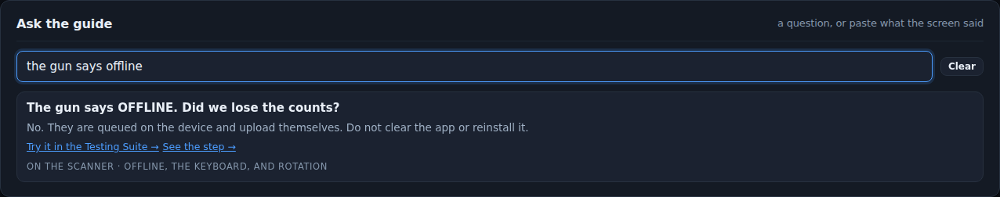

*Ask the guide: a question in plain words, the answer, and where to go.*

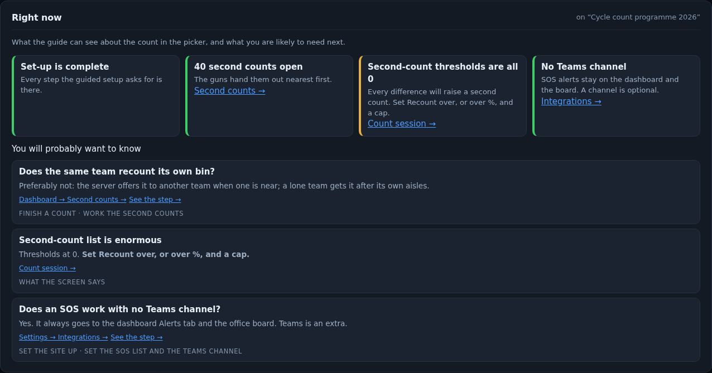

*Right now: what this count is still missing, worked out from the data.*

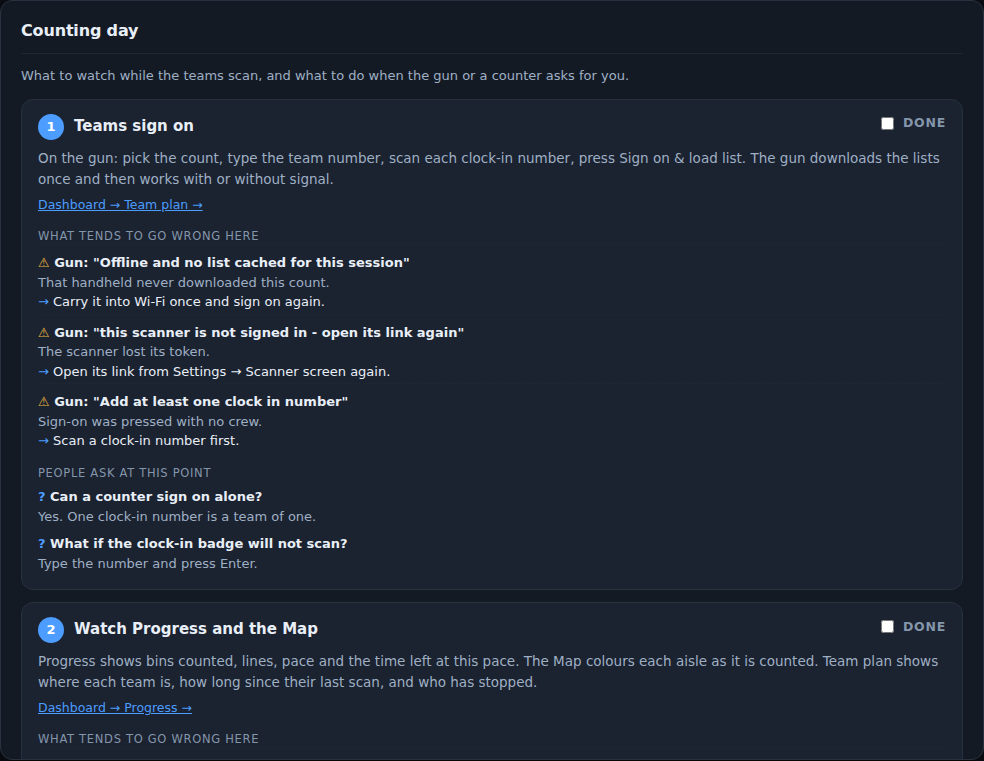

*A journey open: the step, what goes wrong there, and what people ask.*

### Step 9 — Set up the counting screen

**Settings → Scanner screen.**

This is what a counter actually sees. The preview on the right is drawn at the real
pixel size of the device (MC9090 is 240 × 320; MC9200 is 480 × 640) using the scanner's
own stylesheet, so it cannot drift from reality.

- **The questions, in order.** Drag to reorder. The default asks for the pallet, then
  the quantity, then the bin. Counting **location-first** — bin, then what is in it —
  suits a team working a bay at a time. Lot code and expiry sit in the order too, and
  only appear on counts that ask for them (Part 3). A question can never be dragged off
  the list entirely.
- **Show contents after a pallet scan** — shows the SKU and description the ERP has for
  that pallet, so the counter can see they are at the right one.
- **Show the next bin in the aisle** — once a team starts a section, the gun tells them
  which bin comes next (001 → 002 → 003), so nothing is skipped. A bin holding several
  pallets keeps the guide until every tag in it is accounted for — see step 15.
- **The on-screen keyboard never appears by itself**, on any screen — not for the
  quantity, not for a clock-in number. The scanner is the keyboard. The **Keyboard**
  button on the counting screen, and **Type it instead** on the sign-on screen, bring one
  up for whoever has to type.
- **Update itself after a deploy** — on unless you turn it off. A scanner left running keeps
  the version it started with: these are installed apps that sit on a cradle overnight and are
  the same page in the morning. With this on, the gun compares what it is running against what
  the server is serving and reloads itself when it has fallen behind — **never mid-pallet, and
  never with counts still queued on the device**. If it is in the middle of a line it shows a
  green **Update ready** bar and waits for the line to finish; tapping the bar takes it at once.
  It reloads once for any one version: a gun that comes back still behind says *"update did not
  take"* rather than reloading in a loop halfway down an aisle.
- **Keep it upright** — on unless you turn it off. These are portrait handhelds held
  one-handed at a rack face, and a screen that flips halfway down an aisle is unusable.
  There is **one** way up: the installed app asks the device for it by name, and a gun
  flipped end over end is not "still portrait" as far as this app is concerned. Only an
  app that owns the screen (installed, or full screen) is allowed to ask at all — a
  browser tab is always refused — so when the handheld turns anyway, the app turns
  *itself* back: sideways gets a quarter turn, end over end gets a half turn, and either
  way the counting screen reads upright in the hand. It is only a picture being turned —
  scanning, tapping and the comments countdown all carry on exactly as before. Turn it off
  and the gun is left however the device turned it, with a yellow **Hold the scanner
  upright** strip across the top. Turning auto-rotate off on the handheld (an Android
  setting, not an app one) is still the tidiest fix of all.
- **Take the whole screen** — off unless you turn it on. It makes the app fill the display
  at sign-on, but the browser announces that with a bar carrying the site's address, right
  over the counting screen. **Installing the app** on the handheld (step 8) is the quiet
  way to lose the browser, and the one to prefer.
- **Keep the screen awake** — holds the display on while a team is counting, instead of
  it sleeping between bays.
- **Buzz on a good or bad scan** — useful with ear defenders.
- **Text size: Large** — for gloves and a freezer.
- **Re-key a quantity of at least** — anything this big has to be typed twice. 0 never
  asks twice.
- **Comments step moves on after N seconds** — how long the comments step waits before it
  goes to the next bin by itself. It ships at **2 seconds**: long enough to tap a reason,
  short enough that a counter with nothing to say is not standing there. Use **−** and
  **+** to change it, or type a number. **0** turns the clock off and waits for the
  counter. Typing or tapping a chip always stops the countdown, whatever it is set to.

Press **Save**. Scanners pick the change up within about half a minute, between pallets
— nobody has to sign out.

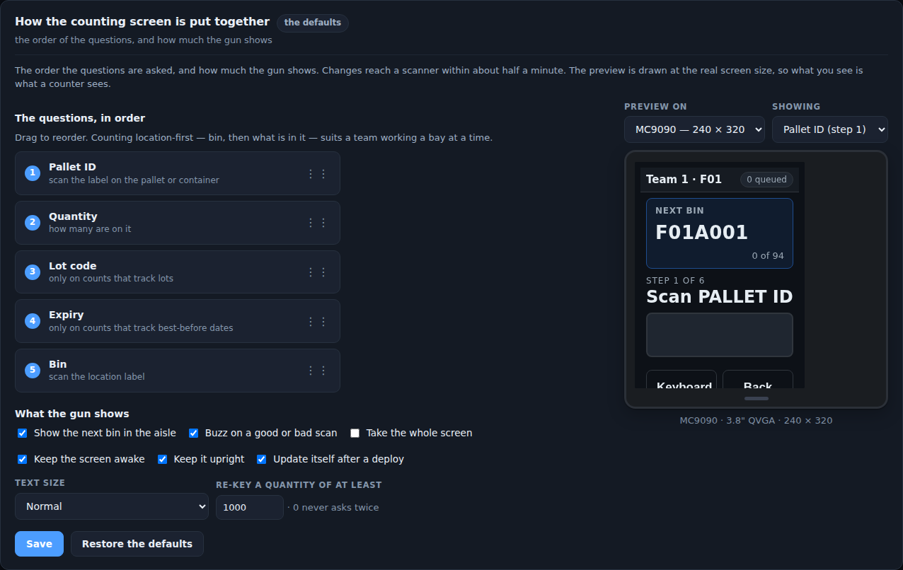

*Settings &rarr; Scanner screen. Drag the questions into the order your site counts in; the preview is the real MC9090 screen size.*

### Step 10 — Set the one-tap reasons

**Settings → Scanner screen → What the scanners offer.** One section for everything a counter
is offered on the gun, with one **Save everything the scanners offer** button at the bottom:

- **Jobs on the sign-on screen** — the full count, the cycle count, Front2Back, Not in Location
  (see step 8).
- **Comments** — offered on the last step, after the bin is scanned. Two tick boxes: **Ask for
  comments after the bin** (untick it and no scanner asks, on any count, whatever the count's own
  setting says) and **Comments are required** (the counter must tap a reason or type a note: no
  Skip, no blank, nothing moving on by itself). Under them, how many **seconds** the step waits
  before moving on when comments are optional (0 waits for the counter), and the one-tap reasons.
- **Override reasons** — offered when a pallet ID is not on the list and the counter is allowed
  to accept it anyway. Click a chip to remove one, type and **Add** for a new one. **Other** is
  always offered on the gun as well, whatever you configure.
- **SOS** — the list a counter picks from when they press SOS.

Counters wearing gloves in a freezer will not type. These are the buttons they tap instead, and
the reasons a site needs are its own — "Blocked by a trailer" means something here and nothing
anywhere else. A scanner picks a change up within about half a minute, **between pallets**: a
reason added while a counter is halfway through a line appears after that line is finished.
The jobs on the sign-on screen change the next time a scanner is online.

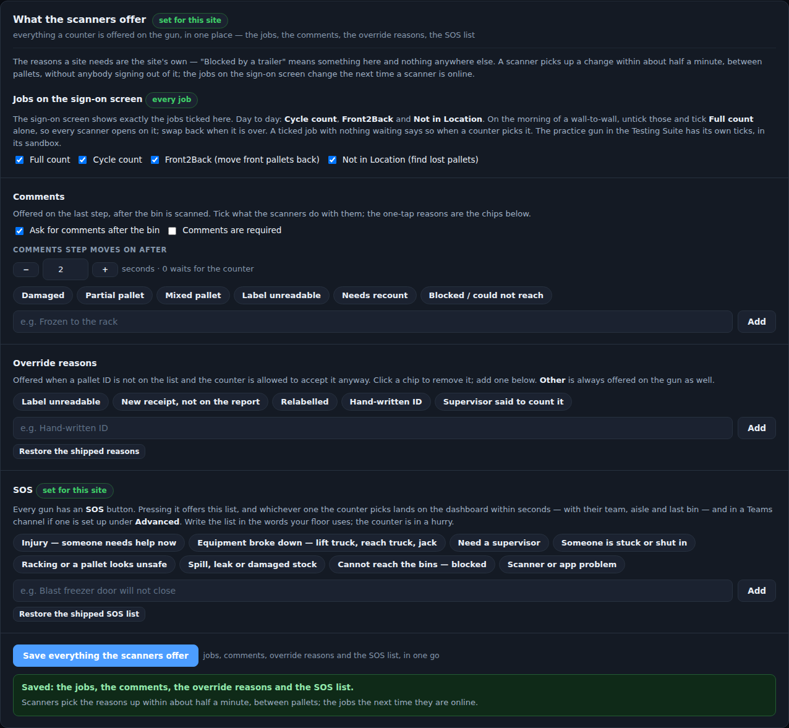

*Settings &rarr; Scanner screen &rarr; What the scanners offer. These are the buttons a counter taps instead of typing.*

---

## Part 3 — Setting up a count

> Do this the day before, not on the morning of the count.

### Step 11 — Create the count

**Full Counts** in the sidebar is the home of the wall-to-walls: a table of every full count,
open and closed, with bins counted, lines and second counts open, **Open on the dashboard**,
**Scanners land here** (the count every gun opens on at sign-on) and **Close** / **Reopen**;
a **New count** tab that creates one; and a **Set-up** tab that lists what the count in the
picker still needs, each step linking to where it is done. The count's options stay under
*Settings → Getting started → Count session*, and the Dashboard stays the live view of whichever
count the picker holds. Cycle counts have their own page, *Cycle counts*, the same way.

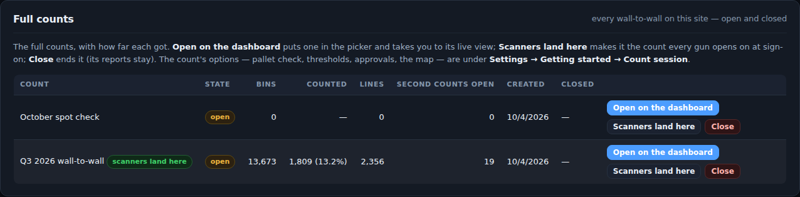

*Full Counts: every wall-to-wall, how far it got, and what to do with it.*

**The picker shows what the login may work.** A login without the *Cycle counts* page sees no
cycle count in the picker at the top of any page, and a cycle-counter login sees no full count.


**Settings → Getting started → Count session → Start a new count.**

1. **Name** it something you will recognise later: `Q3 2026 wall-to-wall`.
2. **Type**:
   - **Full count** — teams work whole aisles. This is a wall-to-wall.
   - **Cycle count** — a batch of bins per day or week; see Part 6.
3. **Bin list** — attach it here, or upload it later in Settings.
4. **Inventory report** — what the ERP thinks is on hand. **Attach it.** With it you get
   variances, second counts and an ERP adjustment file. Without it the count still
   records what is there, but nothing is compared against anything.
5. Press **Create count**.

The new count inherits the rack drawing the last one used, so the map works immediately.

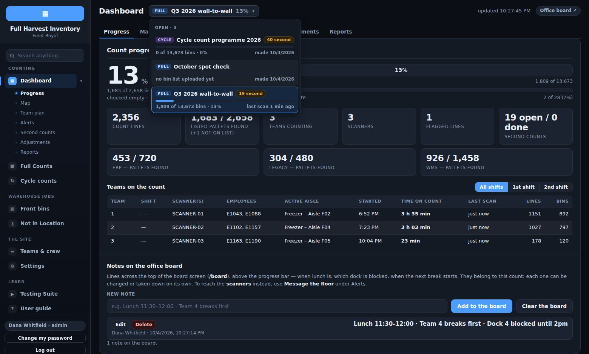

*The count is picked in the header, on every supervisor page. Each row carries its own progress, so two counts are never confused.*

### Step 12 — Check the guided setup

**Settings → Getting started.**

A checklist worked out from what is actually in the database, not from a box somebody
ticked. It tells you what is still missing and takes you straight to the screen that
fixes it. For a full count it wants: the bin list, the inventory report, registered
scanners, the scanner screen, racking blocks, a crew roster and a team plan.

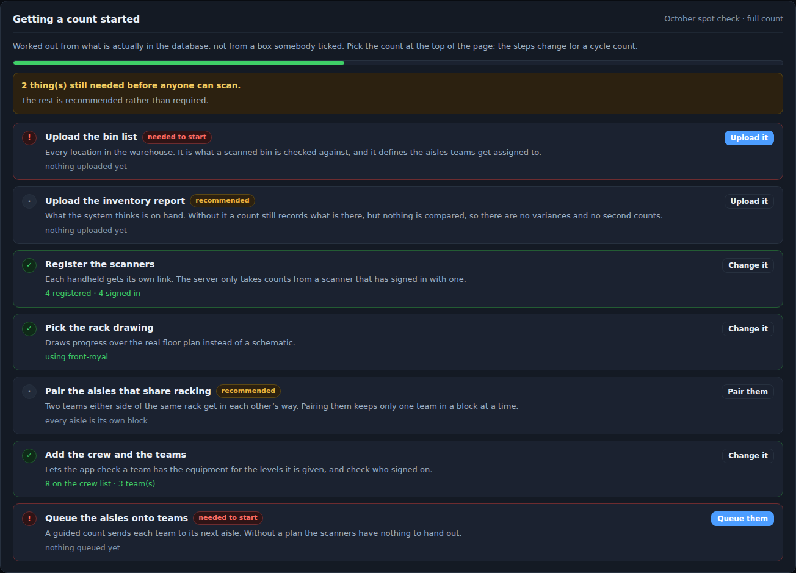

*A new count: two things stop anybody scanning, the rest are recommended. Every step links to the screen that fixes it.*

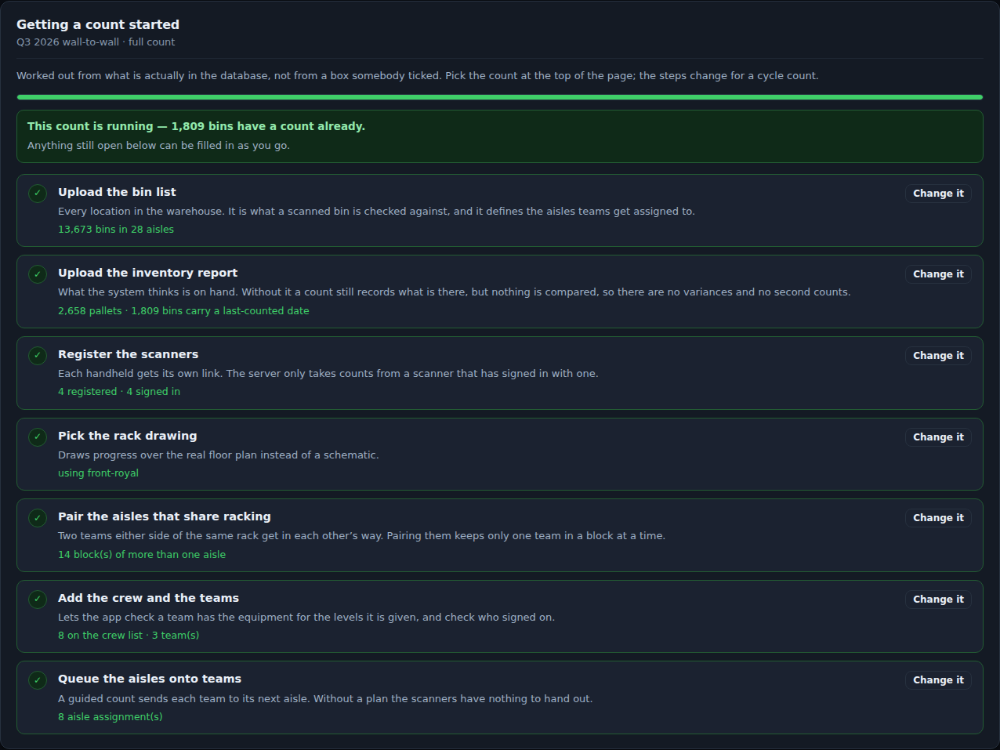

*The same checklist once that count is ready to run: every step green, and the count already running.*

### Step 13 — Set the count's options

**Settings → Getting started → Count session.** These apply to the count picked at the top of the page,
and a scanner that is already counting picks up a change within about half a minute. The
questions it asks change between pallets, never mid-line.

| Option | What it does | Suggested |
|---|---|---|
| **Pallet ID check** | *Validate — allow override*: a pallet not on the report asks the counter **Count it anyway? YES / NO**; YES counts it and it shows as a positive adjustment. *Validate — no overrides*: it cannot be counted. *Accept any ID*: no checking, though duplicates are still blocked. | Validate with override |
| **Guided by aisle plan** | Teams are sent to their assigned aisle and warned when they scan a bin outside it. Off means anyone can count anything. | On for a wall-to-wall |
| **Ask for comments** | Adds the optional comments step at the end of each pallet. | On |
| **Auto second counts** | Raises a "go back and look again" task automatically when a line disagrees with the report. | On |
| **Show on the scanners** | Untick to keep this count off the scanners' list — while it is being set up, or once the floor is done with it. The dashboards still have it, marked *not on scanners*. | On, once the lists are uploaded |
| **Scanners start here** | Every scanner lands on this count at sign-on. They can still pick another. | On, on count day |
| **Ask for the lot code** | Adds a LOT CODE question, checked against the report. Wrong lot is called out at the pallet. | On only if you track lots |
| **Ask for the expiry date** | Adds an EXPIRY question and flags anything already out of date. | On for frozen food |
| **Recount over N units** | A difference smaller than this raises no second count. | 2–5 units |
| **or over N %** | ...or at least this share of the expected quantity. Either threshold is enough. | 5–10 % |
| **Cap open** | Stop raising automatic second counts once this many are open, so the list stays walkable. | 50–100 |
| **Adjustments need approval** | Every difference from the report has to be approved, with a reason code, before it reaches the ERP file. Off by default. | On for a wall-to-wall that is audited |
| **Approve over N units** | A difference smaller than this goes through without a signature. | 5–10 units |
| **or over N %** | ...or at least this share of what the report expected. Either threshold is enough. | 5–10 % |
| **Map drawing** | Which rack drawing the map uses. *Schematic* builds one from the bin codes. | Your drawing |

> **Why the thresholds matter.** With both at 0 the app sends somebody back for a
> one-unit difference, and by mid-morning the second-count list is longer than the count.
> Set them once and the list stays short enough that people actually walk it.

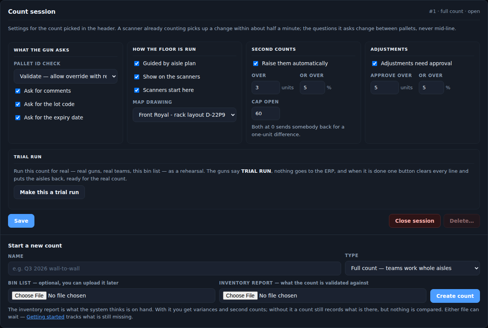

*Settings &rarr; Getting started &rarr; Count session: every option above, on one card, for the count picked at the top of the page.*

### Step 13a — A trial run, before the real count

**Settings → Getting started → Count session → Trial run.**

The way to find out that a crew does not know the empty-bin button, or that an aisle has no
rack labels, is to run the count for real a shift or a day before it matters. **Make this a
trial run** turns the count into a rehearsal on the same bin list, report and team plan:

- the guns show **TRIAL RUN** in the header, and so do the dashboard and the office board;
- nothing can be sent to the ERP, and nothing counted moves a bin's *last counted* date;
- everything else works exactly as on the day — teams, aisles, SOS, second counts, reports.

When it is done, **End the trial — clear it for the real count**, and type **CLEAR**. Every line,
sign-on, SOS and second count goes; the bin list, the report, the team plan and every setting
stay, and each team's aisles go back to the start. The guns are told the next time they check in
(within a minute, between pallets): they forget what they counted in the trial, so no pallet
comes back as "already counted", and a trial line a gun sends late is dropped.

### Step 14 — Give the teams their aisles

**Dashboard → Team plan.**

Either upload a **counting plan** (Settings → Lists & racking → Counting plan: one row
per aisle, in the order each team counts it, with the levels their equipment reaches),
or queue aisles by hand here.

- A team's next aisle starts automatically as soon as the block it belongs to is clear.
  That is what staggers the crews apart.
- A team is not sent where its equipment cannot reach: if the roster says a crew is on
  foot, they will not be queued onto level D. A supervisor can override this.
- Two teams **can** share one aisle as long as their levels do not overlap — a forklift
  crew high and a crew on foot low.

**Auto-assign the aisles.** The card above the queue does the whole plan at once, staggered:

1. Pick the **teams** (blank is every team on Teams & crew, or one **shift**), the **levels**
   (blank is all), and which way to **walk the aisles**.
2. **Preview.** The aisles are split into one continuous stretch per team, about the same racking
   each, so the teams start spread across the building and never bunch up. A team gets only the
   levels its equipment reaches; what it cannot reach goes to the nearest team that can, after its
   own stretch (marked `*`). The preview lists each team's aisles in order, with warnings — two
   teams starting in the same racking block, a level nobody can reach — and what it left alone.
3. **Queue this plan.** Each team's first aisle starts at once. **Replace what is queued** re-plans
   the queued aisles and leaves anything being counted, or done, alone.

The rules it follows are shown on the card, with what to fix if one is missing: **racking blocks**
(step 7 — without them two teams can be released into back-to-back racking), **equipment** on
Teams & crew (a team with nobody on it is given every level), and the **shift**.

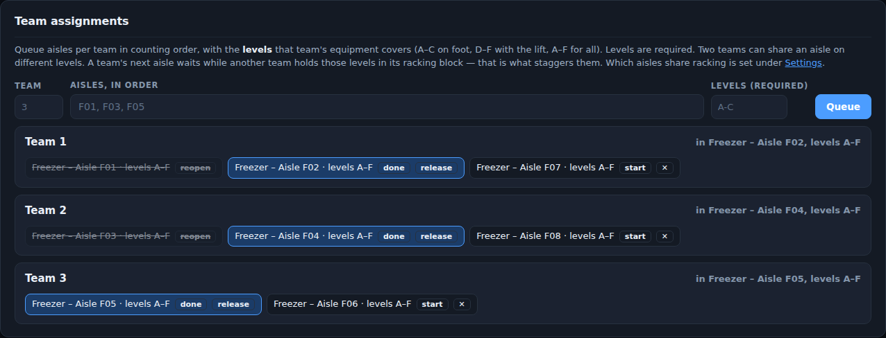

*Dashboard &rarr; Team plan: each team's aisles in counting order — what they are on now, and what is queued behind it.*

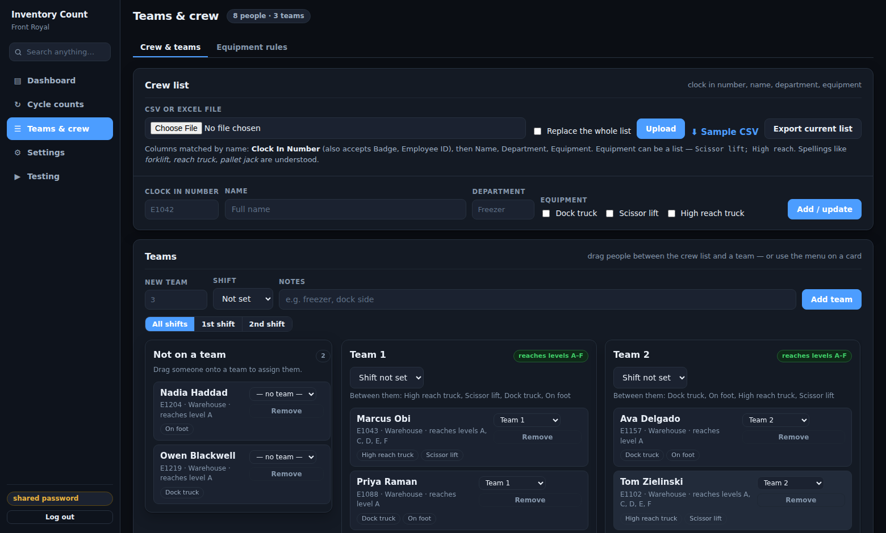

*Teams &amp; crew (`/teams`): the crew list and who is on which team. Equipment is what decides which levels a team can be sent to.*

**1st and 2nd shift.** Each team on Teams & crew has a **shift** — set it when you add the team,
or on the team's card. The page can show one shift at a time, and so can the team table on the
dashboard, so the 2nd-shift lead sees only their crews.

---

## Part 4 — Counting day

### Step 15 — The counter's procedure (on the handheld)

> **There is a film of this.** `docs/gun-demo.webm` (about four minutes) is a recording of the
> real app on real data, working through everything below: signing on, counting a pallet, a bay
> with three tags, two labels on one pallet, a label that will not scan, an empty bin, a pallet
> nobody expected, a message from the office, voiding a line, losing the wifi, and handing the
> aisle back. Open it in any browser. It is worth showing a new crew before their first shift.


**English or Spanish**

The button at the top right of every screen switches the gun between English and **Español**.
It stays that way on that scanner until somebody switches it back. Everything the counter
reads is translated; what reaches the office — the lines, the SOS, the reasons — stays in
English, so the office reads one language whoever counted.

**Signing on**

1. Open the app from the home screen. It shows the scanner's own name.
2. Pick the **count session** (it lands on the default one).
3. Enter the **team number**.
4. Scan or type every **clock-in number** on the crew, pressing Enter after each. Tap a
   number to remove it.
5. Press **Sign on & load list**. The handheld downloads the bin and pallet lists for
   that count and can work from then on **with no signal**.
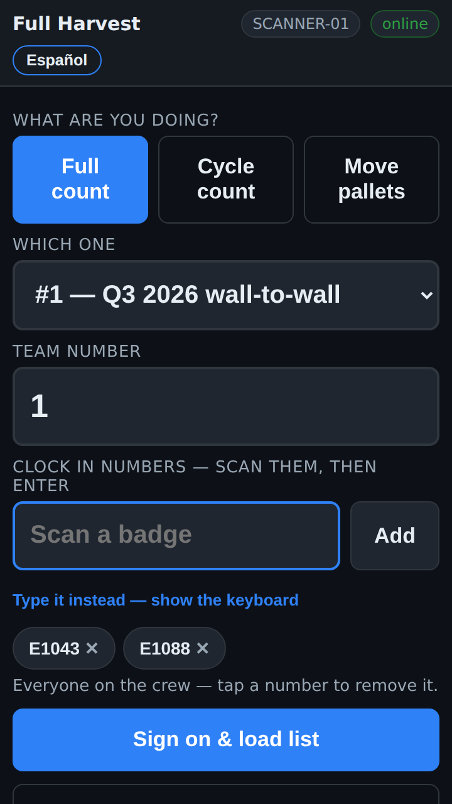

*Signing on: the count, the team number, and every clock-in number on the crew.*

**Counting a pallet**

The gun asks one question per screen, in the order the site configured:

The gun checks that what was scanned is what the step asked for: a rack label at the pallet step,
a pallet label at the bin or lot step, any label where the quantity is typed, is named for what it
is and refused, and nothing is recorded (*"F01A001 is a bin, not a pallet — scan the label on the
pallet"*).

1. **Scan PALLET ID** — the gun says which pallet, and nothing about what is on it. **This is a
   blind count**: the counter counts what is in front of them, not what the system expects.
2. **Enter QUANTITY** — big numbers may have to be typed twice.
3. **Scan LOT CODE** / **Enter EXPIRY** — only on counts that ask for them. A lot that
   disagrees with the report, or a date already past, is called out on the spot.
4. **Scan BIN LOCATION** — it says where that bin is and which face it is on.
5. **Comments** — optional. Tap a reason or type a note; leave it and the gun moves on by
   itself after a couple of seconds (Settings → Scanner screen sets how long). Typing or
   tapping a reason stops the countdown.

The line is saved on the handheld the moment the last question is answered, and pushed
to the server whenever there is a signal. The header shows `online` / `OFFLINE` and how
many lines are still queued.

| | | |
|:--:|:--:|:--:|
| 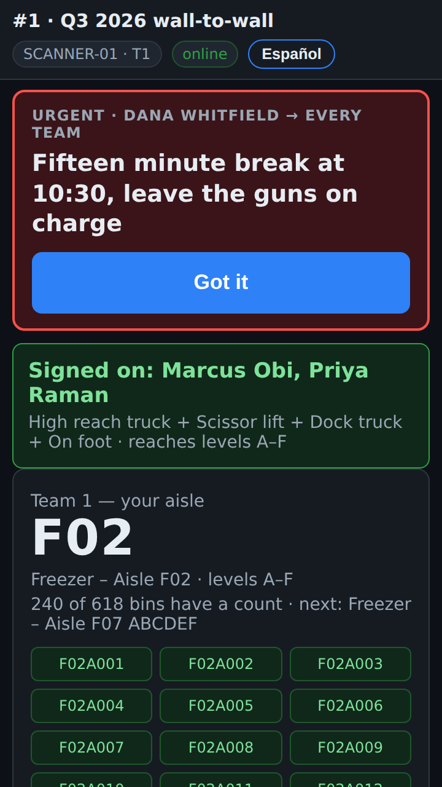<br>**After sign-on** — the aisle this team has been given, what is queued behind it, and any second counts waiting | 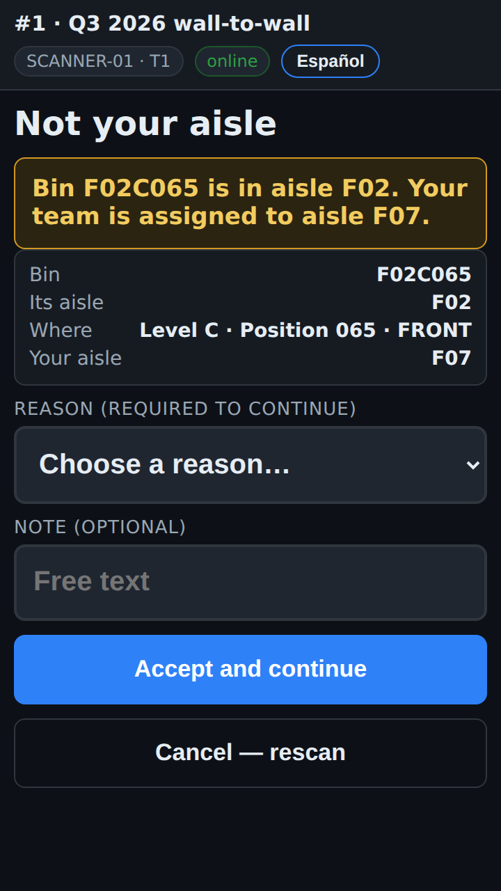<br>**Question 1** — *Next bin* tells the team which bin comes next in the aisle, so nothing gets skipped | 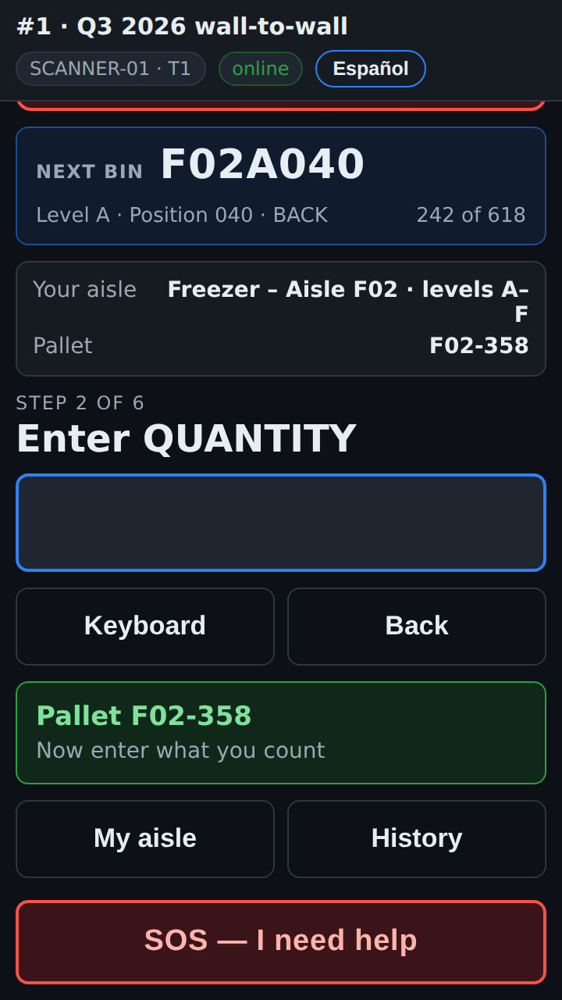<br>**Question 2** — the pallet is recognised; the gun does not say what is on it, so the count is blind |
| 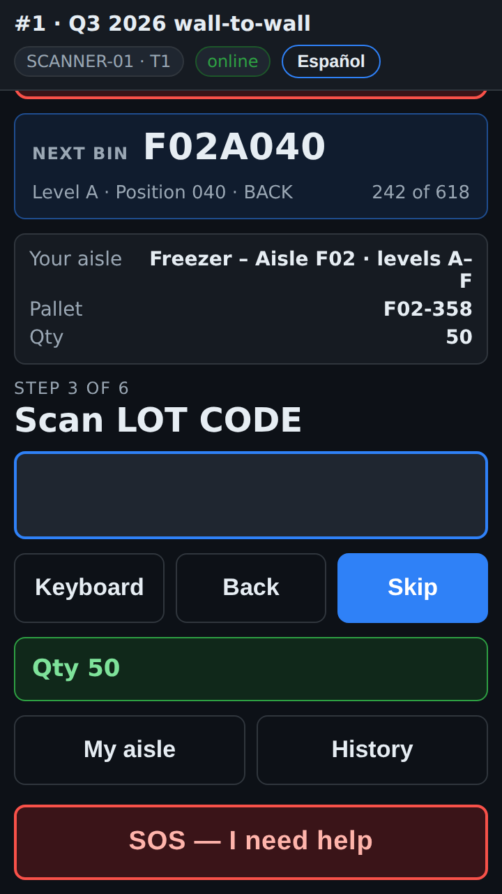<br>**Questions 3 and 4** — only on counts that ask for them. A lot that disagrees with the report is called out here, not a week later in a report | 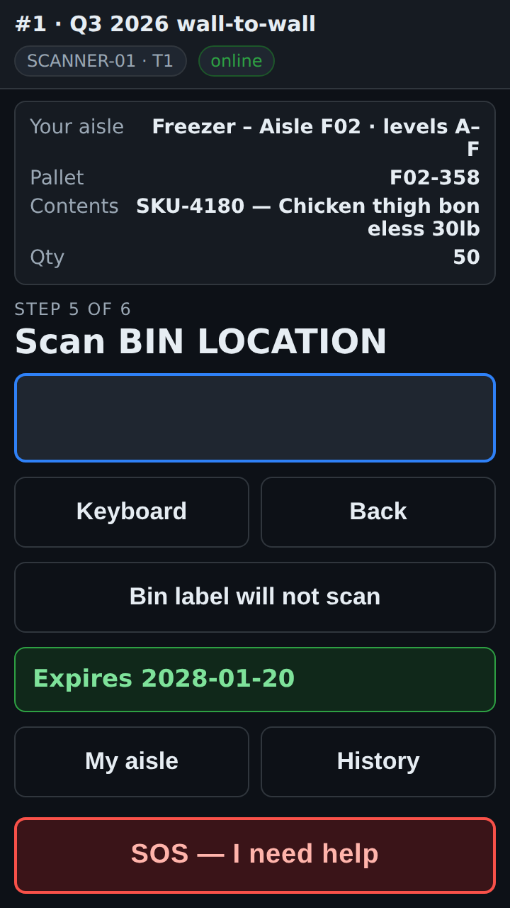<br>**The last required question** — the gun says where that bin is and which face it is on | 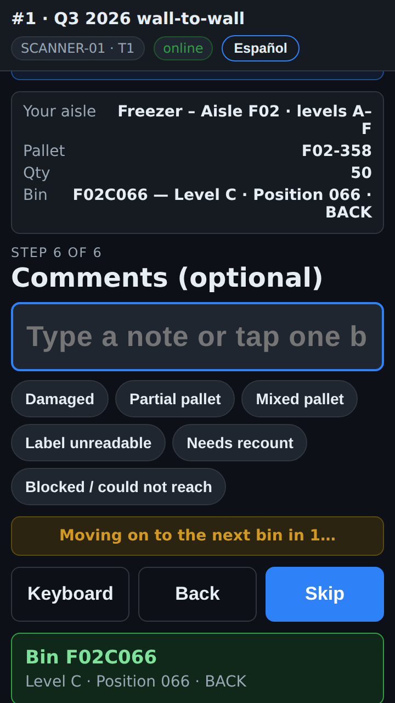<br>**Comments** — tap a reason rather than type one. Left alone, the gun counts down and moves to the next bin by itself |

**A bin with more than one pallet in it**

Four pallet tags in one position is ordinary, and the guide stays put until they are all
counted. After the first tag the banner turns amber and reads **Still in this bin** with
a tally — *2 of 4 tags* — taken from the inventory report, so the team knows what is left
to find before they walk on.

- Scan the next tag in the same bin. The tally goes up; when the report's pallets are all
  accounted for, the banner turns back to **Next bin** on its own.
- If the report is wrong and there is nothing more there, tap **Nothing more here →**.
  The bin is closed and the guide moves on.
- A bin the report lists nothing for stays open after a count, for the same reason — there
  may be a second pallet in it that the ERP has never heard of. Tap **Nothing more here →**
  when it is clear.
- **Bin is EMPTY** closes a bin outright.
- **This pallet has another label** — on the quantity screen, right after the pallet scan. A pallet
  wearing two tags: tap it, scan the other tag, and carry on with the quantity. The pallet is counted
  once; the second tag is saved beside it with no quantity, so neither label comes up as uncounted.
  (**Second label on the same pallet**, on the pallet screen, does the same after the line is saved.)
- **Report a problem** — damage (a pallet, the racking, the product), a bin **blocked** by a trailer
  or a forklift to come back to, or something else. Pick what, then why, add a word if it helps. It
  goes on the office's **Fix list** against the bin and pallet in hand, with no bar and no chime —
  it is not an emergency, that is what **SOS** is for. With no signal it is kept and sent later.
- **Several empty bins in a row** — for a stretch of an aisle with nothing in it. Scan the
  **first** empty bin and the **last**; the gun lists every bin between them in walking order,
  already ticked. Untick any that are not empty, then **Mark N bins EMPTY**. Each is recorded as
  its own empty bin, exactly as if they had been done one at a time; bins already counted are
  shown and left alone.

The tally counts what the whole team has done, not just this scanner, so two handhelds
working the same aisle never double-walk a bay or leave one half counted.

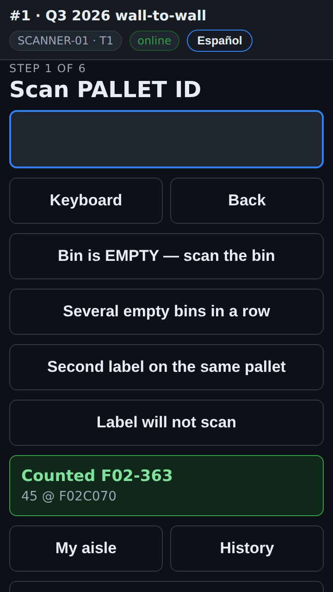

*One tag into a position that holds three: the banner turns amber and stays on the bin
until the other two are counted, or somebody says there is nothing more there.*

**A pallet with two labels on it**

A re-tagged pallet that kept its old label, or one built from two, has two barcodes and is
one pallet. Counting both as pallets doubles the stock; ignoring one leaves a live label
for the next team to find.

1. Count the pallet once, as normal.
2. Tap **Second label on the same pallet**.
3. Scan the other label.

The tag is recorded against the pallet it is stuck to, with no quantity of its own. It
shows on the pallet report as **SECOND LABEL**, the pallet it belongs to says *also tagged*,
nobody is sent back for it, and it never reaches the ERP file as an adjustment. If the
second tag is not on the inventory report, the gun offers the same answer in the
"Pallet not on the list" screen.

| | |
|:--:|:--:|
| 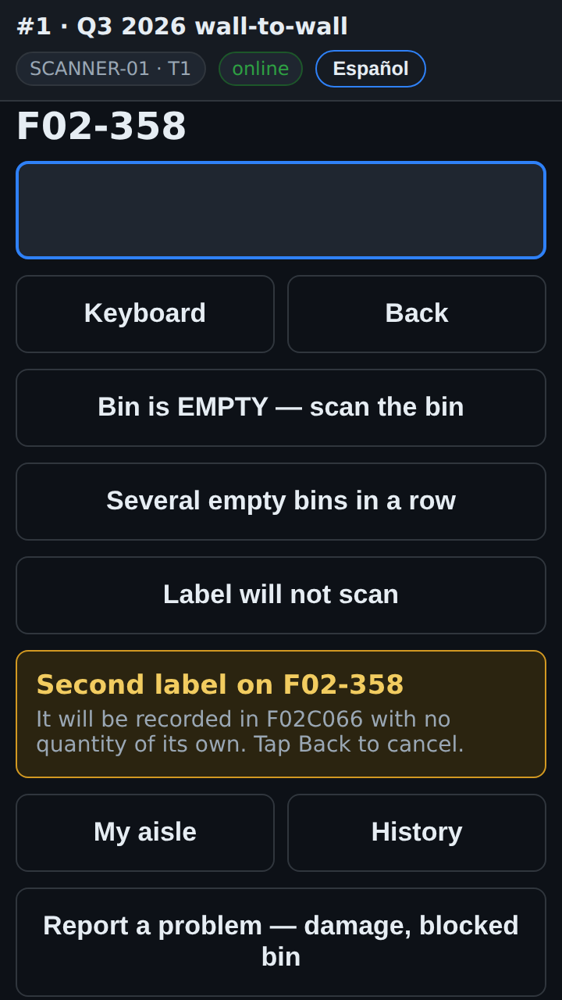<br>The gun asks for the other label and names the pallet it will belong to | 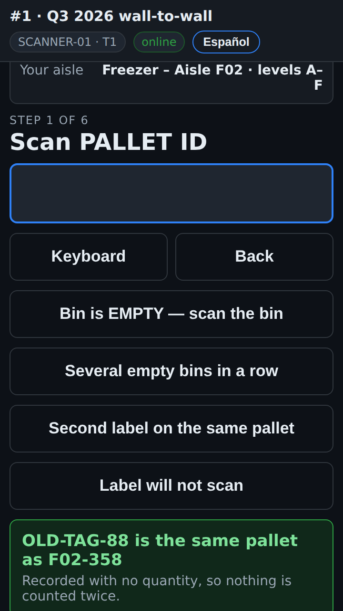<br>Recorded as the same pallet, with no quantity — so the stock is not counted twice |

**The SOS button**

At the bottom of the counting screen, in red: **SOS — I need help**. A counter in the middle of a
freezer aisle cannot radio the office through ear defenders, and walking out to find somebody is
five minutes.

1. Tap **SOS**.
2. Pick what is wrong from the list — your site's own list, set in Settings.
3. Add a note if it helps, then it sends.

It carries the team, the aisle and the last bin counted, so nobody has to explain where they are.
Within seconds it is on the dashboard, and in your Teams channel if one is set up. The bar at the
top of the gun says **SOS sent** while it is waiting, and changes to **Dana has seen your SOS** the
moment a supervisor picks it up — which is the thing the person who pressed it is waiting to know.

> **With no signal it says so.** *"No signal — this has NOT been sent."* It keeps trying and sends
> the moment there is a signal, but a counter is told the truth rather than left believing help is
> coming. If it cannot wait, walk to where there is signal or go and find somebody.

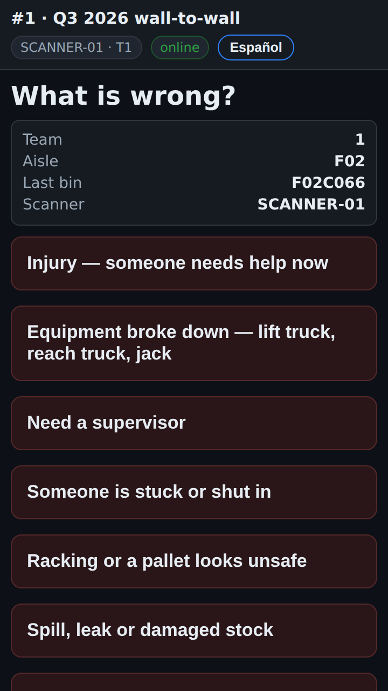

*The SOS list — the site's own words, in buttons big enough for a gloved hand in a hurry.*

**The green "Update ready" bar**

A new version of the app is on the server and this scanner has not got it yet. Nothing is
wrong and nothing needs doing: it loads itself the moment the pallet in hand is finished and
everything counted has reached the server. Tap the bar if you would rather take it now.

**When a label will not scan**

Freezer labels come off, ice over, get clipped by a forklift. The pallet is still there
and still has to be counted, so the gun has a way out that keeps the count going and tells
a supervisor where to send somebody with a label printer.

The same button is on both steps that read a label — **PALLET ID** and **BIN LOCATION** —
and asks the same question: can you read it or not?

**On the PALLET ID step** — tap **Label will not scan**:

| Choice | What happens |
|---|---|
| **I can read it — let me type it** | The keyboard comes up, the counter types the number off the label, and counting carries on as normal. The line is flagged as a barcode to replace |
| **Nothing readable on it** | The pallet is counted anyway, under a name made from its bin — `NO-LABEL-F01A001-1`. Give the quantity and scan the bin as usual |

**On the BIN LOCATION step** — tap **Bin label will not scan**:

| Choice | What happens |
|---|---|
| **I can read it — let me type it** | The keyboard comes up and the counter types the bin code. It is checked against the bin list, the team's aisle and its levels exactly like a scan |
| **It is F01A005** | The app names the bin it believes the counter is standing at — the one the guide is on, the one they are already counting out of, or the one the report puts this pallet in — and one tap takes it. Checked the same way |
| **No readable bin label** | Only when the app has nothing to offer. The line is recorded against the aisle rather than being lost, and flagged as an unknown bin for a supervisor to sort out |

| | |
|:--:|:--:|
| 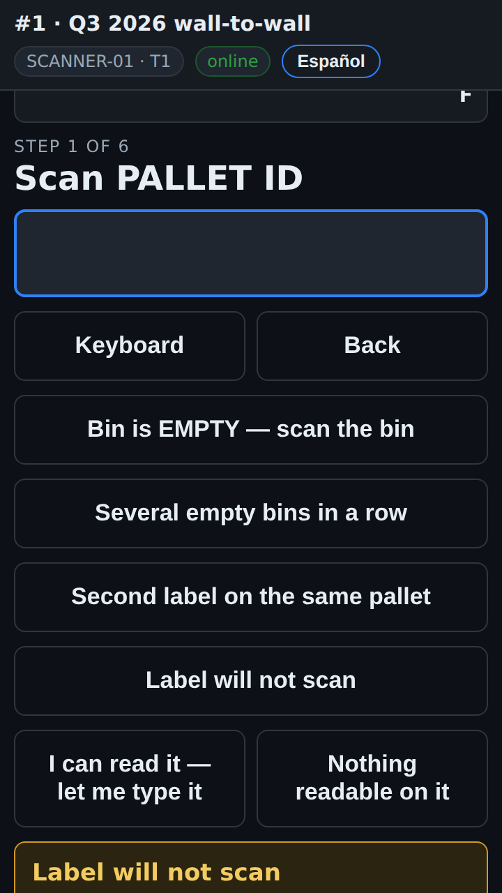<br>On the pallet step: can you read it, or not? | 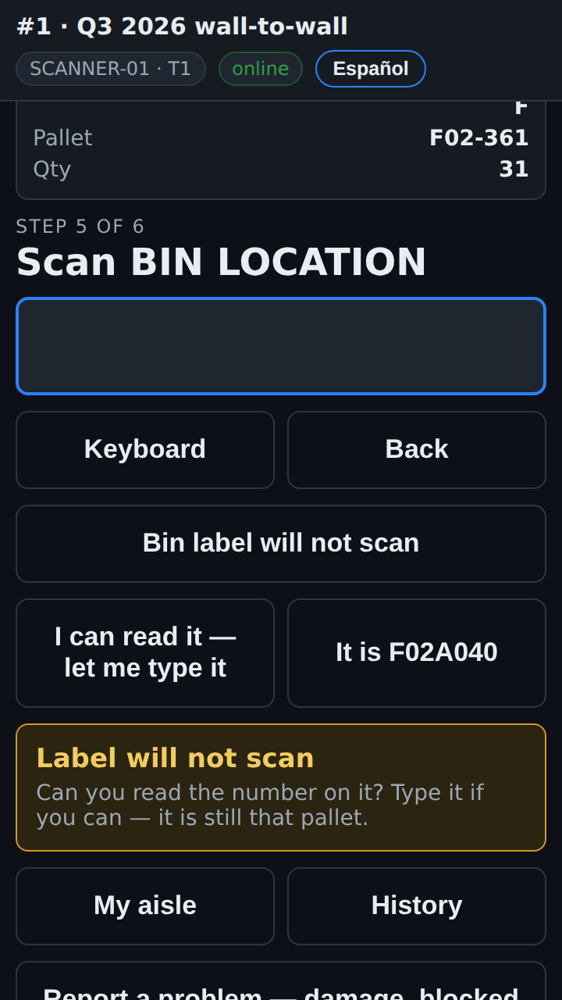<br>On the bin step the app offers the bin it believes you are at, so nobody types a code off a rack leg in a freezer |

*Either way the pallet still gets counted — walking away from it is the one thing that
would put the count out.*

The line is marked either way, and the bin turns up on **Dashboard → Reports → Labels to
replace** with what was counted there. A pallet with nothing readable on it counts as a
pallet not on the report, so it also shows on the pallet report as `NOT IN MASTER` — which
is exactly what it is until somebody puts a label on it.

> **Print the rack labels first.** A pallet's bad label costs one counter one minute. A
> bin's costs every counter who walks up to that bay for the rest of the count — and the
> put-away driver afterwards. The relabel list marks them **RACK** and puts them at the top.

**A message from the office**

A supervisor can put a line on this team's scanners from the dashboard — *"come to
the dock when you finish this aisle"*, *"leave F12, the forklift is in it"*. It arrives
within about twenty seconds, buzzes, and sits on the screen until somebody taps
**Got it**. An urgent one is red. Tapping Got it tells the dashboard who read it.

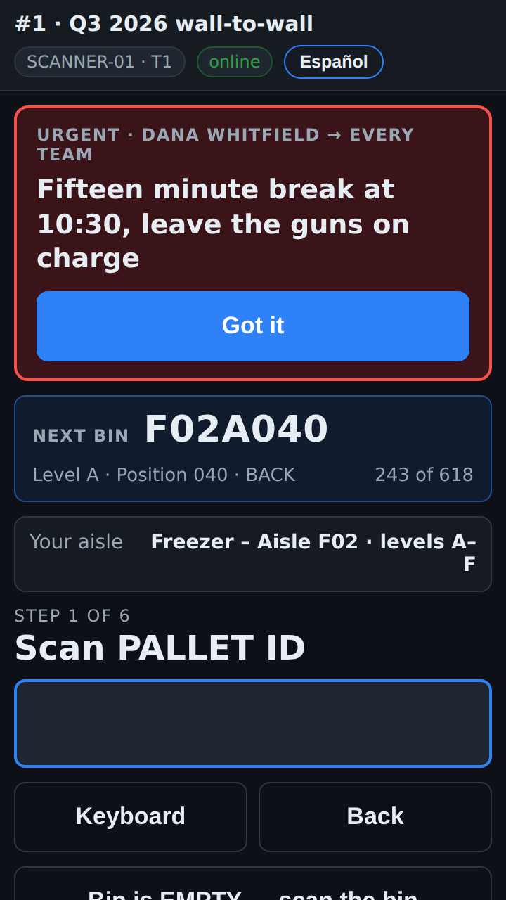

*A message waiting on the counting screen. Nothing else is blocked — the scan box is
still live underneath it.*

**The other buttons**

| Button | When to use it |
|---|---|
| **Keyboard** | Brings the on-screen keyboard up to type an entry by hand — a number pad on the quantity step. It never appears on its own: the scanner is the keyboard, and a keypad covers half the screen. Tap it again to put it away |
| **Back** | Wrong entry — steps back one question |
| **Skip** | Lot, expiry or comments the pallet does not have |
| **Bin is EMPTY** | The bin is genuinely empty. Scan the bin; it is recorded as counted and empty |
| **My aisle** | Back to the assignment screen |
| **History** | The last 50 lines from this scanner. **Void** removes a wrong line from the totals |
| **Aisle complete — next aisle** | Only when the aisle is finished. It frees the racking block and releases the team's next aisle |
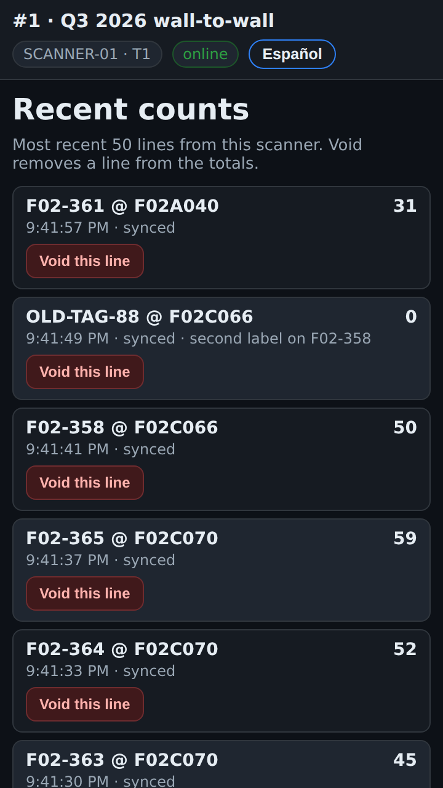

*History: the last 50 lines this scanner counted. **Void** takes a wrong one out of the totals.*

**When the gun stops and asks**

**A pallet that is not on the list** is one question: **Count it anyway?** **YES** counts it —
flagged, and it shows up for a supervisor under **Adjustments** as a pallet to add (a positive
adjustment). **NO** if it was simply the wrong barcode.

An unknown bin, a pallet already counted, a bin outside the team's aisle or level — the gun
asks why before it will take the line. Pick a reason from the list (or **Other**), add a note
if it helps, and press **Accept and continue**. The line is saved and flagged for a supervisor.
**Cancel — rescan** if it was simply the wrong barcode.

| | |
|:--:|:--:|
| 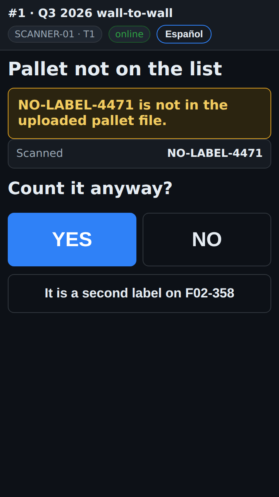<br>A pallet that is not on the inventory report: **YES** to count it, **NO** to rescan | 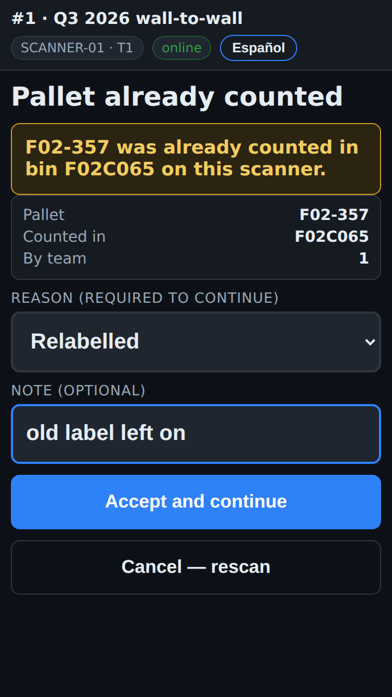<br>Everything else asks why. The reasons are the ones set in Settings — your site's words. **Other** is always offered |

**Not in Location** (the pallets the system has lost track of)

**Not in Location** in the sidebar is the site's list of pallets that are not where the ERP says
— upload it (Pallet, Item, Description, Qty, Lot, **Last known location**, Note) or type one in.
Every scanner then watches for them: the moment any gun scans one, during any count or move, it
is marked **found** with the bin, the team and the time, and the counter is told on the gun
(*"F03-118 was on the Not in Location list — found!"*). **Found in…** marks one by hand; **Close**
writes one off with the outcome. The list is the site's, not a count's: a pallet stays on it
across counts until it turns up or is closed. It downloads as a CSV.

**The find desk** is at the bottom of the page: the next missing pallet, what it is and where it
was last seen, **‹ ›** to step through, and the pallet system framed under it — type the bin and
press **Found**, or **Close** it. The guns have the same desk: **Not in Location** at sign-on with
a clock-in number alone, **pick the aisle** the pallets were last seen in (pallets with no known
location are their own group), and the gun shows the pallet, *last seen in* its bin, what it is,
and the pallet system under it. **Found — next** ticks one off and tells the office — badge,
scanner, time; **›** leaves one; **Aisles** goes back to the list. Nothing is scanned in the app;
the pallet system under the strip is where the pallet is booked.

**Moving pallets back** (a job of its own)

**Front bins → Pallets to move back** builds the list — every pallet the report puts in a front bin
with an empty bin behind it — or takes one you upload (Pallet, From bin, To bin). The guns then offer
**Move pallets** at sign-on while any are waiting:

1. Pick **Front2Back** and scan **your clock-in number** — it is one person with a gun, so there
   is no team and no count to choose — then **Sign on**.
2. **Pick the aisle** to work; each shows how many pallets are waiting in it.
3. The gun opens the **move desk**, the same strip as the office's: the **pallet**, the bin it is
   in (**from**) and the bin it goes to (**to**), **‹ ›** to step through the aisle, and
   underneath, the **pallet system's own screen** (the address the office set under *Settings →
   Advanced → Pallet system*; the gun shows the screen, never the address). There is nothing to
   scan in the app: the move is booked, and scanned, in that screen.
4. Move the pallet, book it in the system, tap **Moved — next**. The next one comes up; when
   the aisle is finished the gun says so and goes back to the aisle list (**Aisles** goes back
   any time). A pallet that cannot be moved is left with **›**; the office skips it with the
   reason from *Front bins → Pallets to move back*.

Moves ticked off with no signal queue on the gun like count lines, so a dead spot loses nothing.

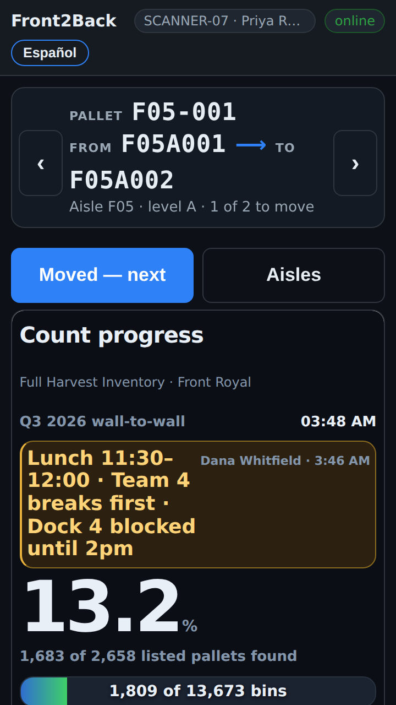

*Front2Back on the gun: the office's strip — pallet, from → to — and the pallet system framed underneath.*

**The move desk.** *Front bins → Move desk* is for the person doing the moves in the pallet
system rather than on a gun: the next pallet, the bin it is in and the bin it goes to sit at the
top, with **‹ ›** to step through the list, and the pallet system's own screen opens underneath,
framed at the size of a Zebra's screen — the same slab as the Testing Suite's gun — so it shows
what the crew see on a handheld; **Full width** opens it out across the page when a system's own
screens need the room, and the choice is kept on that computer (the address is set once under
*Settings → Advanced → Pallet system*). Make the move there, press
**Mark moved**, and the next one comes up; **Skip** leaves one for a look, with the reason. A
system that refuses to be shown inside another page is a click away with **Open the pallet
system in a new tab**.
5. Done moves update the report, so the count that follows expects the pallet where it now is.
   With no signal they queue and send later, like count lines.

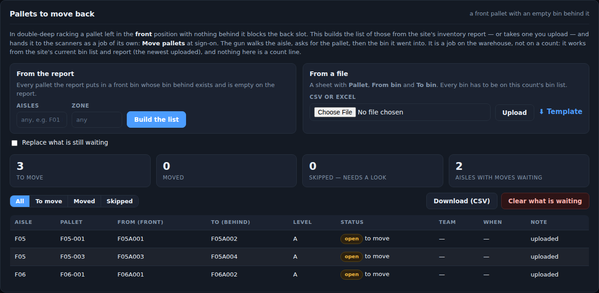

*Front bins &rarr; Pallets to move back: the list built from the report, and how each one went.*

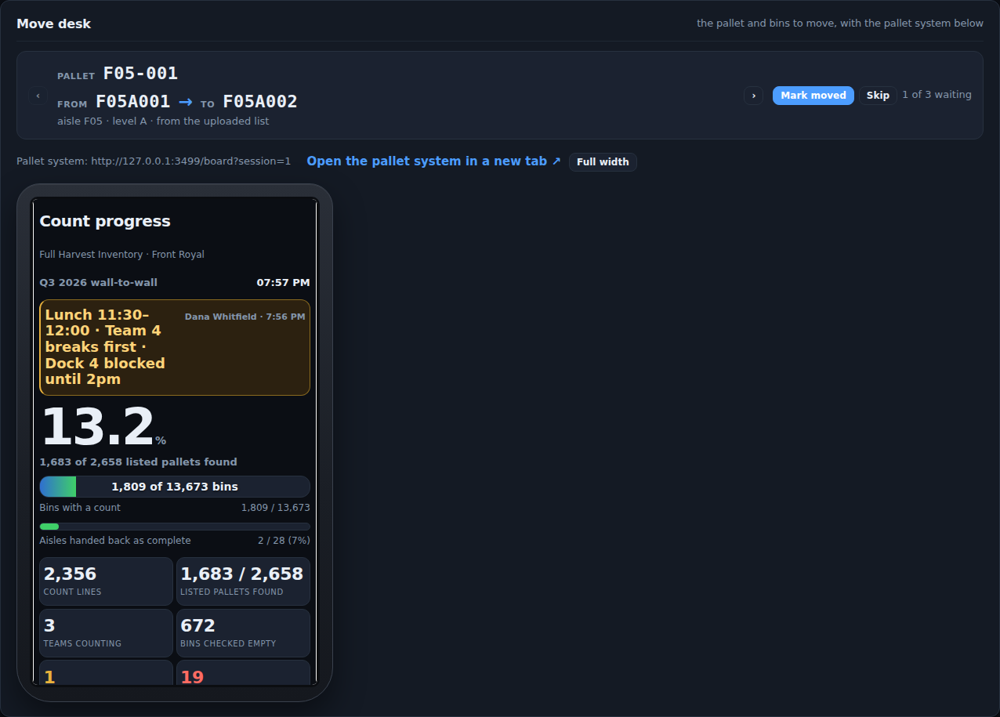

*The move desk: the next pallet and its two bins at the top, the pallet system underneath.*

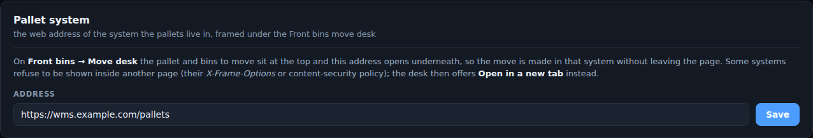

*Settings &rarr; Advanced &rarr; Pallet system: the address the desk opens, set once.*

### Step 16 — The supervisor's procedure (on the dashboard)

**Dashboard**, with the count picked in the header. It refreshes itself every 30
seconds, fetching only the tab on screen (plus the progress figures and the alerts, which are
light), so three dashboards left open on a big count do not keep rebuilding the pallet report.

> **How it looks** is up to you: **Settings → Advanced → Appearance** offers four themes —
> *Midnight* (dark blue), *Graphite* (dark grey), *Daylight* and *Frost* (light) — nine accent
> colours, the text size, how tightly the tables sit, the corners, the sidebar's width and the
> strength of the lines. It is kept per computer, so the office TV can be dark and a desk can be
> light. The same tab holds the **site name**: what the app calls itself (*Full Harvest Inventory*
> out of the box) and the location under it (*Front Royal*). Change either and it lands at once on
> every supervisor page's sidebar, the sign-in screen, the window titles, the scanner app's header,
> the office board and the name of the installed app; a blank name goes back to the default. The
> tab also takes a **logo**: your company's mark at the top of the sidebar and, if you tick it, in
> the header of every scanner.

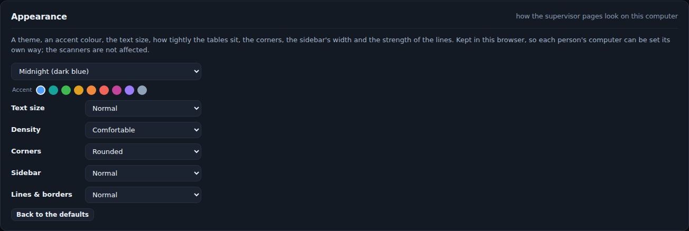

*Settings &rarr; Advanced &rarr; Appearance: theme, accent, text size, density, corners, sidebar and contrast — per computer.*

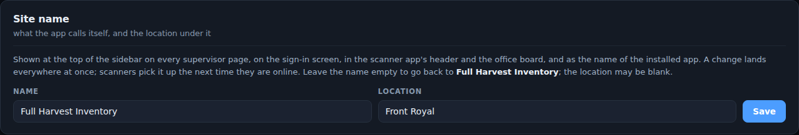

*The site name card: the name and the location, changed here and shown everywhere.*

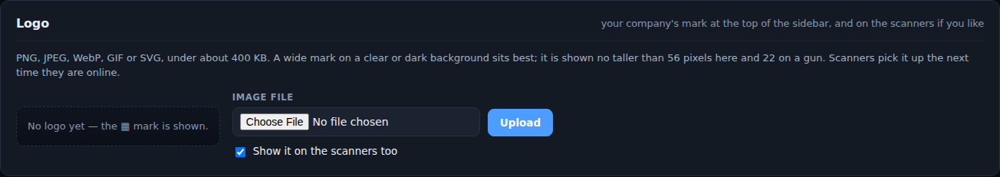

*The logo card: one upload, shown on every supervisor page and, if ticked, on the scanners.*

- **Progress** — lines, bins counted, pallets, exceptions; and a row per team with its
  **shift**, what it is counting right now, **when it started**, a **clock** of its time on the
  count, and when it last scanned. *All shifts / 1st shift / 2nd shift* above the table narrows it.
  A team's clock stops when it signs off on the gun or finishes its last aisle. When the report
  carries a **System** column — three systems' stock in one warehouse — a tile per system shows how
  many of its pallets have been found, and the pallet report, adjustments and ERP files can each
  be narrowed to one system. The scanners never see the difference.

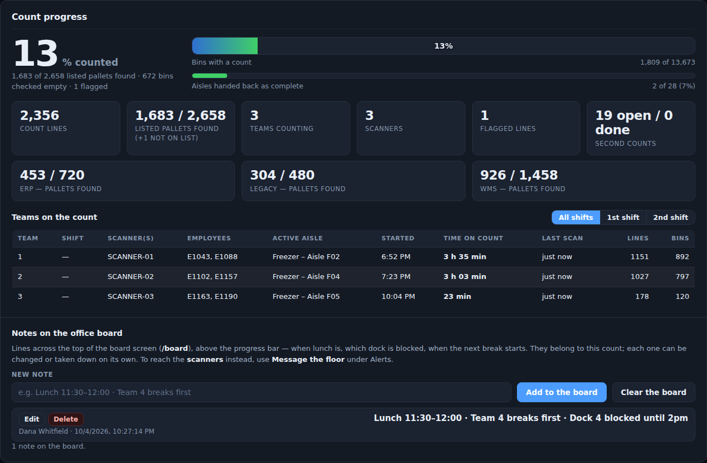

*Progress: the count in numbers, then a row per team with its shift, aisle, clock and last scan.*


*Pallets found, per source system.*
- **Stopped scanning** — a team that is signed on and still has an aisle, but has not scanned for
  the site's limit (Settings → Scanner screen, 10 minutes to start), gets an **amber bar above every
  tab**, and its last scan turns amber in the table. **On break** (30 minutes) and **Lunch**
  (45) quiet it for that long; **Seen — I am on it** quiets it until the team scans again. If the
  site turned it on, the same alert goes to the Teams channel.

- **Map** — the warehouse from above. Aisles are outlined by state: not started, being
  counted now (with the team's number), done. Click an aisle for its bins, who counted
  it and what is flagged.

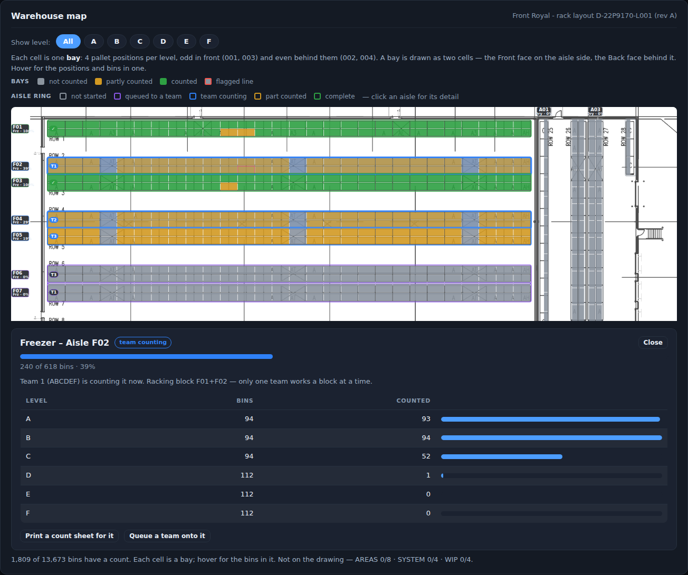

*Dashboard &rarr; Map, with an aisle picked: 240 of 618 bins, level by level, and which team holds that racking block.*

- **Team plan** — who is where, queue the next aisles, hand an aisle back. It also holds
  **Message the floor**: type a line, pick one team or all of them, tick **Urgent** if it
  cannot wait. The table underneath shows who has read each one — *2 of 3* means a
  scanner has not seen it yet, so do not assume. **Take it down** removes a message from
  the handhelds without losing what was said.

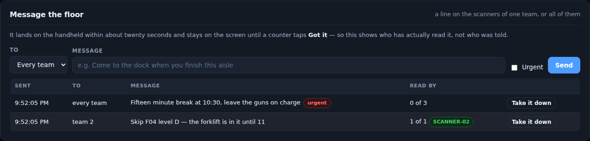

*Message the floor, under Alerts. "1 of 1" with the scanner named is a message that
landed; "0 of 3" is one nobody has looked at yet.*
- **Second counts** — see step 18.
- **Adjustments** — **Positive and negative** at the top, on every count: stock to add (found
  more, or a pallet not on the report) and stock to take off (found less, or not found), with the
  units and the net. Click a side to list it, and download that list. Below it, on counts with
  approvals turned on, who signed for each one; see step 20.
- **Reports** — see step 19.

**Watch for, during the count:**

- Exceptions climbing on one team — usually a training problem, worth a radio call.
- A team stopped for a long time — dead battery, or stuck behind a trailer. The amber
  *stopped scanning* bar is there so you do not have to watch for it.
- An aisle nobody has started by mid-afternoon.

### Step 16a — Answering an SOS

**Anywhere on the dashboard.** An SOS from a scanner appears as a red bar across the top of the
page, whichever tab you are on, and makes a noise once. It names the team, what is wrong, the aisle
and the last bin they counted, and whoever is on that gun.

- **I am on it** — tells the scanner somebody has seen it, by name. This is the one that matters:
  the counter is standing in an aisle waiting to know that anybody at all has picked it up.
- **Close** — ends it, and asks what happened. That goes in the log, and to Teams if the channel is
  set up, so nobody drives over for something sorted twenty minutes ago.

Every alert, open or closed, stays in **Alerts → SOS from the floor**, with who raised it, when,
what happened and whether the Teams channel took it.

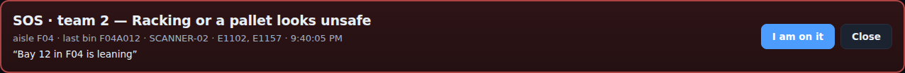

*An SOS above the page: team, what is wrong, where they are, and the two things a supervisor can do
about it.*

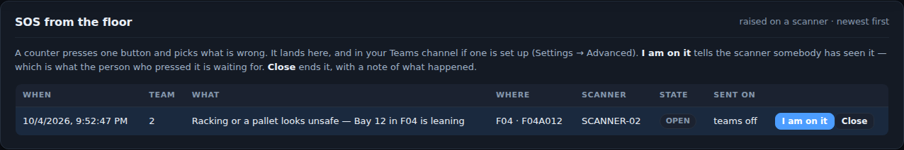

*Alerts &rarr; SOS from the floor: every call, open or closed, and what became of it. The tab carries a badge until the open ones are cleared.*

### Step 16b — Finding anything: the search box

**Every supervisor page, top of the sidebar.** One box. Press **/** from anywhere on the page
(or **Ctrl-K**) to jump into it.

It searches two things at once:

- **Your data** — a pallet ID, an item number, a word from a description, a bin code, a lot, an
  aisle, a name or clock-in number, a scanner, a count, a second count, an adjustment, something
  the office said to the floor, or a line in the log. Each hit carries the answer rather than
  just a link: a pallet shows what the report expected, what was counted, in which bin and by
  which team.
- **The app itself** — *"upload bin list"*, *"keyboard"*, *"approve"*, *"racking blocks"*,
  *"lunch note"*. These come back under **Go to** and take you to the card that does it, on
  whichever page it lives.

Choosing a hit takes you there: a tab on this page, or a page load that lands on the right tab.
A lot code goes one better — it fills the lot box and runs it.

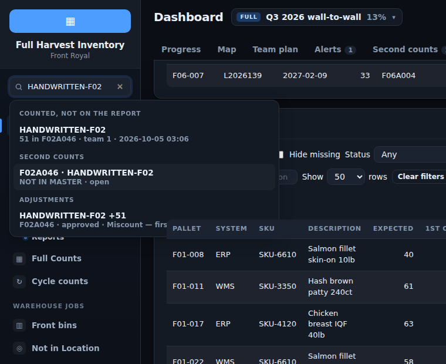

*Typing a pallet ID: what the report expected and what was counted, the second count raised for
it and the adjustment waiting to be signed — without opening any of those three cards.*

### Step 17 — The office board

Put `/board` on the office TV. It needs no sign-in and is read-only: the percentage
counted, bins with a count, aisles handed back as complete, a row per team with what they
are on, and every aisle as a tile coloured by state. It deliberately shows no pallet IDs
and no clock-in numbers.

It follows the newest open count on its own. To pin it to a particular one, add the
session to the address: `/board?session=12`.


*The note across the top of the board, above everything else — because it is the one thing
somebody walking past is looking for.*

**The notes across the top.** *Dashboard → Progress → Notes on the office board* writes
lines that appear above the progress bar on the board, big enough to read from across the
room: *"Lunch 11:30–12:00 · Team 4 breaks first"*, *"Dock 4 blocked until 2pm"*. They belong
to the count and say who wrote them and when; each has **Edit** and **Delete**, and **Clear
the board** takes them all down.

Use the notes for anything the floor reads walking past. To reach the **scanners** instead —
one team, or all of them, with a read receipt — use **Message the floor** under Alerts
(step 16).

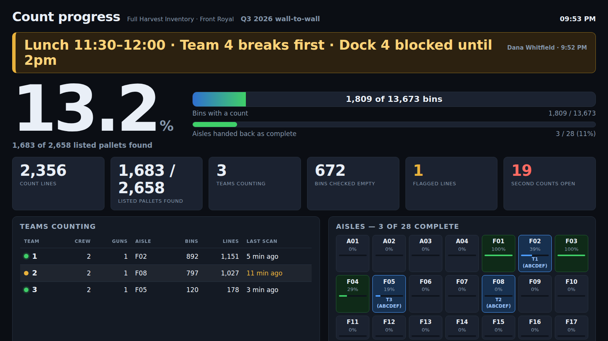

*The office board, for the TV: percentage counted, aisles complete, every team, and every aisle coloured by state.*

---

## Part 5 — Finishing a count

### Step 18 — Work the second counts

**Dashboard → Second counts.**

A second count is a bin somebody has to walk back to. They are raised automatically when
a line disagrees with the inventory report (subject to your thresholds), or by a
supervisor.

- **Raise from all variances now** goes through everything that currently disagrees and raises the
  tasks. It deliberately leaves alone pallets in aisles nobody has counted yet — mid-count
  those are not missing, just not reached — and tells you how many it skipped and why.
- The tasks appear on the handhelds: a team taps **Start second counts** on the
  assignment screen, counts the bin again, and presses **Bin done — nothing more here**. The
  list is **nearest first**: the aisle the team is in, then its racking block, then the aisles
  nearest by number, so a team finishing F11 is not sent to F01.
- A second count that agrees with the first settles the line.

Work these down before you close the count. A count closed with open second counts is a
count with known-wrong numbers in it.

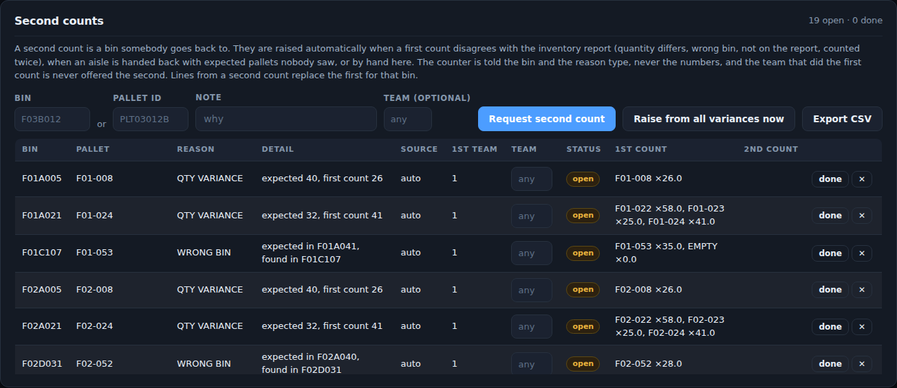

*Dashboard &rarr; Second counts. The counter is told the bin and the reason type, never the numbers — and never the team that counted it first.*

### Step 19 — Read the reports

**Dashboard → Reports.**

**Fix list** — what the floor found that somebody has to put right, on one list: **labels that would
not scan** (pallet or rack — rack first, every counter after walks up to that bin), **damage** reported
from the gun's *Report a problem* button (a pallet, the racking, the product, each with a reason and
a note), and **bins blocked** by a trailer or a forklift that a team said it would come back to. Each
shows the bin, the pallet, who saw it and when. **Fixed** ticks it off with a word on what was done;
*Still open* is the walk-round list. It downloads as a CSV and has its own sheet in the export.

**Filed as the count goes.** The moment a team hands an aisle back, the app writes that aisle to
disk — its count lines, the pallets expected or found in it, its bins, its second counts and
fix-list items — as CSV files in an `exports` folder beside the backups, one folder per hand-back.
A count that stops halfway has every finished aisle on disk already. The card lists what has been
filed, with a download link for each file. **Final report** files every sheet of *Export everything*
the same way, and the button is on only when the count is whole: every bin has a count and no second
count is open; until then the card says what is still missing. The log records every filing.

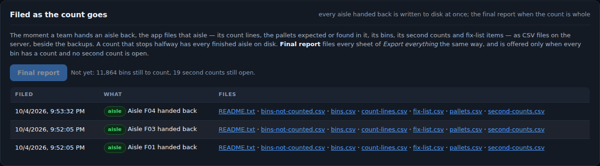

*Filed as the count goes: one row per aisle handed back, the final report once the count is whole.*

**Export everything (Excel)** — one workbook with every table the app keeps for this count, in a
form a person can read: a **Summary**, every **count line**, the **pallet** report, the
**adjustments** (positive and negative), the **bins** and the ones **not counted**, the **teams**
and their times, **sign-ons**, **SOS**, **stopped scanning**, **second counts** and the **log**.
Headings are plain words, flags are *Yes* / *No*, and times are on the warehouse's clock. It is
the file for an auditor, a manager or the shared drive. (The CSV buttons beside it are for
machines — the ERP, a reconciliation sheet.)

- **Pallet report** — one row per pallet: expected vs counted, which bin the ERP expected
  and where it was actually found, and a status you can act on: `MATCH`, `QTY VARIANCE`,
  `WRONG BIN`, `MISSING`, `NOT IN MASTER`, `COUNTED TWICE`. Lot and expiry get their own
  columns, because the right count of the wrong lot is still wrong. **Only exceptions**
  narrows it to what needs attention — including a wrong lot or a date about to run out,
  even when the quantity is right.

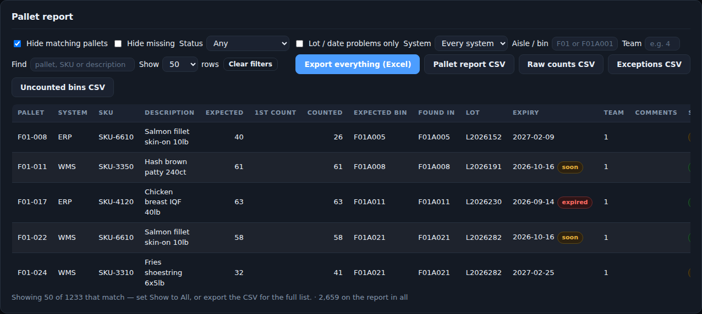

*The pallet report with **Hide matching pallets** ticked: a short pallet, an expired date, one expiring soon. This is the list to work down.*

The filter row reads the report without exporting it: **Hide missing** drops the pallets nobody
has found or counted yet, **Status** picks one kind of difference, **Lot / date problems only**
keeps the wrong-lot and out-of-date rows, **System** one of the site's systems, and **Aisle / bin**,
**Team** and **Find** narrow by place, crew, pallet, SKU or description. The line under the table
says how many rows match out of the whole report; **Clear filters** is back to the usual view.

- **Find a lot** — after a recall notice: type part of a lot code and get every case of
  it, both where it was actually counted and where the report expected it, so a pallet
  nobody found still shows up.

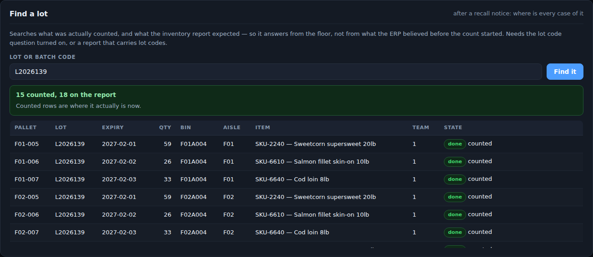

*A recall: five cases of the lot found on the floor, and a sixth the report still expects in an aisle nobody has reached.*

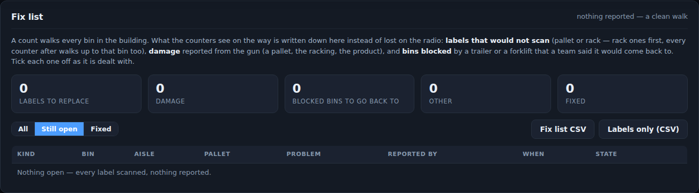

*The fix list: labels that would not scan, damage and blocked bins from the gun, each with the bin, the pallet and who saw it. Fixed ticks it off.*

### Step 20 — Approve the adjustments

**Dashboard → Adjustments.** Only on counts with **Adjustments need approval** turned on
(step 13). With it off this tab says so, and every difference goes into the ERP file as it
always did.

A variance is not an adjustment until somebody owns it. This is where that happens.

1. The list is every pallet that differs from the report, biggest first: what the system
   says, what was counted, and what the ERP would move.
2. Tick the ones you have satisfied yourself about. **Select all shown** takes the
   screenful.
3. Pick a **reason** — your site's list, set in Settings → ERP & backups → Adjustment reasons —
   and add a note if it helps.
4. **Approve selected**, or **Reject selected** if the count is wrong and the system should
   keep its number.

What the feature is actually for:

- **Nothing unsigned reaches the ERP.** The Adjustments export holds back anything still
  waiting, and the preview says how many it left out.
- **Anything under the threshold goes through unsigned.** A two-case difference on a pallet
  of 600 is noise; a count where every line needs a signature gets rubber-stamped, not read.
- **Counted again means signed again.** If a second count changes a pallet after it was
  approved, it comes back to this list with the approval cleared — the number somebody
  signed for is no longer the number.
- **A variance a second count clears disappears.** There is nothing left to adjust.
- **It is all in the log**: who approved what, with which reason, and when. That is the
  answer to "who authorised writing off 400 cases of chicken".

A pallet nobody has reached yet is not on this list while the count is running. Once the
count is **closed**, a pallet the report expected and nobody found becomes an adjustment
like any other.

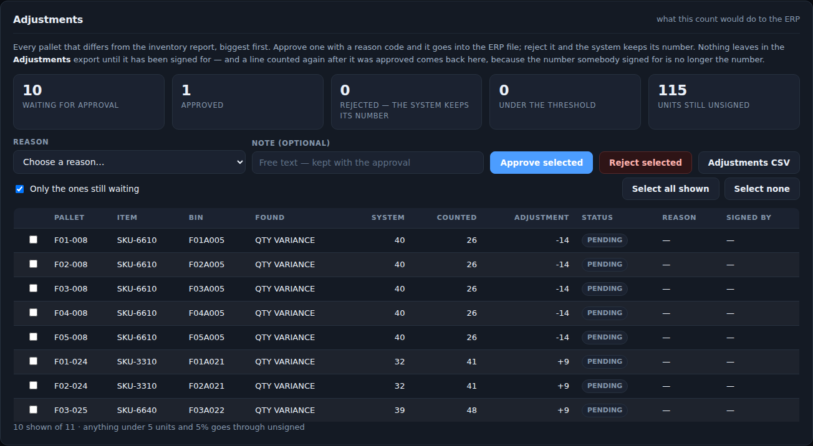

*The adjustments waiting for a signature, biggest first. AUTO is under the threshold and
goes through without anybody being asked; APPROVED carries the reason and the name.*

### Step 21 — Send it to the ERP

**Settings → ERP & backups → Send to the ERP.**

1. Choose the **layout** that matches your ERP. Column names and which rows are included
   are configuration — add a layout rather than editing the file by hand afterwards.
   Where three systems share the warehouse, pick the **System** too: one file per system,
   named for it, with only that system's pallets in it. (Each system's report is named when
   it is uploaded — Settings → Lists & racking → Inventory report → **System** — or carries
   a *System* column; the pallet report, adjustments and Export everything show it, and the
   scanners never do.)
2. **Preview** and read the first rows. On a count with approvals on, the preview says how
   many adjustments it left out because nobody has signed for them yet.
3. **Download CSV** and import it into the ERP.

The **Adjustments** layout carries the reason code and the name of whoever approved it, so
the file the ERP gets is the same story the log tells.

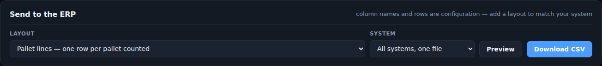

*Settings &rarr; ERP &amp; backups. Preview before you download; the layout decides the column names and which rows are included.*

### Step 22 — Close the count

**Settings → Getting started → Count session → Close session.** A closed count is read-only:
scanners can no longer post lines to it, and its reports stay available for ever.

**Delete…** is separate and deliberately harder: the count must be closed first, you have
to type its name, and a backup is taken before anything is removed. Everything counted
against it goes with it. Close counts; delete only the ones created by mistake.

### Step 23 — Backups and the log

**Settings → ERP & backups → Backups & log.**

- **Back up now** before and after anything large — an ERP import, a bulk re-upload, a
  deletion. The app also backs itself up daily and keeps the last 14.
- **The log** records every supervisor action: who signed in, who uploaded what, who
  overrode what, who raised second counts, who searched for a lot. **Export the log** for
  an auditor.

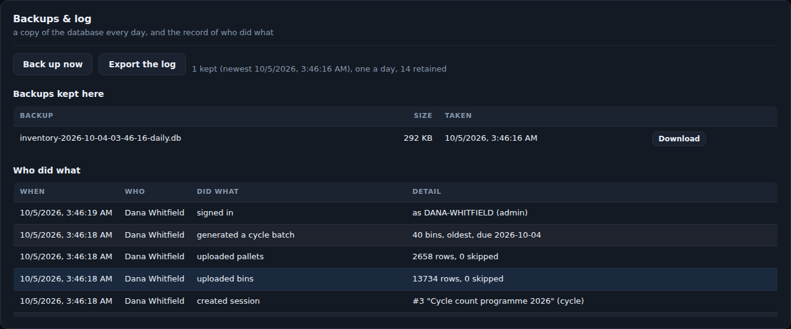

*Backups on the left, the log on the right. Both export.*

---

## Part 6 — The cycle-count programme

A cycle count is the same app with a different rhythm: instead of stopping the warehouse,
a handful of bins are counted every day.

1. **Create one count session of type "Cycle count"** and keep using it. It runs for the
   year — do not create a new one each week, or you lose the history of when each bin was
   last counted.
2. Upload the bin list and the inventory report. If your ERP export has a
   *last physical inventory date* column it is read automatically, and the programme
   picks up where the ERP left off.
3. Go to **`/cycle` → Today's bins**. Choose:
   - **how many bins** in the batch,
   - **which bins**: *longest since it was counted*, *never counted*, or a *random sample*,
   - optionally a **zone, aisle or levels** to stay inside.
   - optionally only **front** or only **back** bins (*Face*).
4. **Preview**, then **Generate**. The bins appear on the handhelds as tasks.

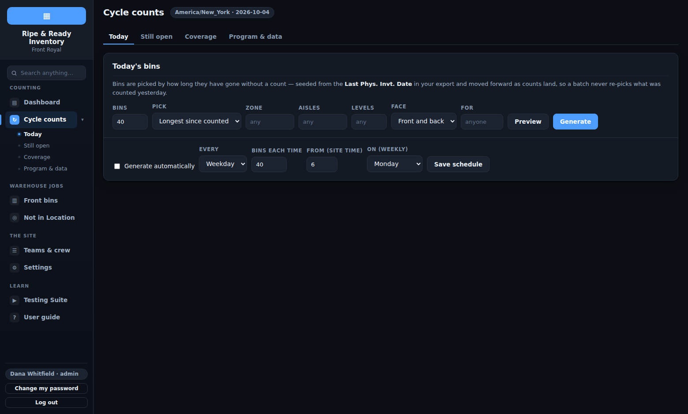

*`/cycle` &rarr; Today's bins: how many, which ones, and optionally the zone or aisles to stay inside.*

**Front-placed bins.** The **Front bins** tab lists the bins on the aisle face of the racking —
narrow it by zone, aisle or level — to look at, **download**, or send to the scanners in one go
with **Count these — make a batch**. Which face a bin is on comes from the bin list's own
description (*… Position # 001 – Front*), or, where the list does not say, from the site drawing
(odd positions front, even back).

5. Counters pick **Cycle count** at sign-on. A cycle count is one person with a gun, so the
   gun asks for **their clock-in number only — no team**. Several people can be on the same
   programme at once: each signs on as themselves and takes their own bins; a bin one person
   has taken is not offered to the next. The dashboard shows each by clock-in number and name.
   They then work the list. Each bin is counted as it
   stands — it is *the* count for that bin, not a second opinion.
6. **Coverage** shows how much of the warehouse has been counted in the period, and what
   has not been touched. Export it for the auditors.
7. A **schedule** generates the batch automatically each day or week so nobody has to
   remember.

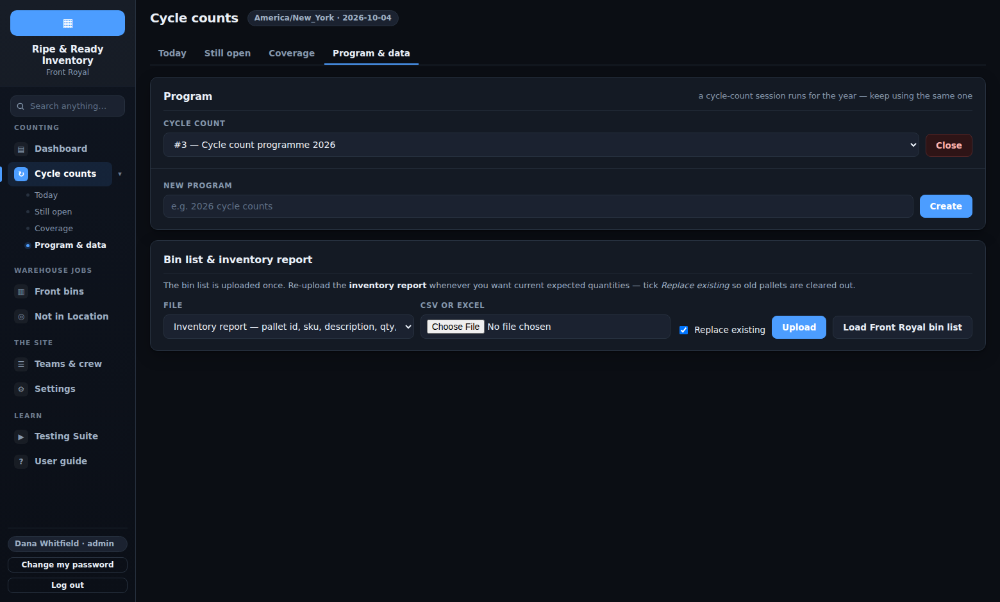

*The batches that have been generated, and the programme's own bin list and inventory report.*

---

## Part 7 — When something goes wrong

| What you see | What it means | What to do |
|---|---|---|
| Gun: *"this scanner is no longer authorised"* | Its link was reset or the scanner was removed | Settings → Scanner screen → **Reset link**, open the new link on the device |
| Gun: *"Offline and no list cached for this session"* | The handheld has never downloaded this count | Carry it into Wi-Fi once and sign on again |
| Gun says `OFFLINE` with lines queued | Normal in a dead spot | Nothing. They upload when it gets a signal. Do not wipe the device |
| A scan does nothing | DataWedge is not sending a suffix | DataWedge → Basic data formatting → send **ENTER** (or TAB) |
| A keypad covers the screen | Somebody left the **Keyboard** button on | Tap **Keyboard** again. It is off by default and never comes up by itself |
| The Adjustments tab is empty | Approvals are off for this count, or nothing differs from the report yet | Turn on **Adjustments need approval** under Count session. A pallet nobody has counted yet is not an adjustment until the count is closed |
| The ERP file is shorter than the variance list | Adjustments are waiting for approval and are held back deliberately | Work the Adjustments tab, then export again. The preview says how many were left out |
| A pallet is on the report as `NOT IN MASTER` with a name like `NO-LABEL-F01A001-1` | Its label would not scan and nothing on it was readable, so it was counted under the bin's name | Send somebody to relabel it — **Reports → Labels to replace** has the list |
| A line is in a bin called `NO-LABEL-BIN-F01-1` | The rack label would not scan, and the app had nothing to suggest — an unguided count, with the pallet not on the report either | The quantity is safe. Relabel the bay, then correct the bin on the line if it matters; the relabel list says which aisle it was in |
| The note is not on the board | The board polls every 15 seconds by default, or the note is on a different count | Wait a few seconds; check the board is pinned to the same count (`/board?session=12`) |
| A change you made does not appear on the scanners | The gun is still running the app it loaded before the change | Site settings (questions, reasons, text size) reach a running gun within about half a minute and need nothing. A new **version of the app** needs the page to reload: with **Update itself after a deploy** on it does that by itself between pallets, within a couple of minutes of somebody picking the gun up. To force it: tap the green **Update ready** bar, or close the app fully (not just the home button) and reopen it. Reinstalling is never necessary |
| An SOS did not reach Teams | The channel address is wrong, expired, or Teams was down | The alert is still on the dashboard — the row says what Teams answered. Settings → Advanced → **Send a test card** to check the address. Microsoft is retiring the old *Incoming Webhook* connectors; if yours was one, make a **Workflows** one instead |
| A counter says they pressed SOS and nothing happened | The gun had no signal | The gun tells them: *"No signal — this has NOT been sent."* It sends itself the moment there is signal. In a dead zone, walking ten metres usually fixes it |
| The printed barcodes will not scan | The page was printed “fit to page”, or on glossy paper | Print again at **100%** on plain white paper. If a gun still refuses them, print with **Per row: 1** — the bars are wider on a bigger label |
| A code in the spreadsheet will not print | Code 128 carries plain ASCII only — an accented letter or a smart quote cannot be drawn | The book says which character it was; retype that code with plain letters and numbers |
| The app still shows the old name somewhere | The name was changed under Settings → Advanced → Site name | Supervisor pages change at once. A scanner picks it up when it is next online; the board on its next refresh. The name under a home-screen icon comes from the app's install and updates when the app is next reinstalled |
| The strip on the gun shows the pallet but no system under it | No pallet system address is set (the gun says so), or the system refuses to be framed | Settings → Advanced → Pallet system. A system that refuses to be framed cannot be shown on the gun — the gun never shows its address; use the office desk's Open in a new tab, or ask the system's owner to allow framing from this site |
| The site's address opens the supervisor sign-in, not the scanner | That is how it works: the bare address is the office's | A scanner is opened from its own link under Settings → Scanner screen (`/?d=…`); after that its home-screen icon lands on the app. If a handheld lost that (site data cleared), open its link again |
| A gun does not offer the cycle count, Front2Back or Not in Location | That job is unticked under Settings → Scanner screen → What the scanners offer | Deliberate during a wall-to-wall; tick it back on when the count is over |
| A gun offers Front2Back but says *Nothing waiting to move right now* | The job is ticked and the move list is empty | Normal: build a move list under Front bins, or untick the job |
| A count is missing from the picker | The login may not work that kind of count | A login without the Cycle counts page sees no cycle count; a cycle counter sees no full count. An admin adds the page under Supervisor logins |
| You do not know what a message means | The gun or the dashboard said something unfamiliar | Paste it into **User guide → Ask the guide**: it knows every message the gun and the server can show, with the fix. A new starter should begin at the guide's *Your first day* |
| You cannot find where something is set | The app has four pages and twenty-odd cards | Type what you would call it into the search box at the top of the sidebar — *"upload bin list"*, *"keyboard"*, *"approve"* — and the **Go to** hits take you straight there. **/** puts the cursor in it |
| Not sure whether a gun has the latest version | — | The sign-on screen's bottom line reads *"App build a1b2c3d4e5f6 on the server — this scanner is up to date"*. Compare it across two guns, or against a fresh reload |
| A gun keeps saying "update did not take" | It reloaded and is still on the old version — something between it and the server is serving stale files | Close the app fully and reopen it. If it persists, clear the site data for the app on that device (Android → Settings → Apps → the app → Storage), then open its link again |
| The screen keeps rotating, or reads upside down | Auto-rotate is on, and a browser tab is never allowed to lock the orientation | The app turns itself back upright on its own, sideways or end over end. If it is not, check **Keep it upright** is ticked under Settings → Scanner screen, then read the grey line at the bottom of the sign-on screen — it says the screen size the handheld gave the app, how far the device says it has turned, and what the app did about it. To stop the device turning at all, install the app (it asks for one way up) or turn auto-rotate off on the handheld |
| A team says they never got a message | Look at **Read by** on the dashboard | It shows which scanners have tapped Got it. A scanner that is offline gets it on its next sync |
| A scan seems to land on a button instead of the box | Something else took the focus | Nothing — the app puts the keystrokes in the box and carries on. Tell us if it still happens |
| The guide is a bin or two ahead of the team | The bins hold several pallets each | Fixed: the guide now stays on a bin until its tags are counted. Check **Show the next bin in the aisle** is on |
| Gun: *F01A001 is a bin, not a pallet* / *P-100 is a pallet label, not a bin* / *That is a bin, not a quantity* | The wrong label was scanned into that step | Scan what the prompt asks for: the pallet's label at PALLET, the rack label at BIN, a typed number at QUANTITY, the lot code at LOT. Nothing was recorded. For an empty bin tap **Bin is EMPTY** first |
| A scan opens the address bar and the text goes into it | The page has lost the keyboard — either the scanner sends a TAB that used to move focus out of the page, or somebody tapped the browser's own bar | Fixed: TAB now ends a scan like ENTER and the focus never leaves the box. If it ever happens again the app shows a red **Tap here to scan** bar — one tap puts it right |
| A bar with the web address appears on every scan | The app is being run as a page in Chrome rather than installed | Install it: Chrome menu → **Install app**, or the **Install on this scanner** button on the sign-on screen, then open it from the home-screen icon |
| The browser's address bar is in the way | Same thing — the app is not installed | As above. For a device that should run nothing else, use Zebra's Enterprise Home Screen |
| Gun: *"Team N is counting aisle X"* | Another team holds that racking block | Wait, or hand the other aisle back first |
| Second-count list is enormous | Thresholds are at 0 | Set **Recount over** and **or over %**, and a **cap** (Part 3, step 13) |
| The map is a schematic, not your drawing | No rack drawing on this count | Settings → Getting started → Count session → **Map drawing** |
| A reason code edit "did not reach" a gun | It takes up to about half a minute, and only lands between pallets; a gun on an old build does not take it at all | Wait for the counter to finish the pallet they are on; check the build line on the sign-on screen matches the server |
| Can nobody sign in? | All logins lost | The superadmin is made from the Railway variables the first time the app starts; if it was deleted or demoted later, set `SUPERADMIN_USER` to a new username and restart, which makes a fresh admin login |
| Numbers look wrong after an ERP import | The inventory report moved on | Re-upload it with **Replace what is there**, then re-read the pallet report |
| A scanner's scan times are hours out | The handheld's clock is wrong | Nothing to do: every line carries the gun's own send time, and the server corrects the scan time by the clock's error. Set the clock when you can, all the same |
| Everyone was signed out of the dashboards | The server restarted (a deploy, a Railway restart) | Sign-ins now survive a restart; if it still happens, the server lost its database volume — check Railway |

---

## Part 8 — Capacity: what the system will take

Two measurements, both against a count bigger than the warehouse.

**A whole count, played end to end.** Twenty teams with two scanners each counted 20,000
bins over three shifts, with the three shifts compressed into 6.0 hours of real time (`node
tools/sim-floor.mjs`): the sign-on rush at six, the breaks, a lunch that trips the stopped-scanning
alert, SOS calls, second counts raised behind the variances, and a supervisor approving adjustments
over the top of it all. Every ten minutes the dashboard and the office board were photographed;
`docs/load-test/index.html` is the result, to scrub through.

| | |
|---|---|
| Bins counted | 20,000 of 20,000, 22,655 count lines, 0 failed requests out of 27,059 |
| Nothing lost, nothing doubled | 0 pallets counted twice; every aisle job handed back (71) |
| A scan, with the whole floor working | 9 ms typical, 747 ms at the 95th percentile |
| A dashboard refresh over the top of it | 279 ms typical, 1595 ms at the 95th percentile |
| The office board | 350 ms typical, 1468 ms at the 95th percentile |
| Forty scanners pulling the whole list at once | 11 ms typical, 2574 ms worst |
| The office: approvals, SOS, messages | 296 approved, 62 rejected, 25 SOS raised and 25 closed, 657 second counts walked |

**The same floor at full tilt.** The rehearsal of that run plays the three shifts in eighteen
minutes — twenty-eight times real speed, every scanner posting a line every second or two — and
the server still answered: 20,000 bins in, a count line at 8 ms typical and 536 ms at the
95th percentile, dashboards at 150 ms typical. (`node tests/run-all.mjs load-15-teams` keeps the
older fifteen-team burst test in the suite: thirty scanners posting flat out, nothing lost, nothing
doubled, the racking-block rule honoured.)

**What the simulation found and fixed.** On a count this size the pallet report took six seconds
to build, and the adjustments list, its summary and *Export everything* twelve to eighteen; the
server answers one request at a time, so while it built them nothing else moved. It is now five
indexed passes joined in memory: the report in about a tenth of a second, the export in under one.

The constraints that matter in practice are warehouse Wi-Fi coverage and battery life, not the
server. Real counters scan a pallet every ten to twenty seconds; the whole floor at that pace is a
small fraction of what the rehearsal threw at it.

---

## Appendix A — File column reference

Files may be CSV, TSV or Excel (`.xlsx`/`.xlsm`). Column names are matched loosely —
case, spaces and punctuation are ignored — so most ERP exports load unchanged. Each
upload card shows exactly which columns it recognised.

**Bin list** — the only required column is the location.

| What | Accepted column names |
|---|---|
| Bin (required) | location, loc, bin, bin location, location code, slot, code, warehouse location |
| Aisle | aisle, row, aisle no, aisle number — *derived from the bin code if absent* |
| Zone | zone, area, section, region, warehouse |
| Level | level, levels, tier, shelf — *derived from the bin code if absent* |
| Description | description, desc, name |
| Last counted | last phys invt date, last counted, last count date, last inventory date |

**Inventory report** — upload it exactly as the site's systems export it. The columns are:

| Column | What it is | Required |
|---|---|---|
| **Bin Code** | the position (F18D064); lower case is fine | yes |
| **Container No.** | the pallet's number as printed on its label (FR12345678, F61409-006, 4748025); a leading `$` from the ERP is dropped | yes |
| **Item No.** | the item | |
| **Description** | the item's description | |
| **Variant Code** | DIST, REWORK, DONATE, ALLERGEN, DESTROY, REJECTED, RND — kept on the pallet and in the exports | |
| **Quantity** | the system's quantity; zero and negative quantities are kept as the report says, and counted in the upload summary | |
| **Unit of Measure Code** | CS, CS30LB, C10KG, CASE, BAG, BOX … | |
| **Entry No.** | the ERP's item ledger entry number, carried through to the pallet report and the ERP file so adjustments post against the right entry | |
| **Lot No.** | the lot (F61409, 50479-1, PO123456) | |
| **System** | which system the pallet belongs to (JustFood, SGI, NTFF); `OPEN` with no container is an empty position | |

Other names for these columns are understood too (pallet id, LPN, item, SKU, qty, location, bin,
lot code, unit, source …), as is a **Best Before** or **Expiry** column when the file has one.

Three things in a real export, and what the upload does with them:

- **Empty positions.** A row with a bin and no container (System `OPEN`) is a position the count
  expects to find empty. It is not a pallet; the summary says how many there were.
- **A container on two rows.** In the same bin it is two ledger entries for one pallet (a −134
  and a +180 are a pallet of 46): the quantities are added up. In two different bins the first row
  stands and the summary lists the rest, with both bins, so somebody can look. Nothing is
  overwritten quietly.
- **Odd quantities.** Zero and negative quantities are kept exactly as the report has them, and
  the summary counts them.

**Barcode test book** — one row per practice line.

| What | Accepted column names |
|---|---|
| Bin | bin, bin location, location, loc |
| Pallet | pallet, pallet id, tag, LPN |
| Qty | qty, quantity, count, cases, units |
| Note | note, notes, label, description |

A row needs a bin or a pallet; everything else is optional. Sheets made with the first version of
the template (Type / Code) are still read.

**Counting plan** — one row per aisle, in the order the team counts it.

| What | Accepted column names |
|---|---|
| Team | team, team number, crew, group |
| Aisle | aisle, row, aisle no |
| Levels | level, levels, tier, shelf — e.g. `A-C`, `D-F`, `A-F` |

Dates are read in either order — `2027-03-15` and `03/15/2027` both work.

---

## Appendix B — Server settings reference

| Setting | Default | What it does |
|---|---|---|
| `SUPERADMIN_PASSWORD` | — | The superadmin's password. Set it |
| `SHARED_PASSWORD_LOGIN` | `on` | `off` requires named logins — ignored if no admin account exists, so it cannot lock you out |
| `SUPERADMIN_USER` | — | Username of the permanent admin, created at start-up |
| `SUPERADMIN_NAME` | — | That person's name, as it appears in the log |
| `SUPERADMIN_PASSWORD` | falls back to `ADMIN_PASSWORD` | Must be 8+ characters and not `changeme` |
| `SCANNER_AUTH` | on | `off` lets anything on the network post counts. Leave it on |
| `DB_PATH` | `data/inventory.db` | Put this on a persistent volume |
| `BACKUP_DIR` | `data/backups` | Where the daily backups go |
| `BACKUP_KEEP` | 14 | How many backups to keep |
| `SITE_TIMEZONE` | `America/New_York` | Dates on reports and cycle-count due dates |
| `PORT` / `HOST` | 3000 / 0.0.0.0 | Where the server listens |
| `MAX_UPLOAD_MB` | 64 | Largest file an upload will accept |
